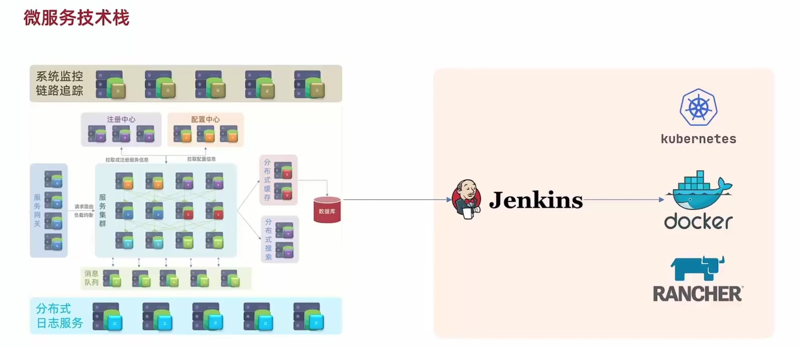
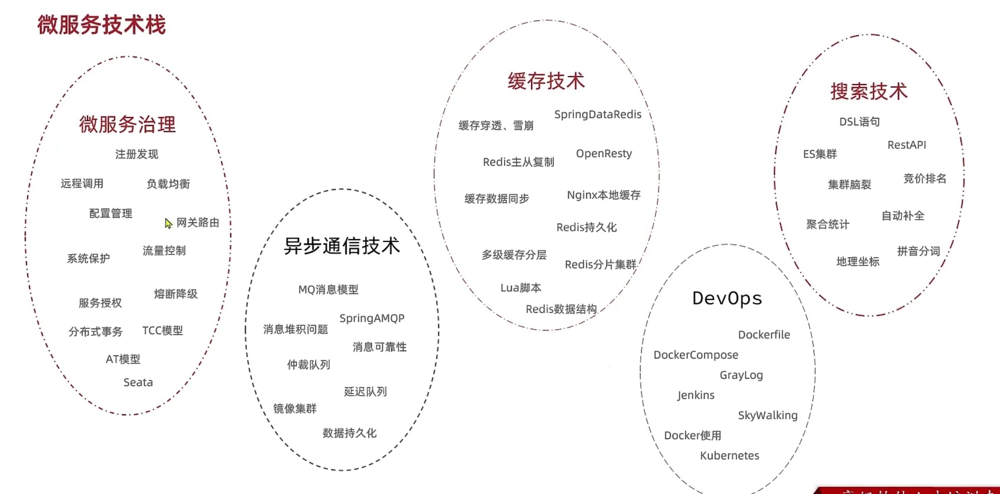
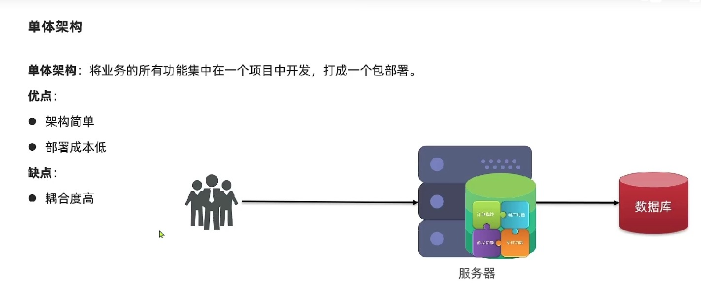
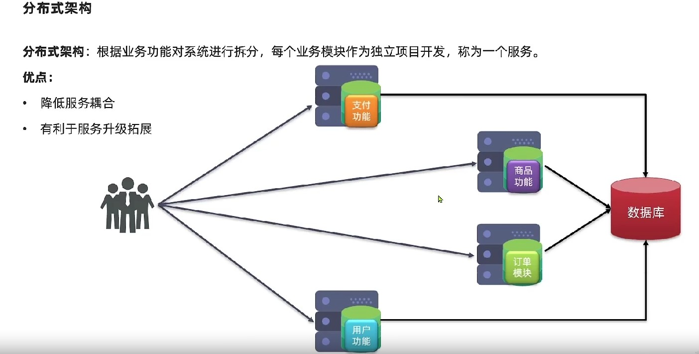
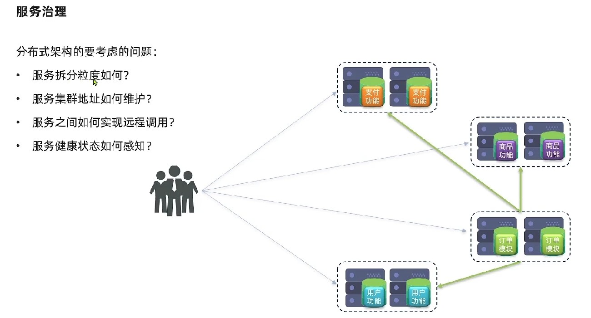
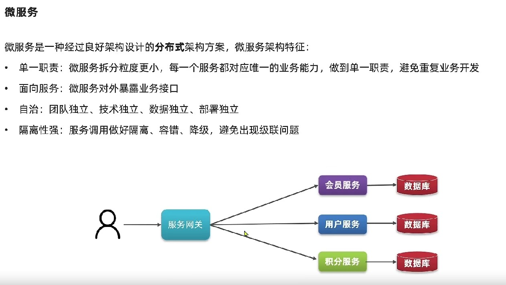

# 1-微服务概述

## 微服务架构

### 微服务实际做的事情

1. 微服务就是将单体应用的模块进行拆分；
2. 模块之间的连接和沟通通过注册中心解决；
3. 配置中心主要对所有服务进行统一配置；
4. 服务网关对客户端请求进行验证，然后路由服务；
5. 分布式缓存主要为解决服务器中数据库读写压力；
6. 分布式搜索引擎可快速智能解决数据库搜索查询问题；
7. 服务在相互调用时会出现链式调用的情况，链路可能会很长。这将导致性能降低，消息队列可以在靠前服务发出请求后以消息的方式通知后续的服务，无需阻塞当前服务；
8. 集群中的日志和链路调用健康还要介入日志和系统链路监控功能；
9. 复杂的服务使用人工去部署会麻烦，还要引入CICD功能；

### 微服务架构

### 微服务技术栈

## 单体与微服务架构

- 单体架构：业务所有功能在一个项目中，作为一个包发布；好处是架构设计简单，部署成本也比较低，面相简单的项目；缺点是业务之间的耦合度高，扩展难度高，如果项目变大那编译和运行时间都会变慢；
  
- 分布式架构：根据业务进行拆分，每个模块作为独立的服务。服务之间相互调用来回去数据；好处是服务之间耦合度降低了，可以进行扩展或者升级，缺点是部署将变得很麻烦，如果需要做集群模式的话还要考虑远程调用和负载的情况；
  
  所以在微服务架构设计中，就要考虑在多个服务相互远程调用并存在集群情况是会出现的问题：
  

微服务是经过良好架构设计之后的分布式架构实现，主要有以下特点：

1. 单一职责：每个模块负责自己的功能，避免出现交叉业务重复开发的情况；好处就是每个业务之间职责更小了，对整个系统的影响就更小了；
2. 面向服务：每个服务都应该对外暴露业务接口，以便于其他服务调用；
3. 服务自治：每个服务作为独立的团队，使用独立的技术和数据，进行独立的部署，不同服务之间耦合度解开；
4. 隔离性强：服务之间会相互调用，所以服务之间还要做好隔离/容错/降级，避免出现级联调用问题；

所有的问题都是为了高内聚低耦合，为了让服务之间能够稳定的实现相互调用。
