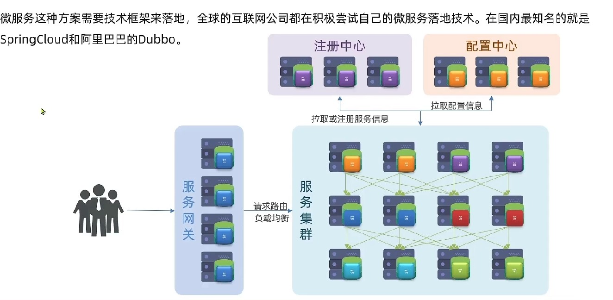
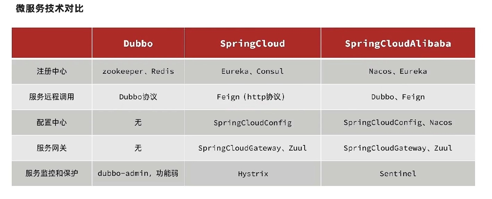
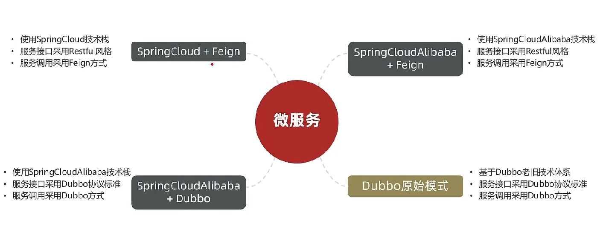
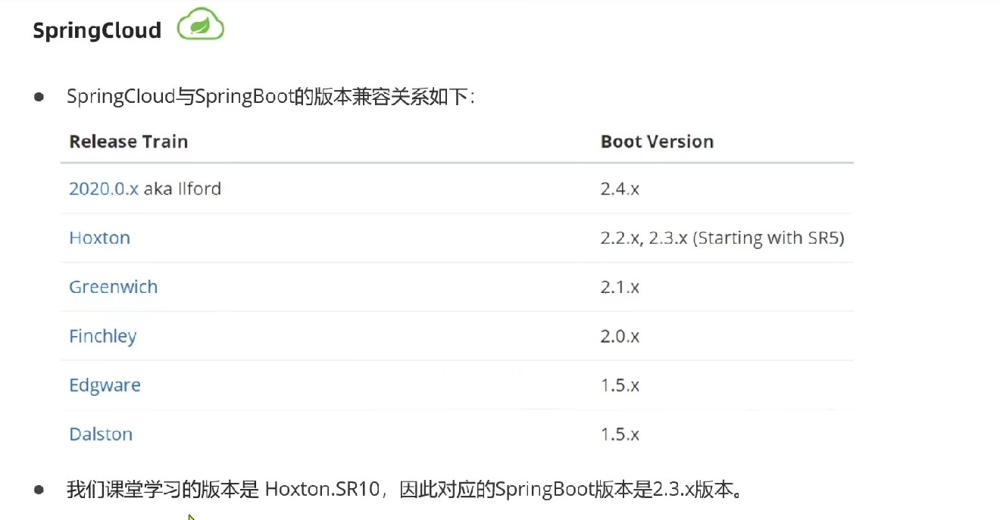
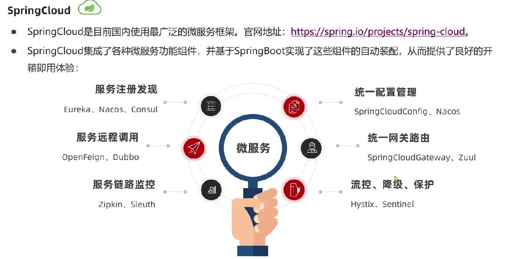
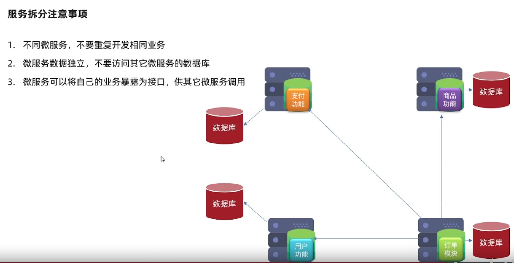
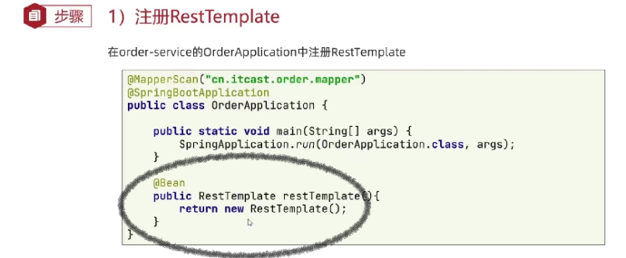
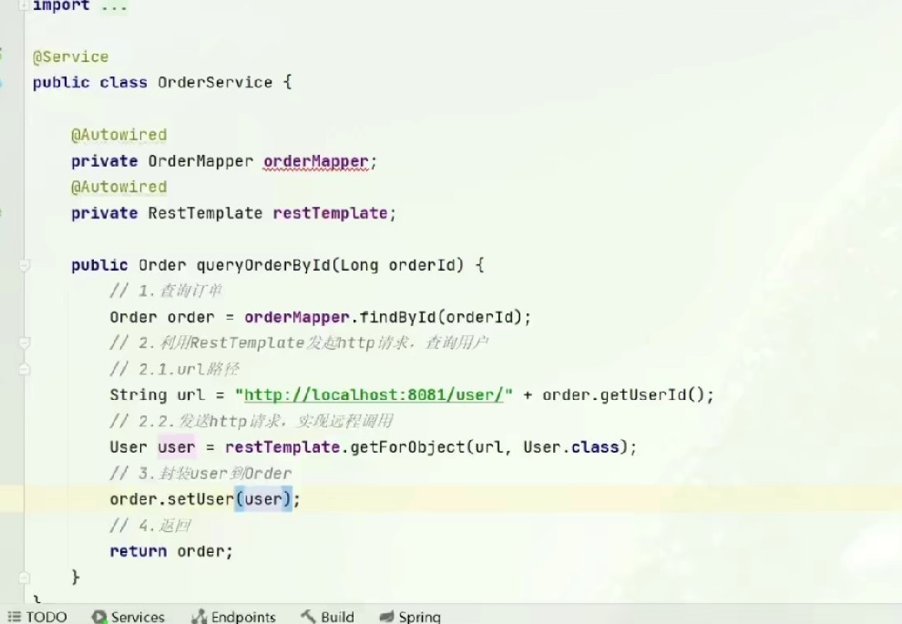

# 2-微服务技术选型

## 分布式架构案例

微服务架构是一种架构思想，具体的功能实现还要有具体的框架技术支持来落地。
无论是哪个框架，都有共同的功能：服务要进行拆分并进行集群，服务之间的交流也通过注册中心来进行交流，所有服务的配置也进行统一的管理放到配置中心，服务网管进行路由和鉴权以及服务保护/隔离/容灾等功能，只是框架的实现方式不同。

**SpringCloud**：并不是一个独立框架，而是一个整合中心，将很多插件和框架通过标准进行整合可方便的插拔。也支持了所有微服务中所需要的所有插件；
**Dubbo**：2012开源，并非是纯粹的微服务体系，主要是用作远程调用，并且注册中心也不是专业的支持。dubbo的远程调用也必须采用dubbo规定的协议，很多现代微服务功能也不够完善；
**SpringCloudAlibaba**：实现了SpringCloud的标准，插入了很多功能组件，兼容原来Cloud的所有框架，并且增强了阿里巴巴的框架支持。兼容性更强，功能性也更强；

在企业中可能会遇到很多的架构方式，因为微服务是由很多的框架组合而成的，他们的组合方式可能不同，但因为Spring制订了微服务整合标准，所以在使用Spring相关的框架时，在应用层面都是差不多的，底层原理方面可能有所不同：

## SpringCloud Alibaba

SpringBoot支持自动装配，SpringCloud也借助此特性将更多的框架进行了整合。

## 服务拆分与调用练习

服务拆分注意，微服务拆分的目的就是解耦合，也就是单一职责，并且每个服务的数据都是隔离的，每个微服务都负责自己的业务和数据，不同的微服务不能重复的开发功能。
例如订单涉及支付和商品数据，那也不能在订单中存储商品和订单相关的数据也业务。
那如何才能在不同的服务中获取不同的数据呢，就要借助暴露接口的方式来进行获取。

在每个服务中，都有对外开放的http接口，所以只要在另一个服务中进行接口访问就可以了。
Spring提供了RestTemplate工具发送http请求，首先要在容器中创建对象（下文在启动类中进行了对象创建，也可以用外部的配置类实现）：

上文中的远程调用代码与语言和技术无关，因为只是一个http服务调用的过程。