# 3-Eureka注册中心

## 服务提供者与消费者

每个服务可能是服务提供者也可能是服务消费者，这两个概念来源于一套代码调用中哪个服务被调用和哪个服务主动调用其他服务。
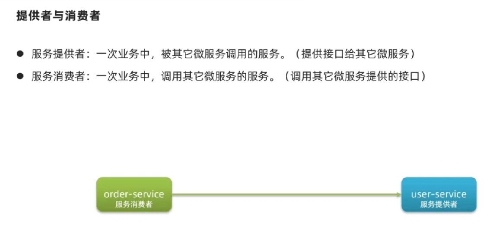
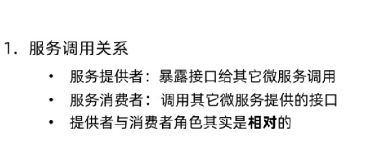
服务提供者与消费者只是两个服务之间调用关系的区分，无论多长的调用链，提供者与消费者也仅仅是两个服务之间的关系，而与其他服务无关。

## Eureka注册中心

上文通过rest进行IP访问的时候，服务访问路径都是硬编码到项目中的，并且在服务进行集群化部署的时候，具体服务的访问也将成为问题，再就是如果提供者如果出现宕机或者延迟的情况如何进行判别，并防止后续请求再次请求不健康的服务，那就讲存在以下问题：
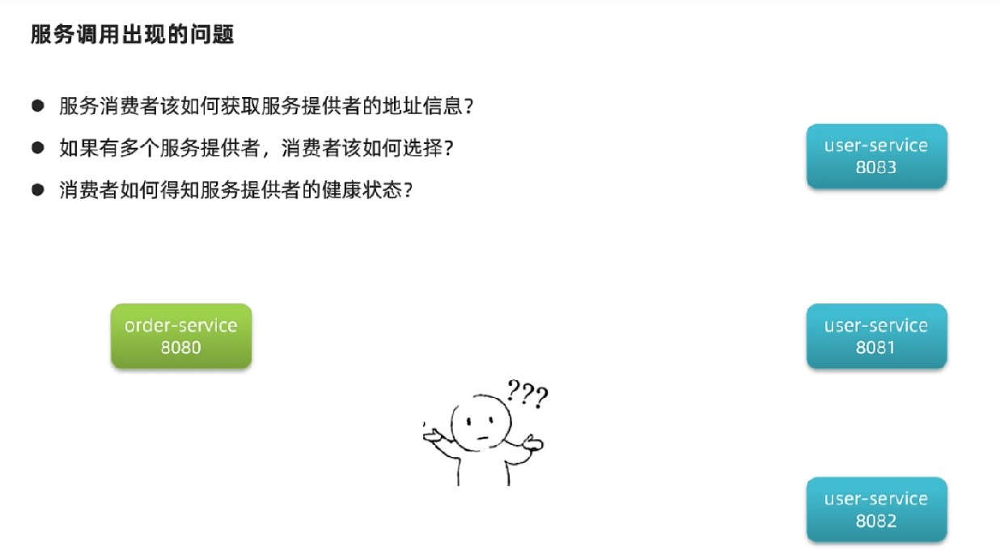

Eureka的架构分为两个方向，一个是服务端，一个是客户端，客户端包含所有服务，无论是提供者还是消费者还是集群内的服务。
每个服务在启动之后，都将会提供给注册中心个人信息，当消费者希望访问一个提供者时，也将从注册中心获取对应的提供者的信息列表（集群就是列表），然后自己决定访问哪个节点，再进行远程的访问。
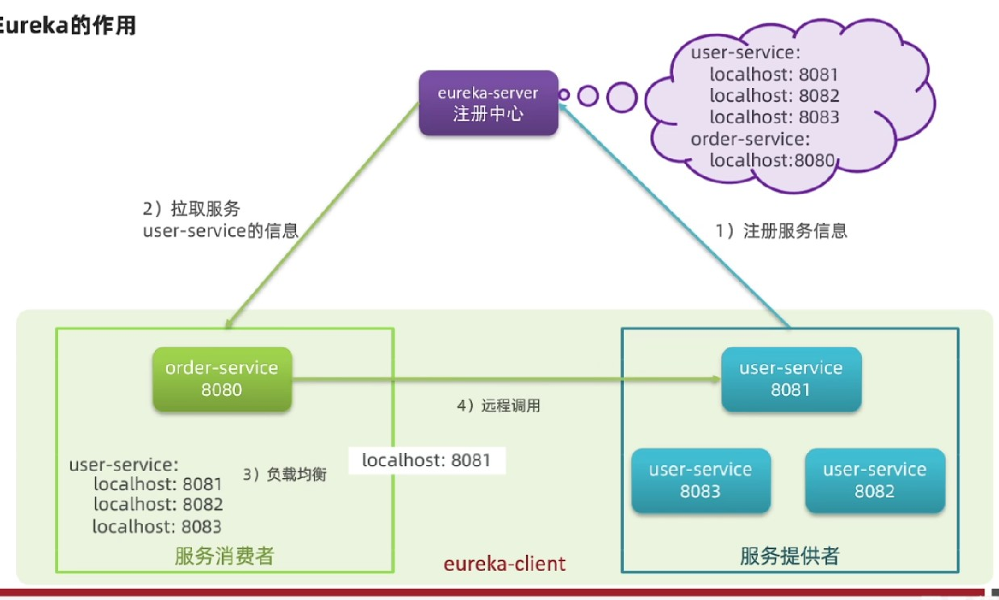
每个客户端都会30s发送心跳给注册中心，如果心跳没有了，注册中心就踢出此客户端，这也就保证服务是否健康了。
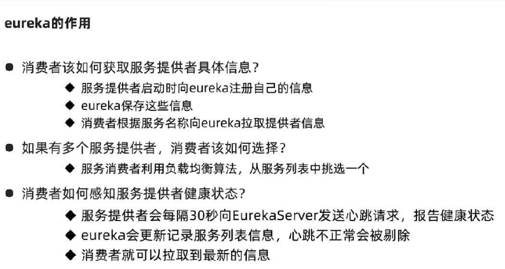
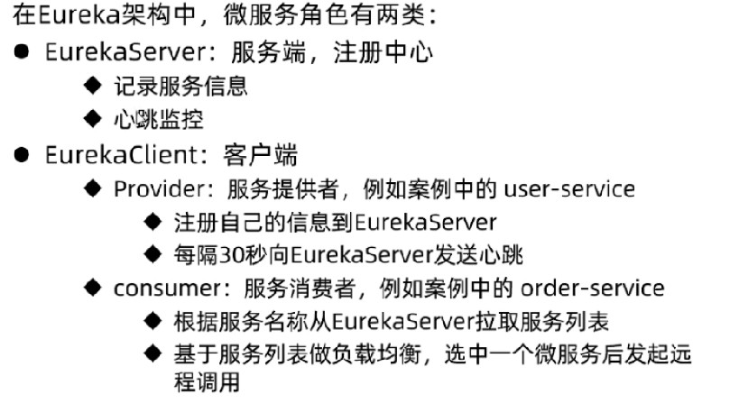

## 搭建练习

### 服务端的搭建

创建新的项目并引入Eureka的服务端依赖，然后再配置文件中规定当前服务端口/名称（application.name）/注册地址（defaultZone）：
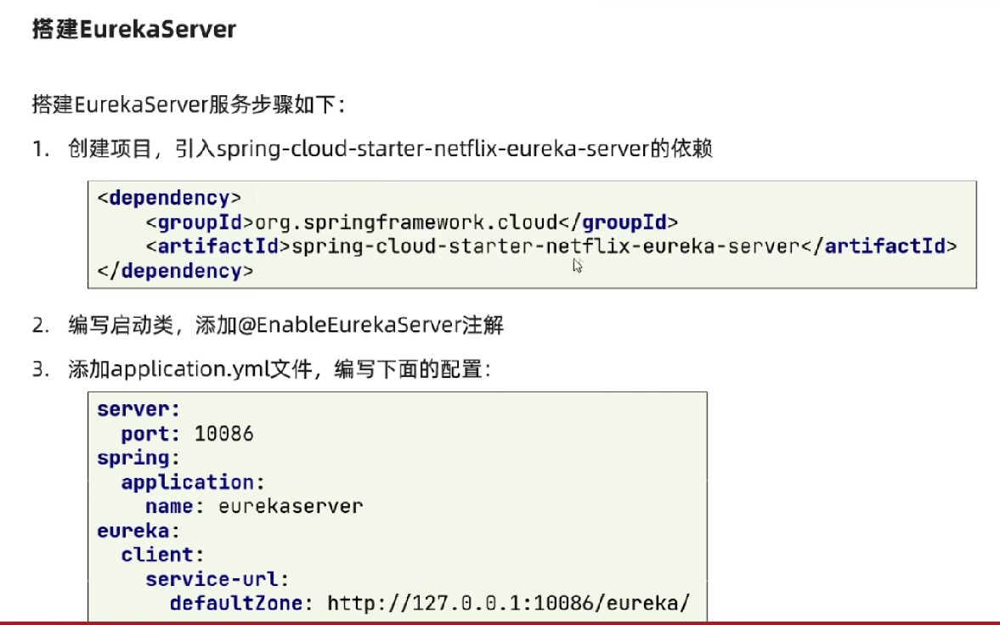
然后创建启动类，并添加服务端自动装配注解：
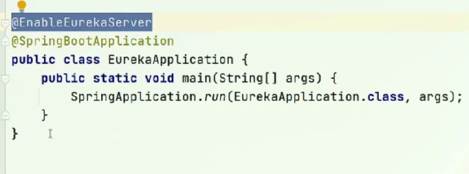

配置文件中，服务的名称也就是微服务的名称，并且Eureka服务也是作为一个微服务注册到自己或其他Eureka上，这方便了未来注册中心集群部署。
注册地址也就是当前Eureka服务注册到哪个服务上去，因为当前服务是唯一的主服务，所以就注册到自己就可以了。
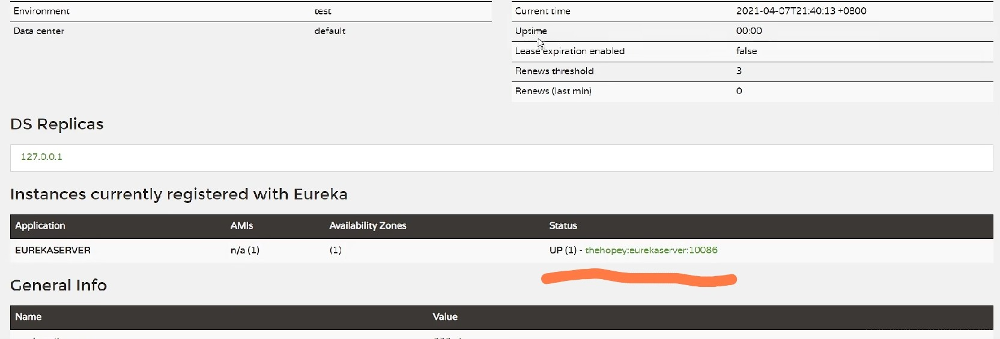
访问端口就会获取到Eureka的后台，UP 表示正在活动的服务数量，后面就是服务的IP和端口，在Windows中显示的是计算机名称。

### 微服务注册

创建一个服务注册到Eureka服务端只需要两步，引入客户端依赖然后配置服务端地址即可进行注册：
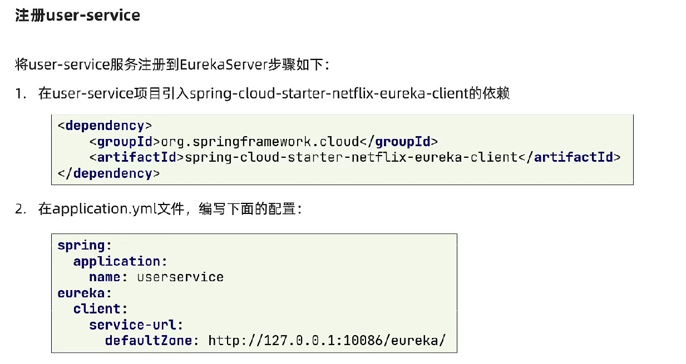

在服务中心注册多个服务之后，将从列表中看到所有服务列表集状态：
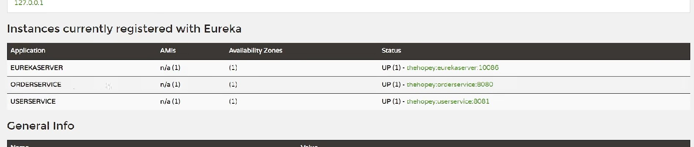

同一个服务可以多次启动，修改端口配置方式：
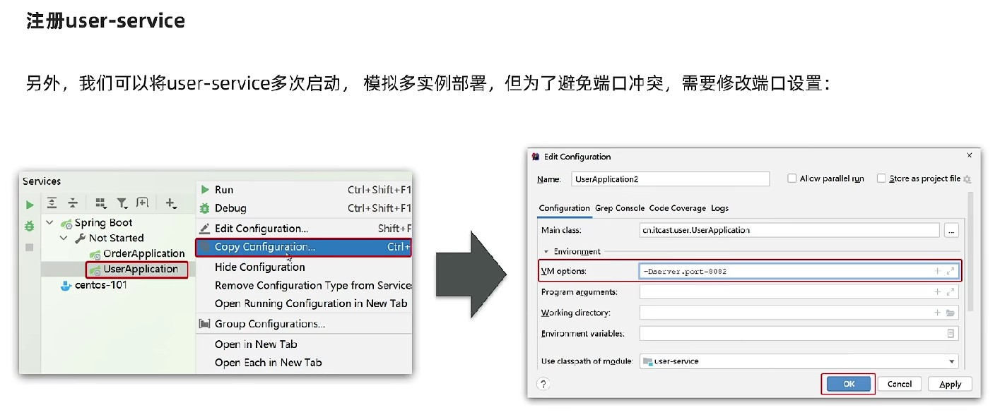

同一个服务多次注册效果如下：
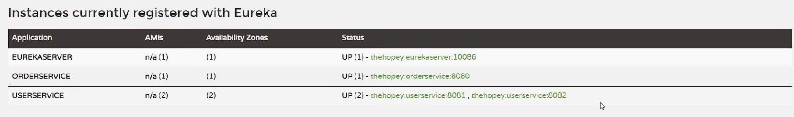

### 服务发现

服务发现就是从Eureka中获取到服务提供者的列表，将此前rest框架访问的IP和端口替换成服务名称进行访问：
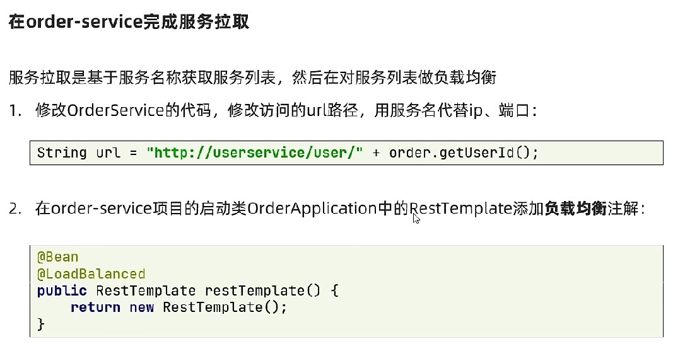

因为在拉取到一个服务信息时获取到的是列表，所以还要做负载均衡：
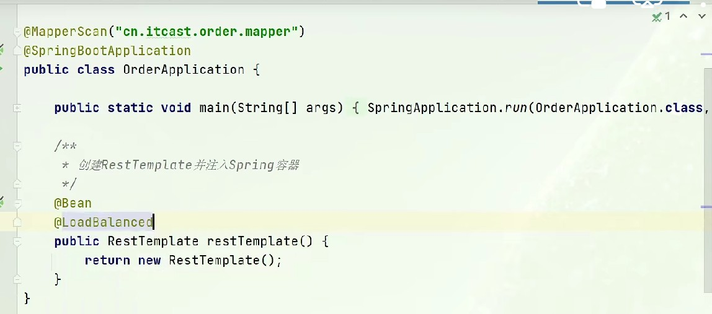
默认情况下，ribbon将采用轮训的方式进行多个服务的负载均衡。