# 4-Ribbon负载均衡

## 负载均衡原理

在刚刚进行远程调用的时候，实际上进行了服务拉取，然后负载均衡访问了服务提供者来获取的数据。
在消费者方使用的链接是无法直接访问的，而是由ribbon进行解析然后进行负载均衡和远程调用来获取的真实地址进行的访问。
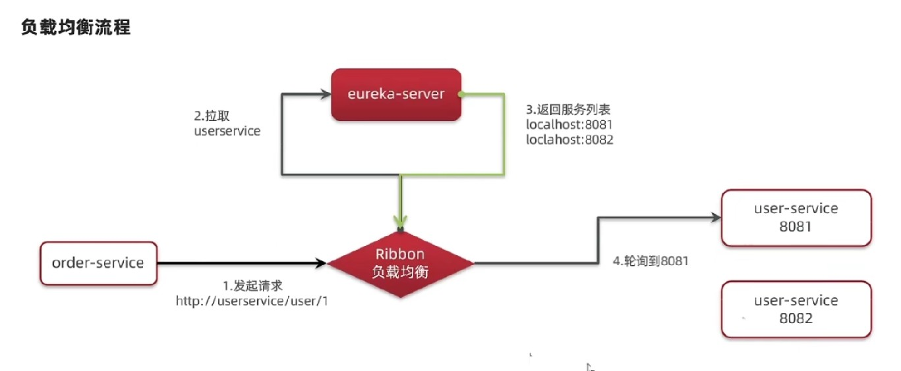

实现负载均衡的类是LoadBalancerInterceptor，负载均衡拦截器：
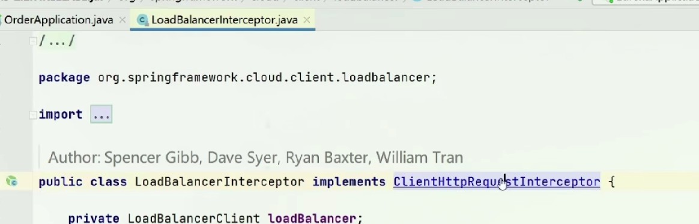
LoadBalancerInterceptor继承了ClientHttpRequestInterceptor，也就有了拦截http请求的能力，通过此类进行对路径的拦截和解析：
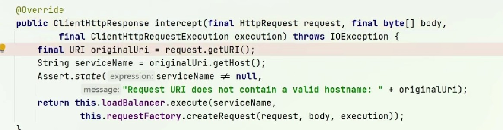
intercept方法是实际执行拦截的方法，方法中获取到Host也就是服务名称之后，进入Eureka获取服务拉取。
其中loadBancer的excute方法就是来自RibbonLoadBanlancerClient对象，进入此方法可以看到：
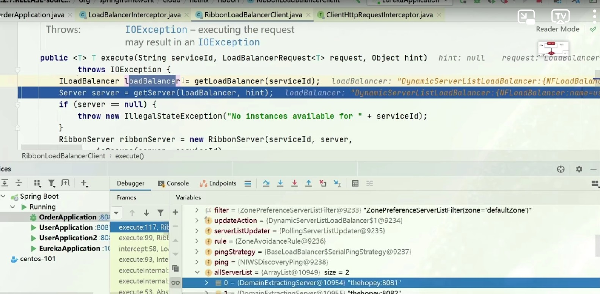
对象中loadBanlance方法经过getLoadBanlancer方法之后，获取到了loadBanlance对象，其中allServerList中就包含了所有的服务实例也就是服务列表。
也就是说getLoadBanlancer方法就是从Eureka获取服务列表。
接下来getServer方法就是获取一个实际的服务实例来进行调用，也就是实际的负载均衡的方法。

## 负载均衡策略

### 原理与默认策略

根据getServer方法后，在BaseLoadBalacer类中可以看到通过rule选择到了一个服务，rule对象为IRule类型：
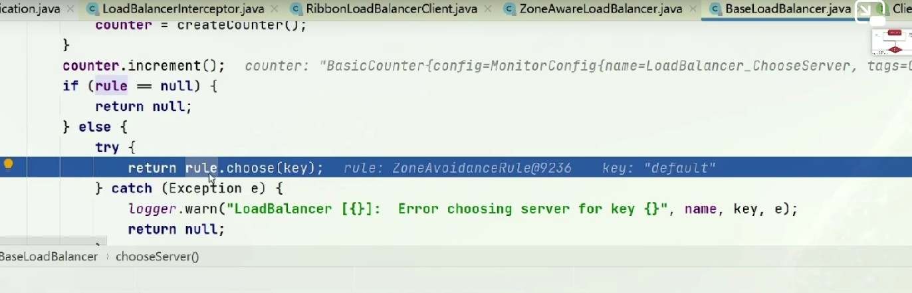

IRule接口有很多的实现类：
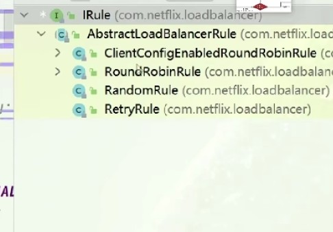
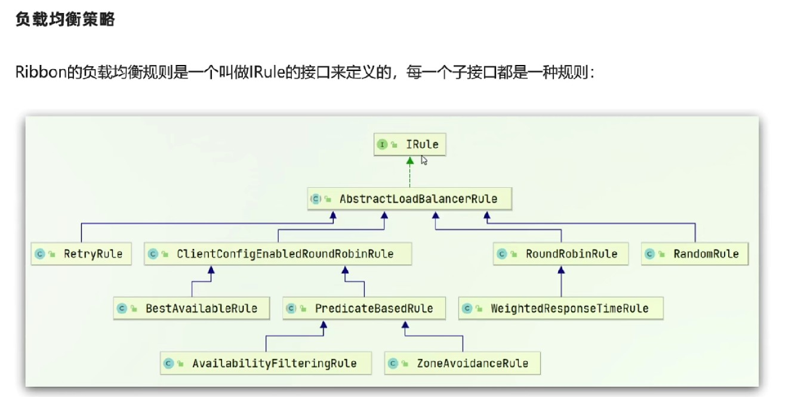
其中random是随机的意思，round robin是轮询的意思。
ribbon默认的Rule是ZoneAvoidanceRule，其上级采用的是轮询的机制，所以ribbon默认采用的是轮询机制。

所以ribbon的实际运行流程就是：
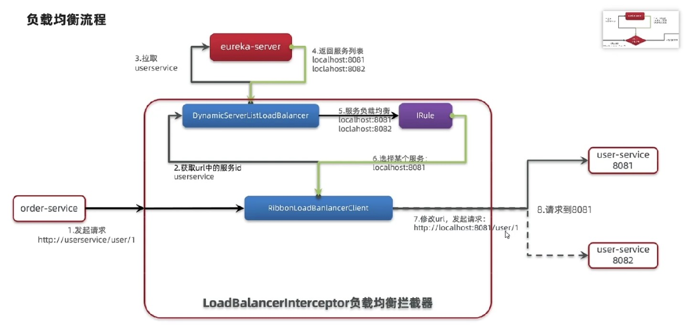

### 配置负载均衡策略

负载均衡策略：
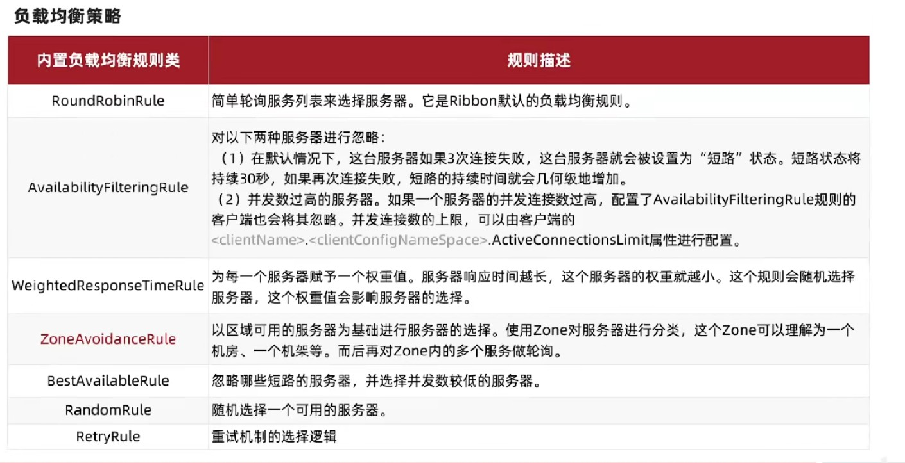

配置负载均衡规则的第一种方式就是IOC一个IRule类型的实例，然后返回指定类型的Rule实现类即可：
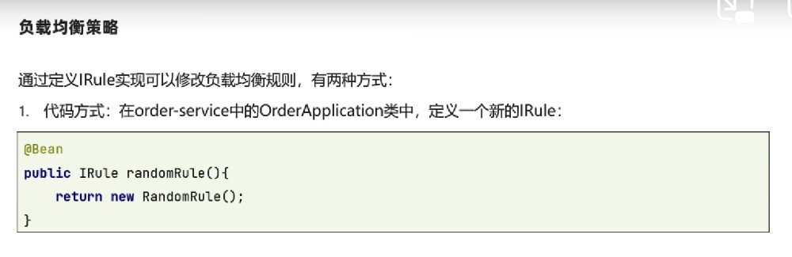

第二种是采用配置文件来完成，需要指定对哪一个服务进行哪种负载均衡策略：
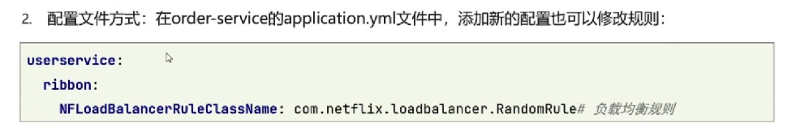
在代码中书写配置类无法在运行中进行更改，但是配置文件的方式是可以的。使用配置类是对所有发出的服务获取的服务列表进行统一管理，使用配置文件的方式是对某一个服务进行管理。

### 饥饿加载

默认每个服务的负载均衡实例是在进行服务调用的时候创建的，可以将其设定为启动项目创建。

如果不配置饥饿加载，在控制台中也能看到加载实体类的日志，是在第一次访问的时候创建的：
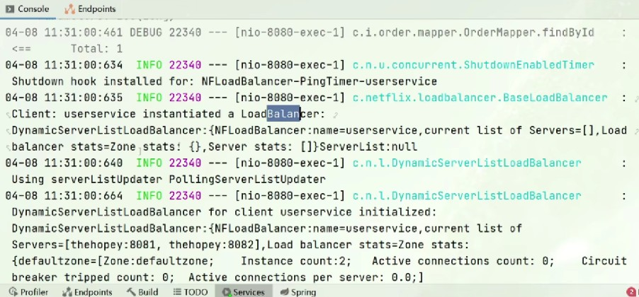

进行饥饿加载配置很简单：
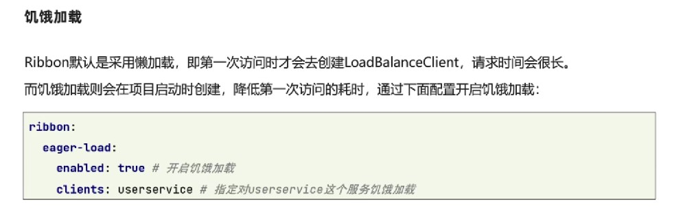

如果要对多个服务统计进行控制，则可以指定集合：
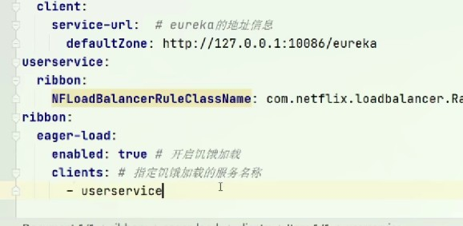

指定饥饿加载之后，启动项目后就会针对服务进行负载均衡实例创建。

小总结：
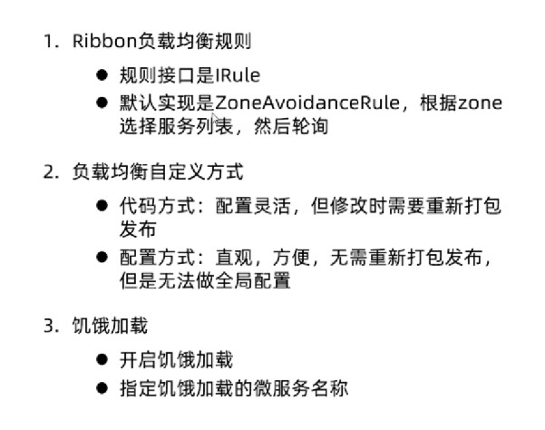