# 5-Nacos注册中心

## 简介

nacos是阿里巴巴的产品，是spring cloud的组件，nacos不仅可以作为注册中心，还可以做配置中心：
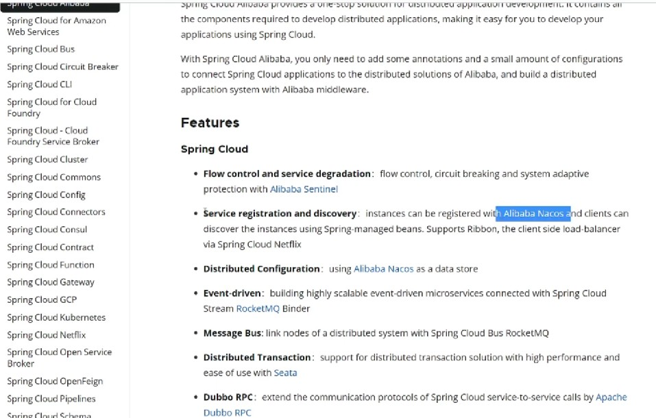

spring cloud commons组件提供了组件规范，也就是说进行依赖修改之后再进行配置就可以完成集成：
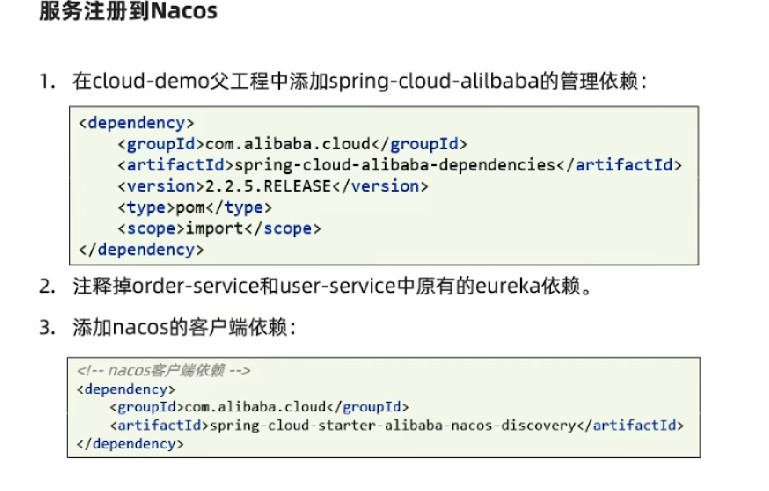

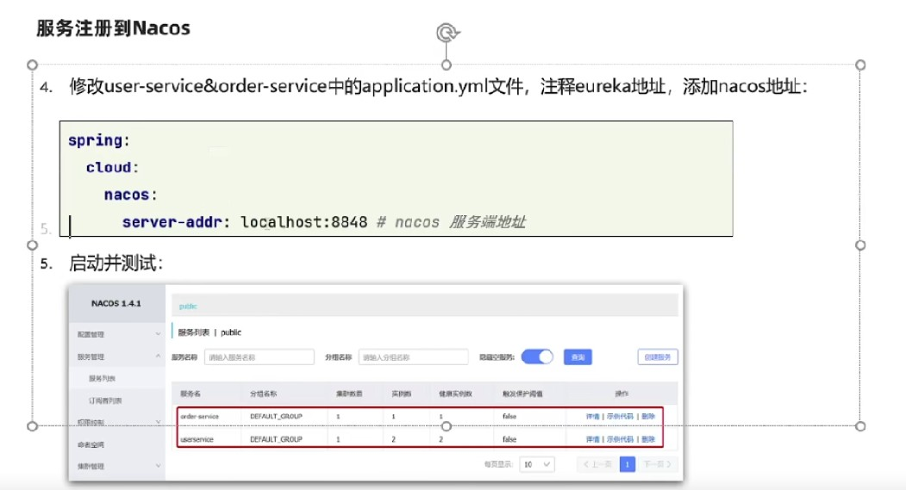

在经过上文操作之后，直接可以用消费者访问提供者即可。

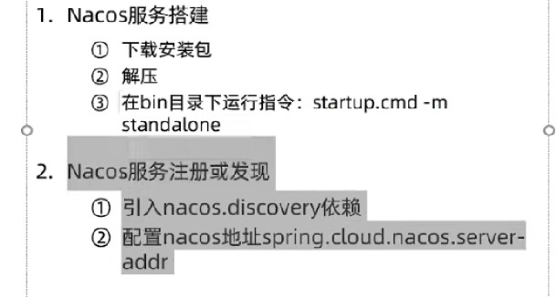

## 服务多级存储模型

多级集群也就是加入了地域模式，每个地区叫做一个集群：
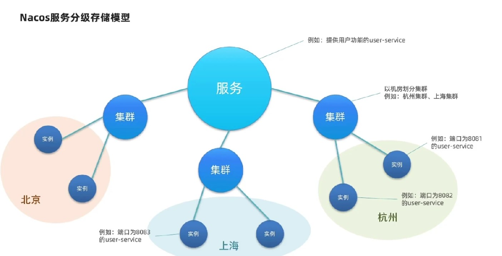

本集群内的访问是快速的，只有本地集群无法访问才去跨集群调用：
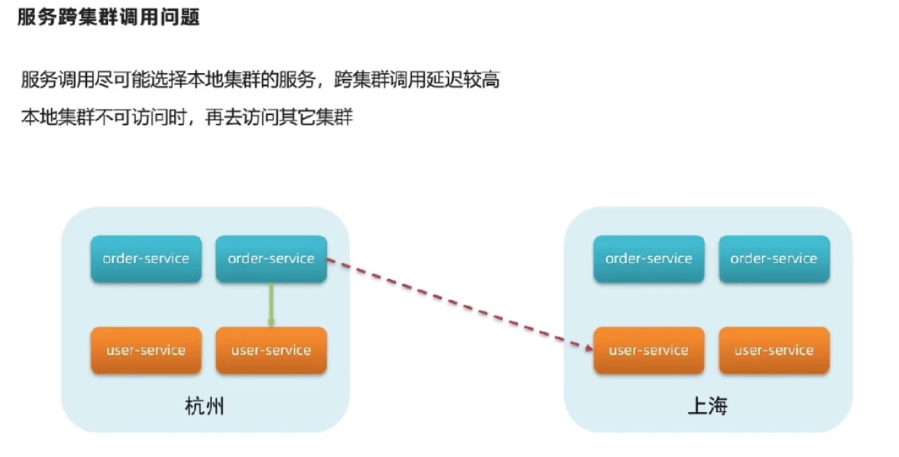

默认所有实例都在DEFAULE集群中，可以通过配置来实现对实例所处集群的修改：
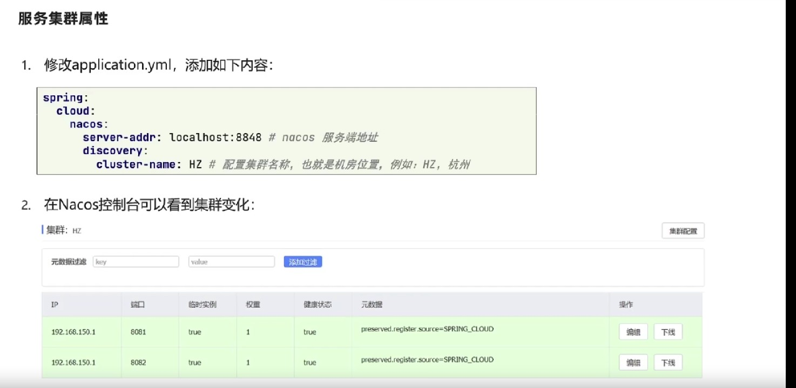
集群的名称是自定义的。

集群配置后效果如下：
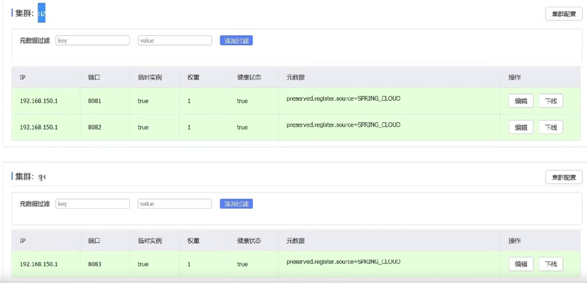

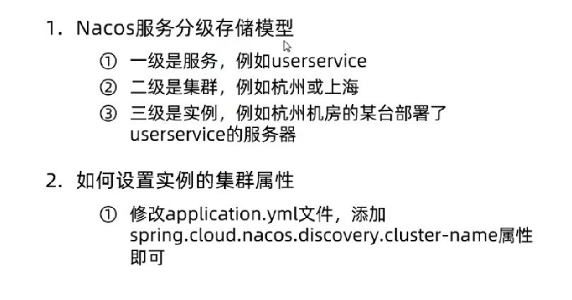

## 负载均衡

### 配置集群负载均衡

nacos调用集群内的服务提供者会更快，所以消费者也应该配置集群名称；
集群负载均衡方案也是通过ribbon来实现的，要通过nacos的负载均衡策略来实现：
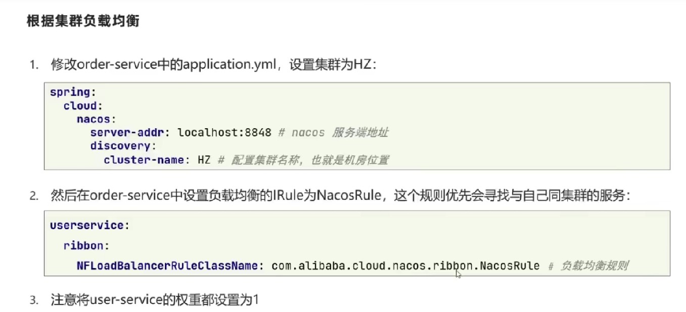
nacos rule优先选择本地集群，然后随机选择实例进行访问。

如果跨级群访问了请求，就会在消费者控制台中显示警告：
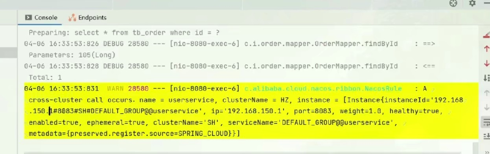
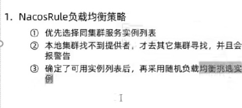

### 权重负载均衡

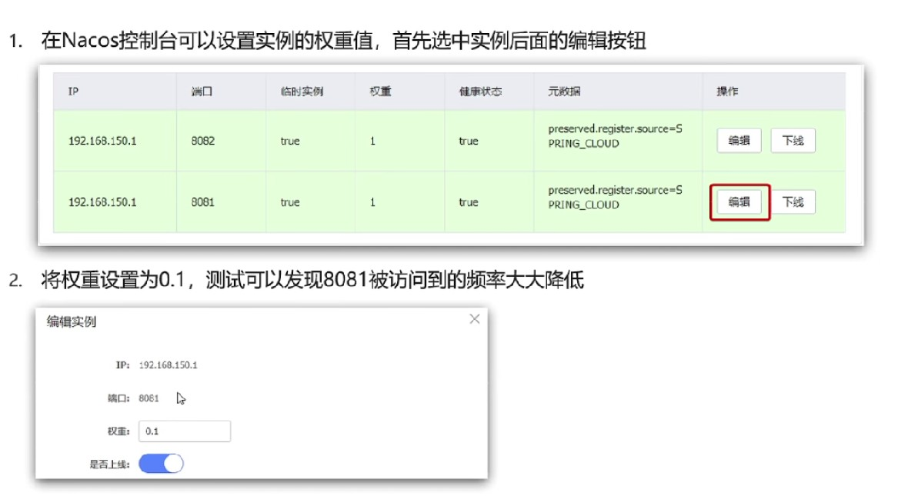
权重一般在0－1之间；借助权重就可以实现灰度发布的功能；

## 环境隔离

服务划分和实例划分是从地域和业务方面的划分，namespace是根据环境不同，例如生产环境和开发环境的不同就要相互之间隔离数据和配置:
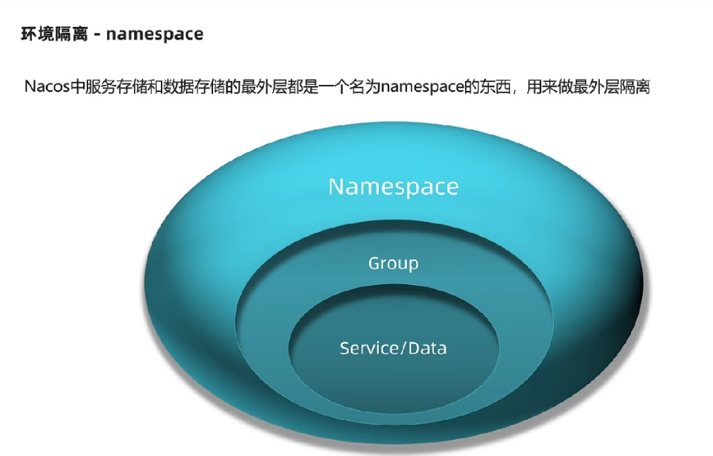

所有的服务默认都在defalut group，也都在public 空间内:
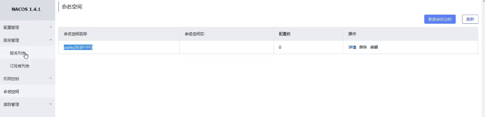

创建新的命名空间，然后在配置文件中进行配置：
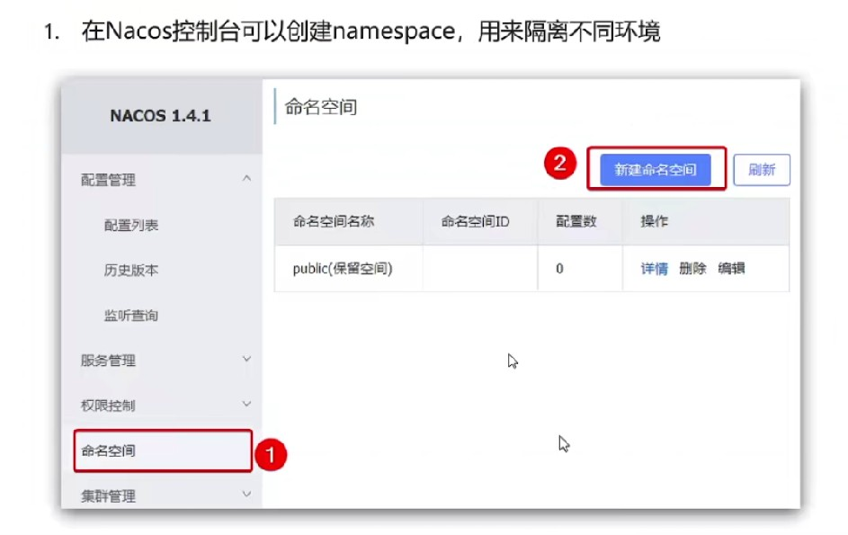
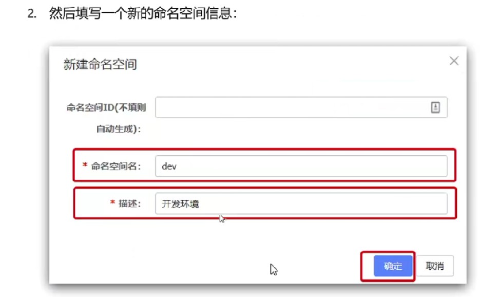
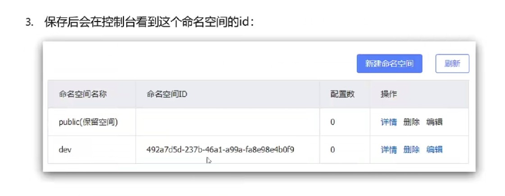
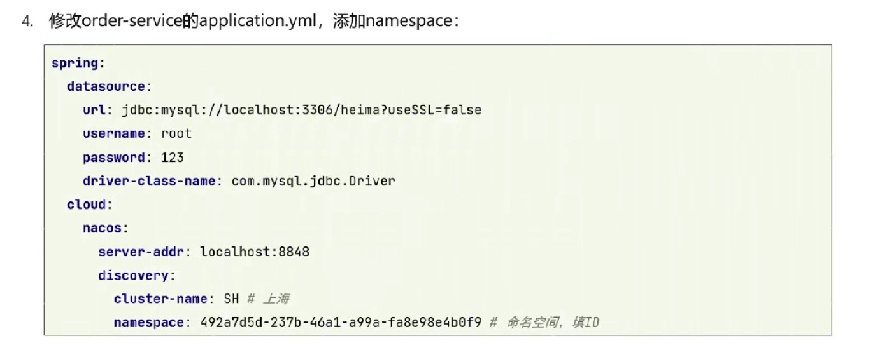
注意配置文件中填入的是命名空间的ID。不同的命名空间是绝对隔离的，无法相互之间访问。

## Nacos与Eureka的区别

### 列表拉取策略

每一个服务进行注册的时候都会将数据提交到注册中心，消费者每次请求都会拉取提供者的列表，但是Eureka不会每次都拉取最新的数据，这样可以减缓Eureka的压力，主要缓存在ribbon的对象中。
Nacos与Eureka都会每30s去拉取一次服务列表，以解决某些服务宕机导致无法访问的问题。

### 临时实例

nacos分为临时实例和非临时实例，默认所有的服务都是非临时实例。
临时实例也会采用心跳的方式进行提交信息，非临时实例nacos不会做心跳，会nacos主动的检测服务是否健康。临时实例宕机之后会直接在列表中去除，非临时实例宕机后并不会在列表中去除，而是在列表中提示实例出现问题。
nacos在发现服务宕机，会主动推送给所有服务消费者信息，而Eureka不会主动推送实例健康信息。
ephemeral表示此实例是否为临时实例，默认为true：
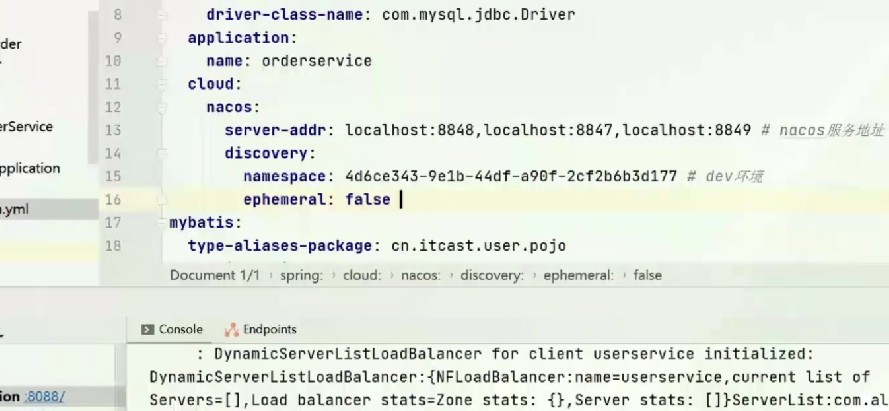
当非临时实例出现问题之后，列表中仍然存在此实例信息，只是健康状态变成了不健康状态：
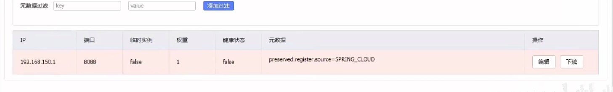
能够看到，实例状态变成了非临时实例，并且健康状态为不健康，但并不会从列表中删除实例信息。

### 高可用与一致性

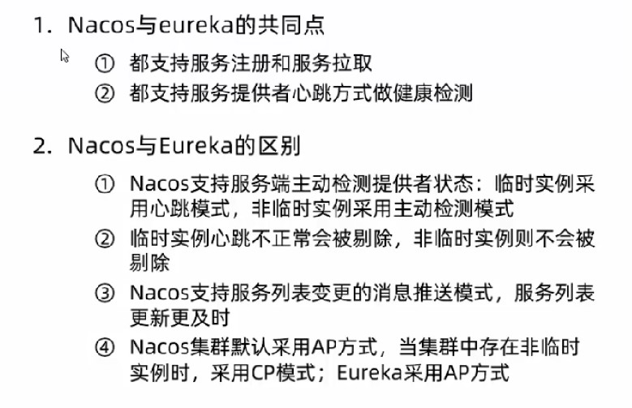

AP：强调服务的可用性
CP：强调数据的可靠性和一致性