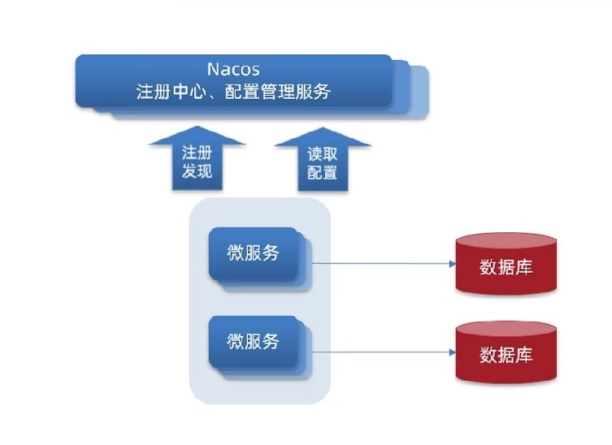
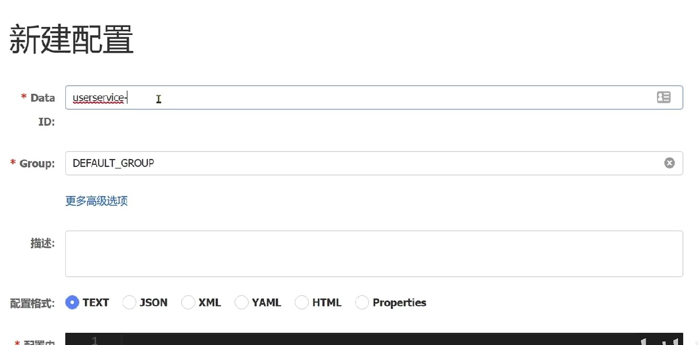
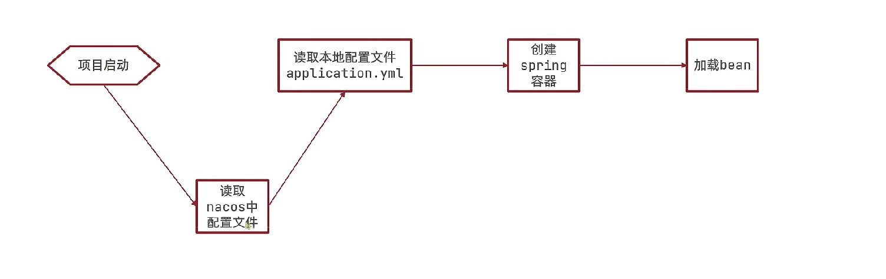
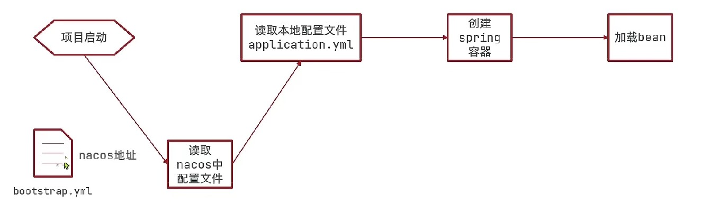
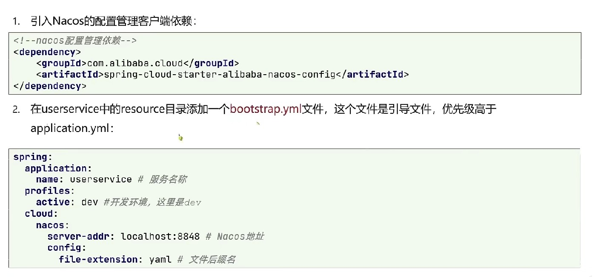
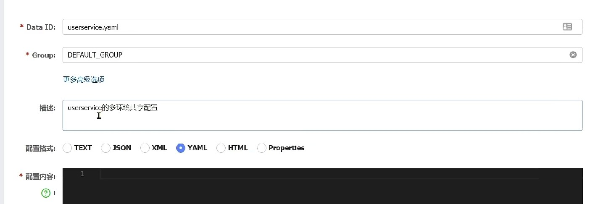
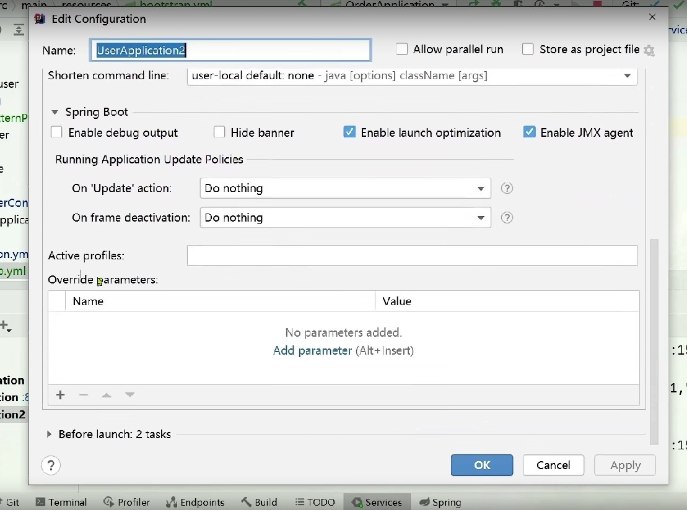
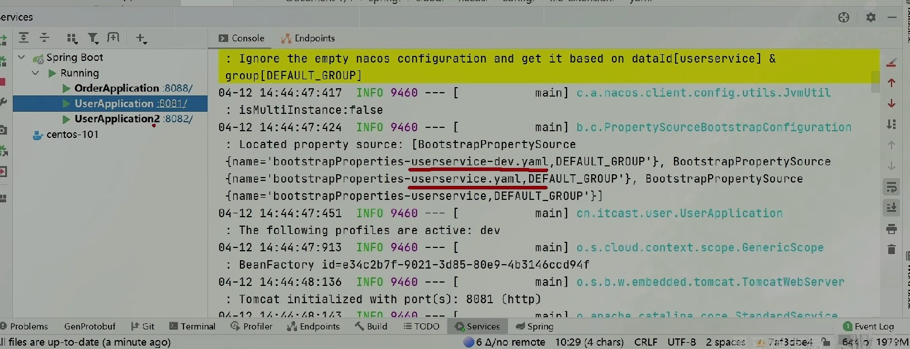

# 6-Nacos配置中心

## 配置中心

注册中心注册的服务可能达到很多，每个微服务的配置都要单独设置，配置完成之后都要重启启动。
需要一个配置管理服务统一管理所有服务的配置加上本地的配置进行结合来使用。并且每个配置修改之后还要完成热更新情况，这样无需重启服务即可更新配置。

## Nacos应用

### 创建配置

进行新建配置时，每个data id不能重复，如果重复将导致配置冲突：

ID命名时通常叫做 服务名-运行环境.yaml：

分组可以用在默认环境中，描述是中文的描述，配置内容中主要写开关类型等经常更换的配置项。

### 启动流程与实践

进行项目启动的时候，会完成如下的流程：

但是现在nacos的地址放在了application配置文件中，所以理应nacos中的配置是无法提前感知到的，所以就要用到boostrap配置文件。bootstrap配置文件的优先级高于application，可以讲nacos的地址配置到bootstrap中提前进行nacos读取，然后再读取application进行整合：

其中服务名称/开发环境和配置文件后缀名就能定位到nacos的配置。

验证是否可以应用配置中心，通过@Value注解获取配置中心的内容进行读取。

## 配置热更新

配置热更新方法一：在@Value注解所在类上添加RefreshScope注解：

配置热更新方法二：通过配置类：

使用这种方式，prefix所表示的是前缀，属性名则表示前缀后面的内容。通过这种方式可以将配置参数注入到实例中以供调用。

在使用的时候，要对配置类进行注入，然后采用get方法进行属性内容的调用。

小总结：

## 配置共享

配置共享在多个环境运行过程中都会用到，那就可以一套配置在多个环境中同时使用。

微服务启动的时候会读取多个配置文件：

1. 上文所属的通过服务名/环境/后缀组成的配置文件;
2. 由服务名/后缀名组成的配置文件;
   也就说，第一种配置文件是分环境的，第二种是分服务的，所以对于第二种配置文件，无论环境如何服务都讲读取此配置文件。
   
   

对于项目运行环境的更改可以在项目配置中修改Active profiles进行修改，这样就就无需修改配置文件即可：

控制台中也会看到项目启动主要读取了几个配置文件：

**优先级**
当同一个配置项在本地/环境/环境共享都有配置时，本地会被共享环境覆盖，共享环境会被环境配置覆盖。
也就是本地配置优先级最低，远端较高；远端中精确配置高于共享配置。

