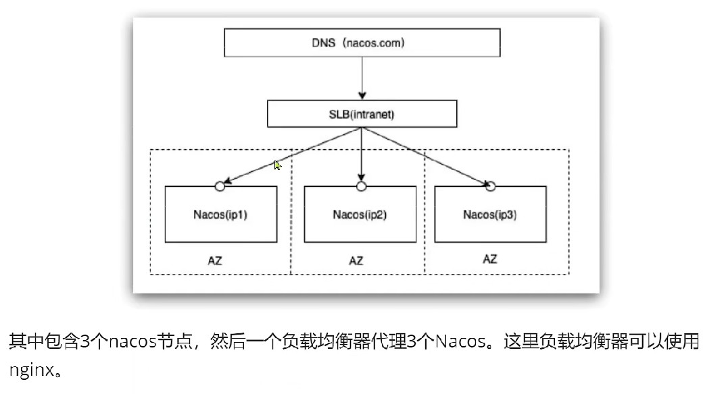
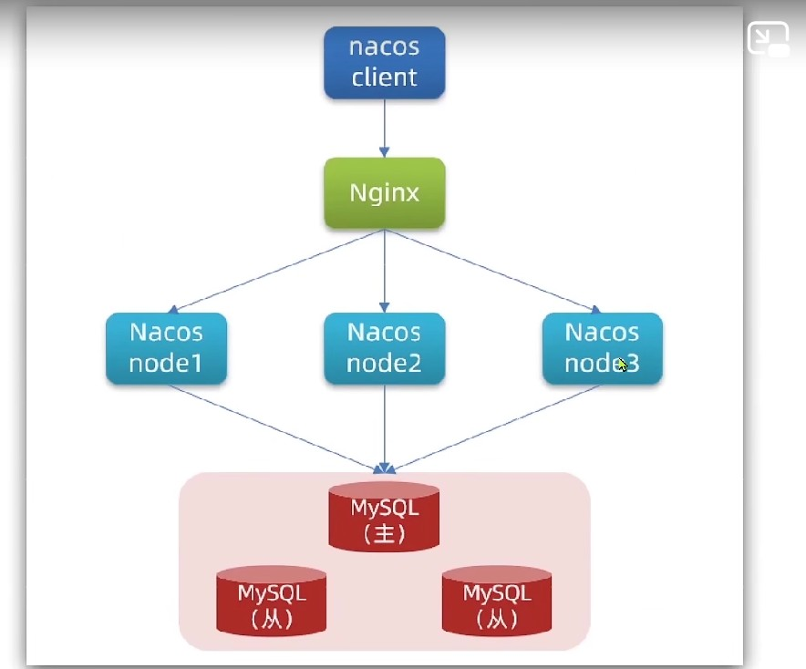
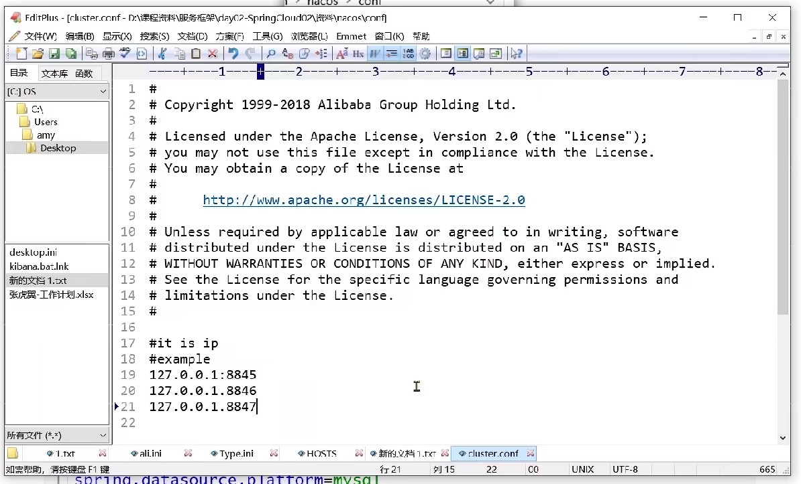
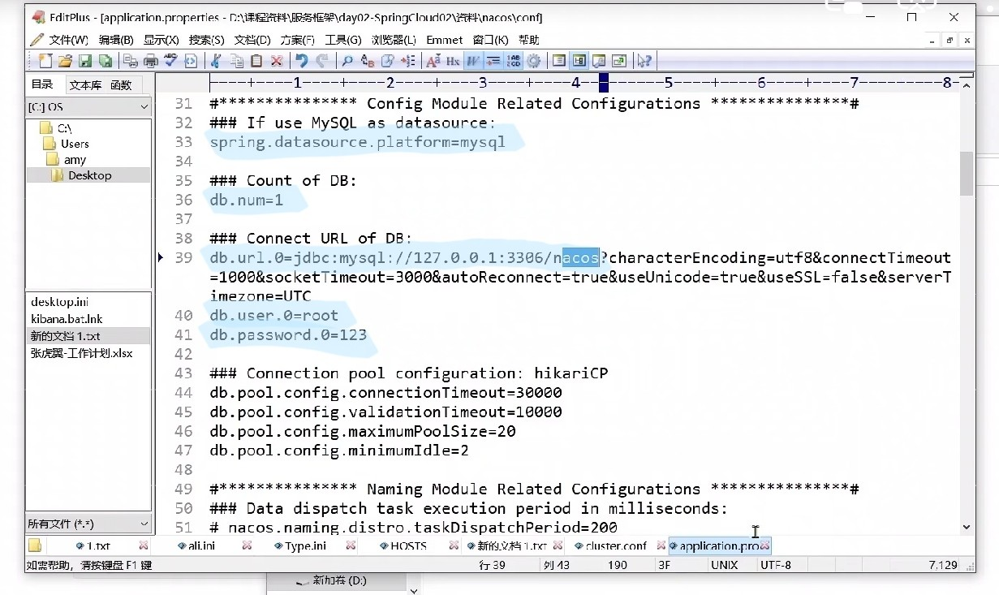
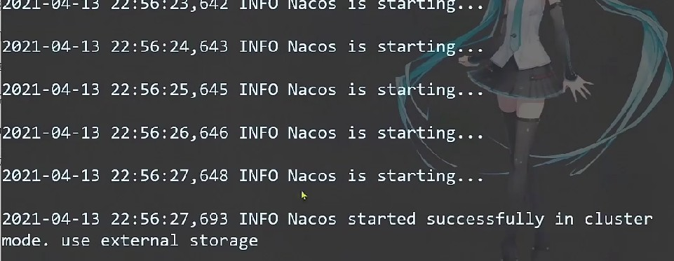
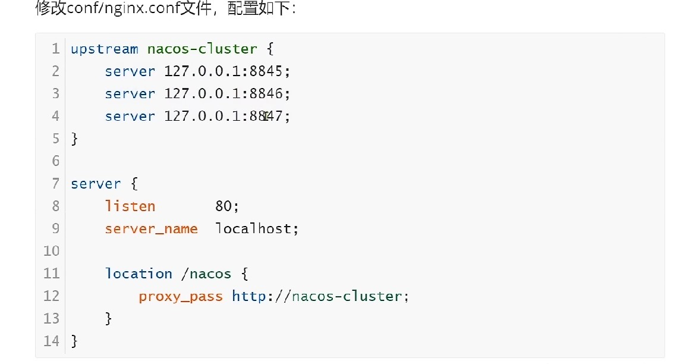
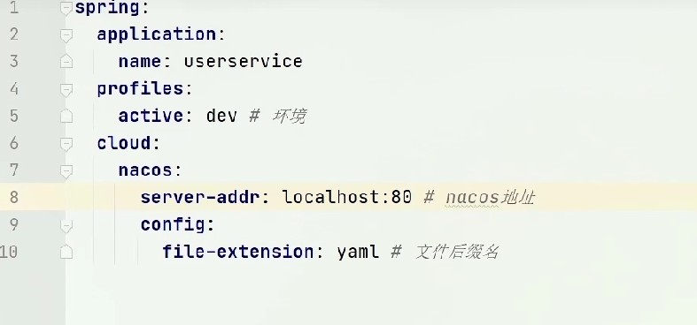
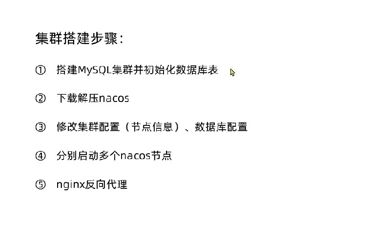

# 7-Nacos集群

## 流程

企业中要求高可用，所以nacos通常为集群方式搭建：

SLB表示负载均衡器，可以是nginx进行负载均衡，分发请求到其他的nacos：

为了解决数据共享问题，数据库是同一个服务，使用数据库集群的方式来完成。

## 实践

之前启动nacos提供－m提供的参数表示单机启动，集群模式就不添加参数直接运行即可。

nacos下载的安装包中提供的sql文件可以直接运行到mysql数据库中；
将nacos的cluster.conf.example改成cluster.conf，在其中配置所有节点的内容：

然后在Nacos的application.properties中修改数据库连接信息：

如果单机运行多个nacos，那还要在application.properties中将端口更改为不同的；
出现以下控制台则表示nacos在集群模式下启动成功：

修改nginx配置文件：

那在项目配置文件中的nacos server addr就配置成nginx所开放的端口：

nacos集群模式下会将数据都存储到时数据库中。

小总结：
