# 8-Feign远程调用

## 简介与安装

RestTemplate方式存在的问题：
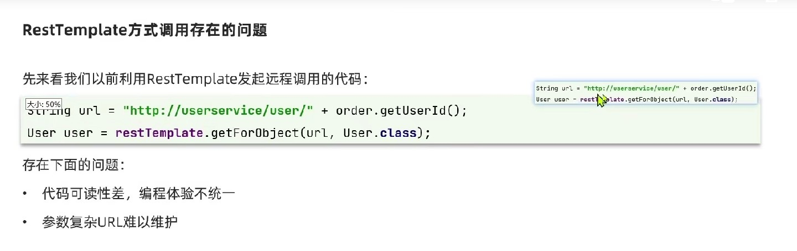
feign是声明式的，也就是制定规则后简单进行调用即可完成请求发送：
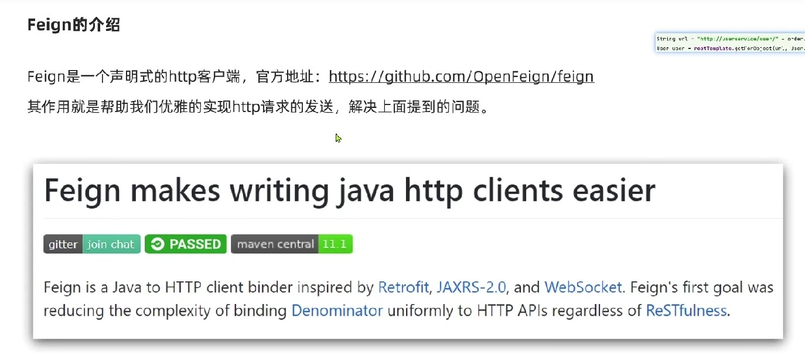

feign使用方式分三步：加入依赖，添加配置，添加声明：
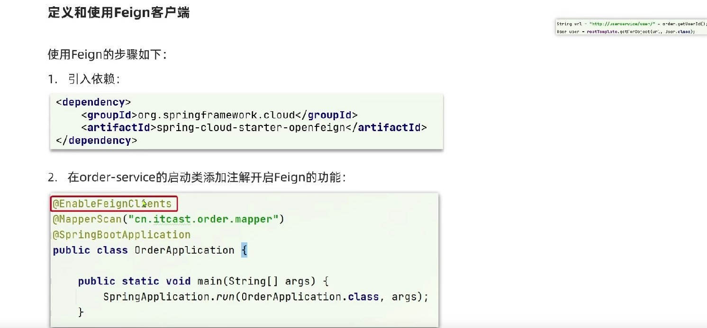

## 远程调用

feign client表示针对哪个服务进行调用，http接口方法的参数与SpringMVC相同：
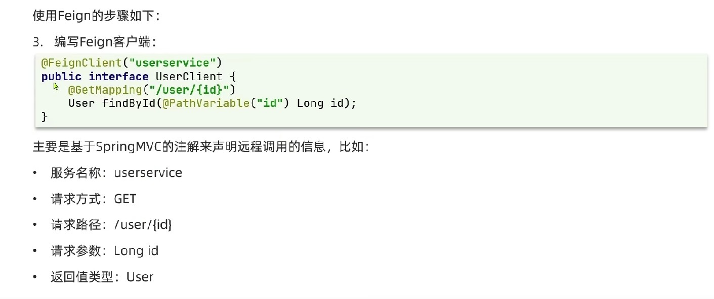

采用feign进行调用的语法如下：
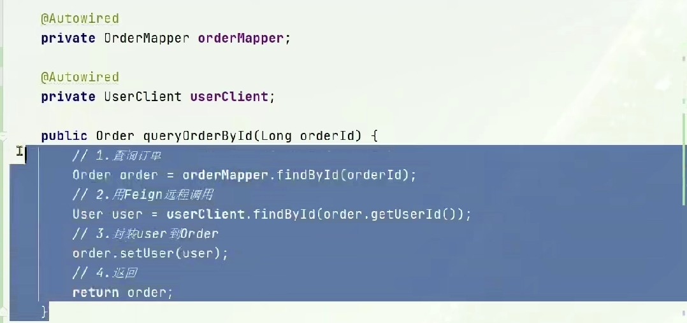

小总结：
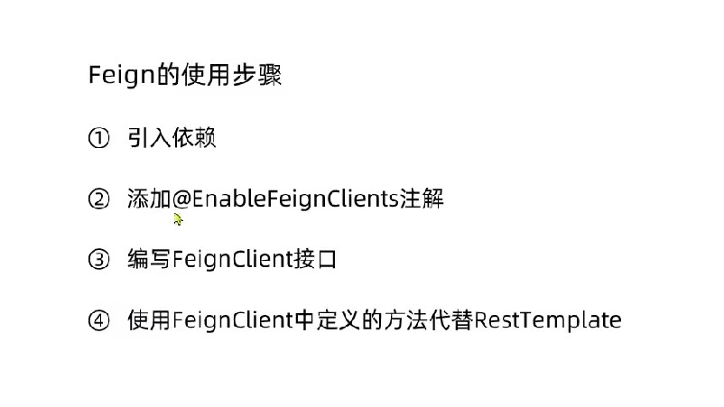

## 自定义日志配置

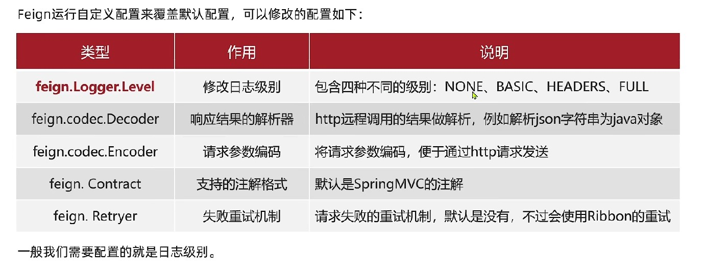

日志等级信息，默认是none，也就是没有日志：

- basic：基本信息，发送时间/结束时间/耗时
- headers：基本信息+请求头信息
- full：基本信息+请求头信息+请求体+响应体

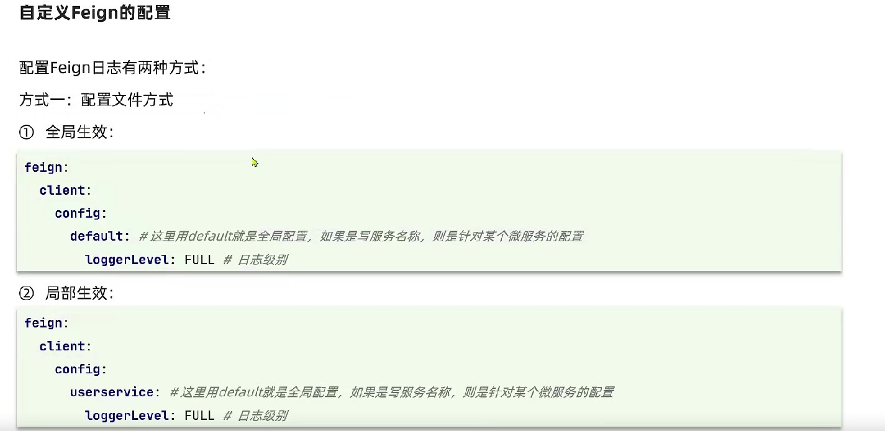

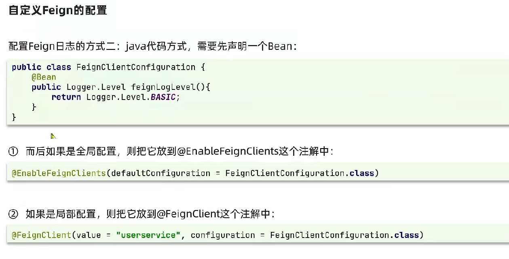

## 性能优化

feign虽然是声明式的远程调用，底层还是基于其他的框架来实现的远程调用。
性能优化主要从底层框架的选择可日志输出内容方面来进行：

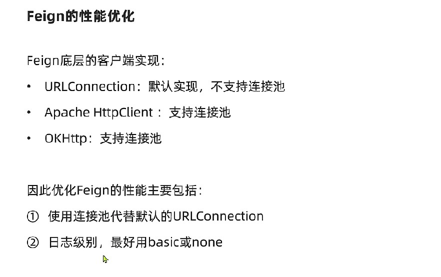

以下将feign的连接方式更改为Apache HttpClient方式，因为这种方式支持连接池：

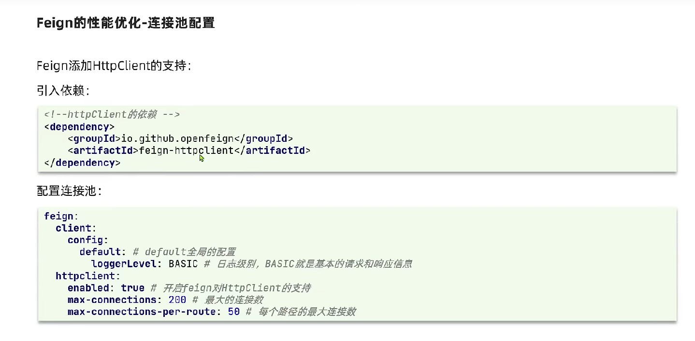
引入的依赖是可以直接使用的，从配置中对连接池进行配置即可。实际连接数的大小和连接池的大小要从压测来获得。

## 最佳实现方案

### 继承模式

消费者调用的接口方法和提供者的控制层接口是一样的，所以这两者应该可以提取成公共的父接口：
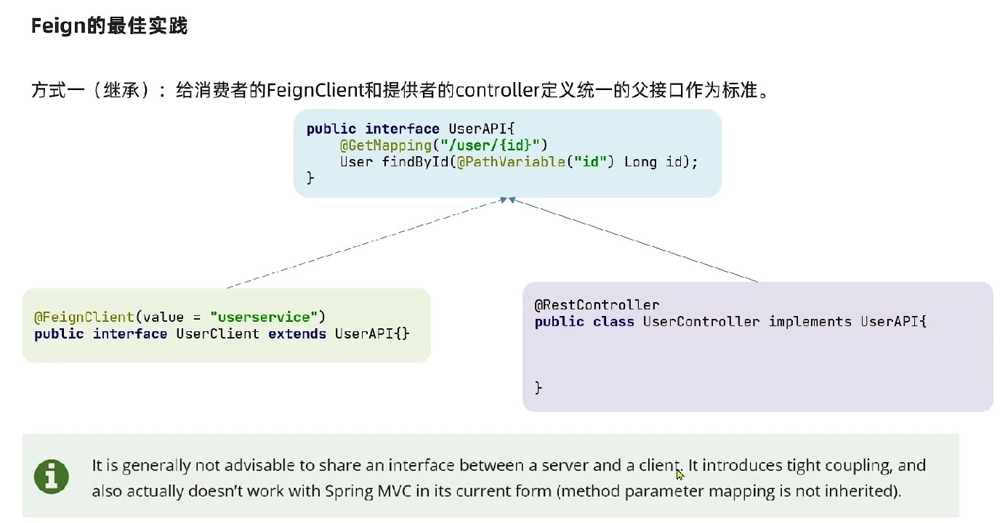
文中表示并不推荐此类方式，因为这种方式会导致耦合度过高的问题。

### 抽取模式

第二种优化方式：如果多个消费者都调用同一个服务，并且使用方式也是相同的，那就可以将远程调用的代码抽取成公用的依赖，依赖中还可以包含对实体类/配置等等的共用的内容，以简化每个客户端重复编码的问题，并制定统一的标准：
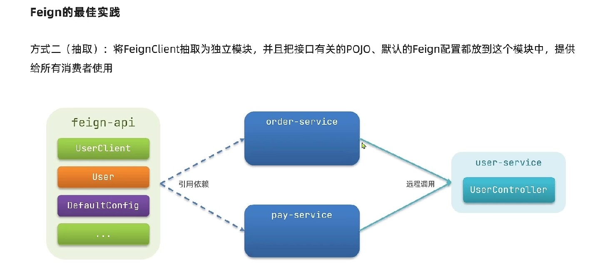
此类方式存在的问题是，所有服务将全量的获取到所有远程调用的方法，但实际上可能并不需要这么多的方法。
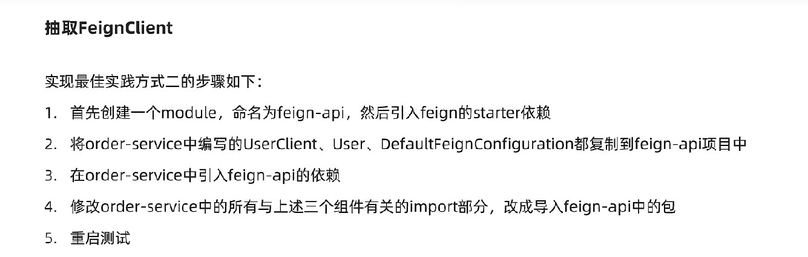
当抽离后无法进行feign包扫描的时候，可以进行批量指定或者单个指定：
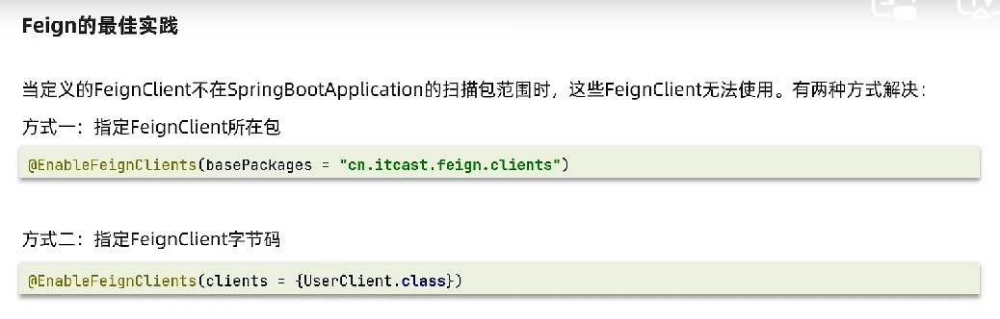

小总结：
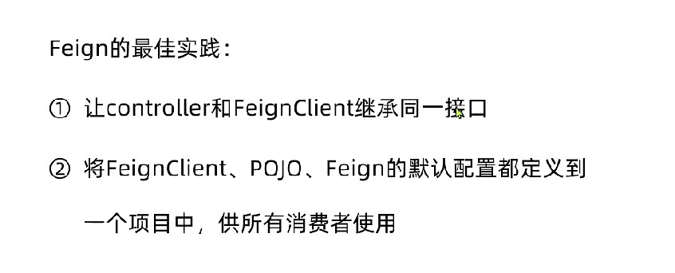