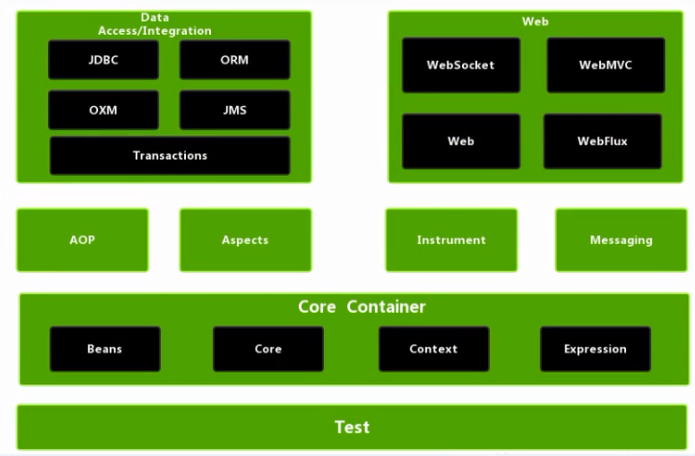

# 1-框架概述

1. Spring是一个轻量级开源JavaEE框架，Spring的轻量级体现在jar较少，并整体依赖较小，对其他框架的依赖也更少；

2. Spring可以简化企业应用开发的复杂性；

3. Spring的两个核心部分：IOC控制反转、AOP面向切面编程：

   1. IOC控制反转表示将创建对象的过程交由Spring进行管理，而并非手动new创建。
   2. AOP面向切面可以在不改变源代码的情况下，对已有程序进行功能增强。

4. Spring模块组成部分：

   

   基础模块：Test（测试模块）、Bean（实例管理）、Core（核心模块）、Context（应用上下文模块）、Expression（SpringEL表达式）。

## Spring特点

1. 方便解耦，简化开发：在AOP参与之后，功能间的耦合度将降低；并且在IOC参与之后，创建对象以及构建对象的过程交由Spring，简化了开发。
2. AOP编程支持：在不更改源代码的情况下就可以增强功能。
3. 方便程序的测试：在Spring中集成Junit之后，可以进行单模块的单元测试，无需整体测试；
4. 方便集成其他框架：在Spring项目中，可以轻松集成其他功能的框架；
5. 降低JavaAPI的难度：将传统JavaAPI进行了封装，暴露更简便的操作接口；
6. 声明式事务的支持：事务的控制只需声明式的控制，无需耦合到代码中；
7. 源码经典：从设计、结构、思想方面都是经典；