# 2-入门案例

## 下载依赖

1. 进入Spring官网，在Project下找到Spring Framework：

   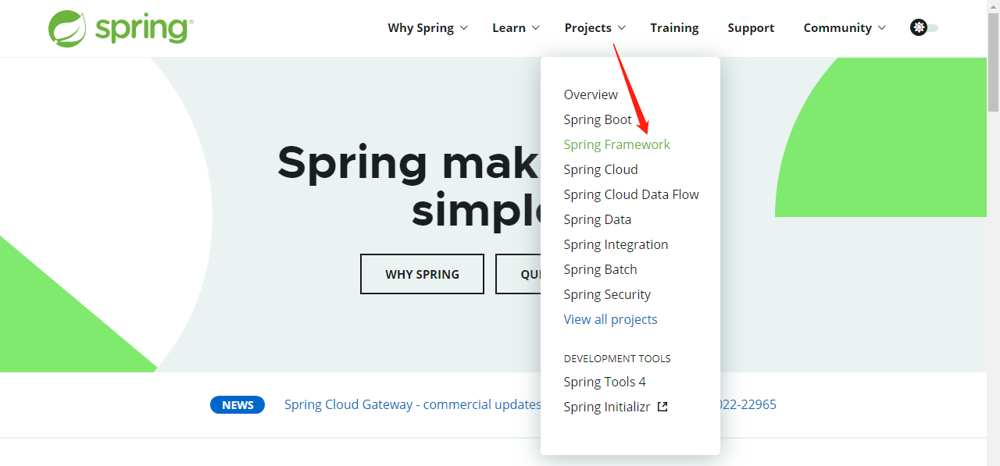

2. 选中LEARN后，会显示Spring的文档和API界面，其中GA表示正式版本，SNAPSHOT表示快照版本：

   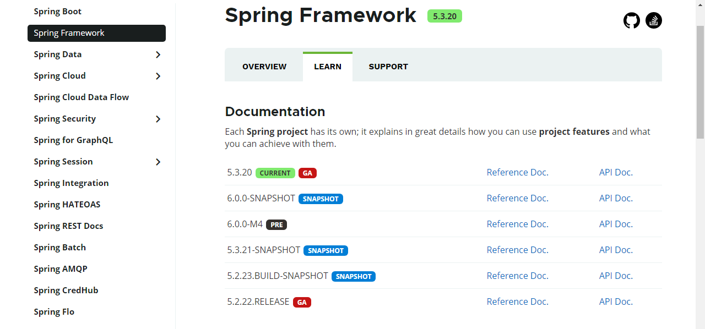

3. 点击github进入到Spring的官方仓库，并点击进入Spring Framework Arthritis：

   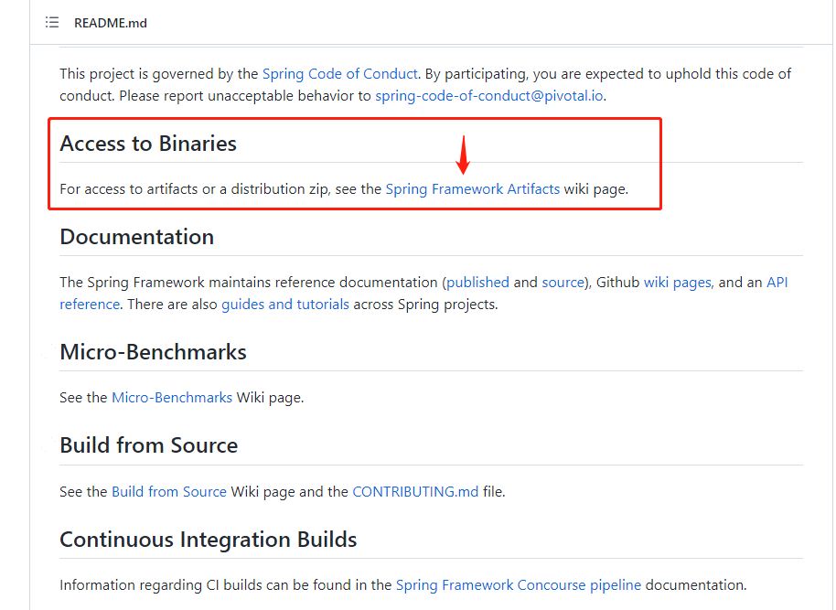

4. 进入Spring Framework Arthritis后，进入Spring仓库：

   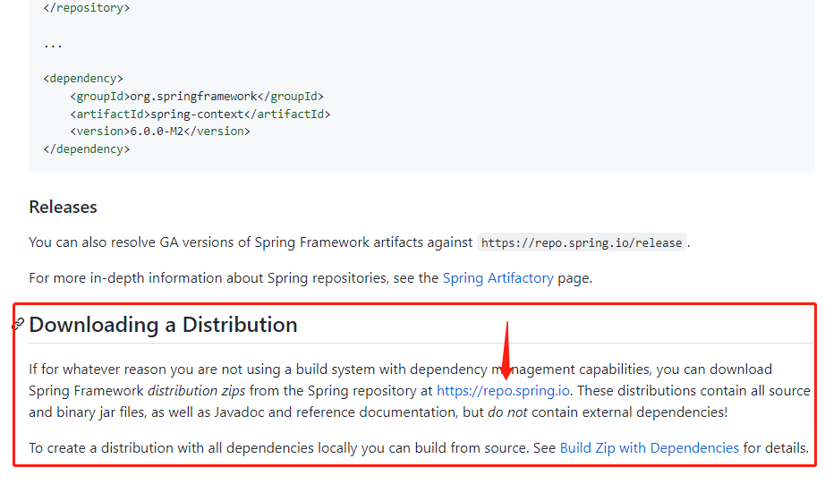

5. 在Spring repo中，点击Artifactory-Artifacts-release-org-springframework-spring，即可在右侧见到URL to file，表示Spring仓库地址：

   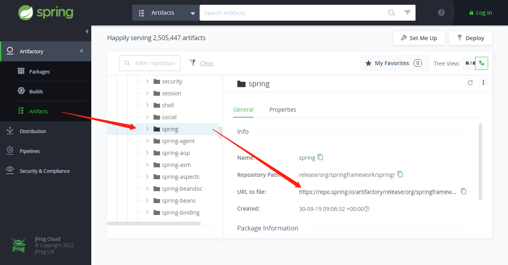

6. 根据在第二步中确定的最新稳定版本，点击进入相应的链接：

   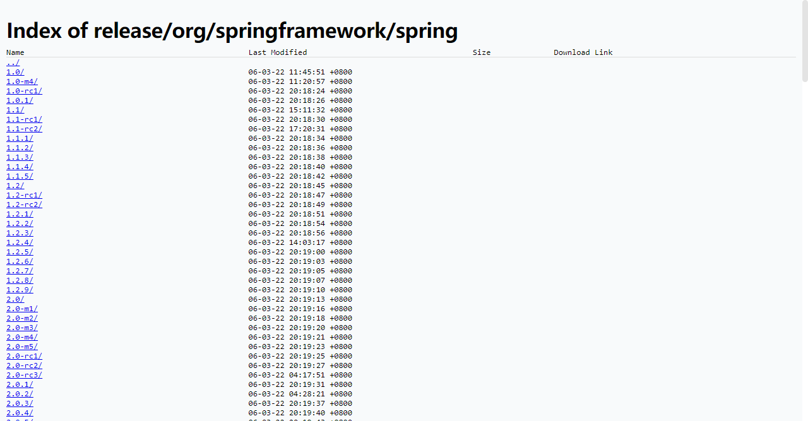

7. 点击spring-x.x.x-dist.zip进行下载，将获得一个压缩包，其中就是Spring的所有依赖：

   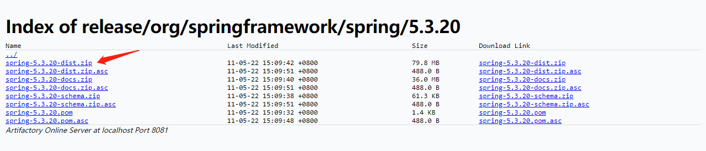

8. 依赖目录：

   1. docs：文档文件；
   2. libs：相关依赖jar包，sources.jar是源码包，javadoc.jar是文档包，另外是编译后包；
   3. schema：xml约束规范；

9. 下载Spring所依赖的common-logging日志依赖，访问[Apache Commons Logging](https://commons.apache.org/proper/commons-logging/)官网，并选择Download下载Binaries资源：

   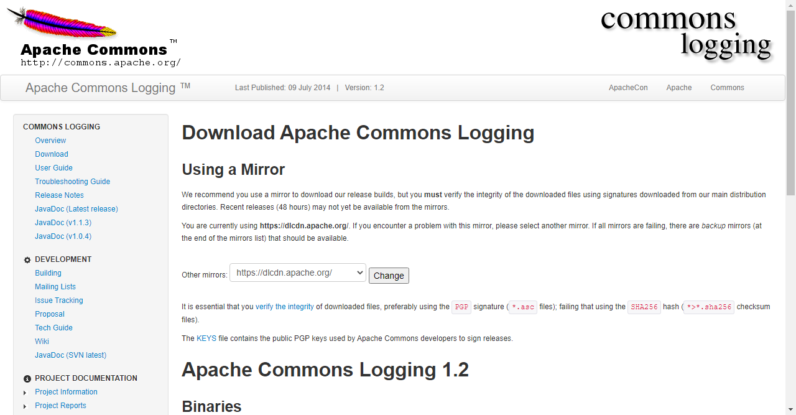

## 创建项目

1. 打开idea工具，创建普通Java工程：

   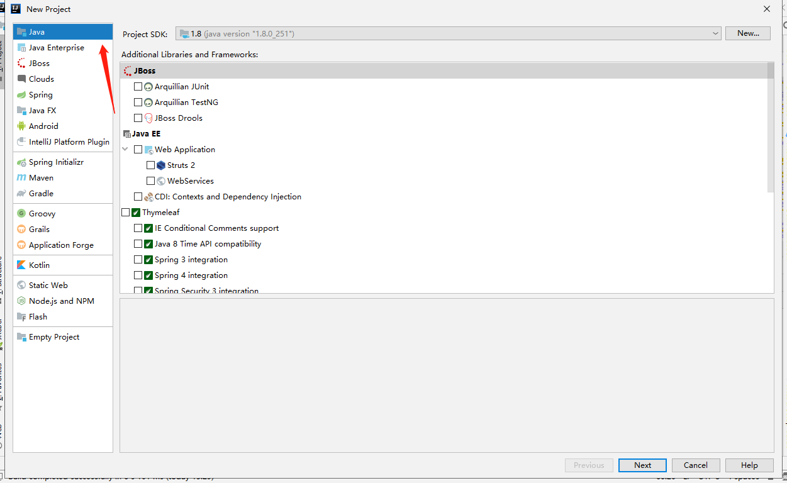

2. 导入Spring所依赖的jar包，注意只导入编译后的jar包。只导入基础模块做测试，并依赖一个common-logging作为日志支持：

   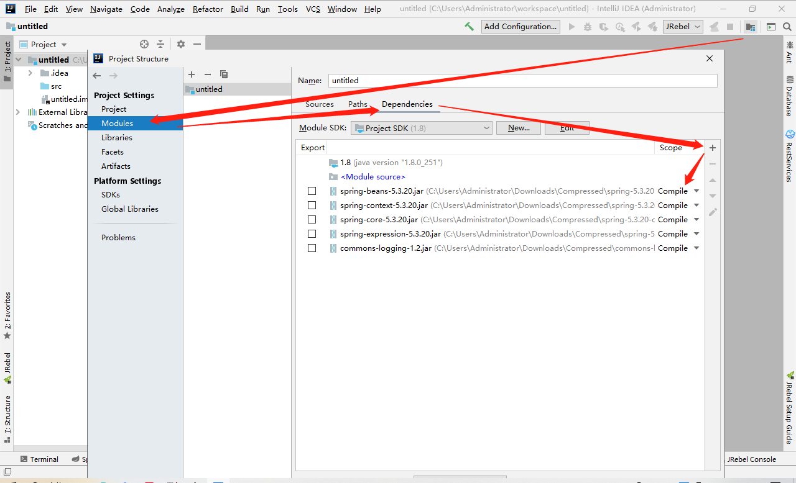

3. 创建类并填写内容：

   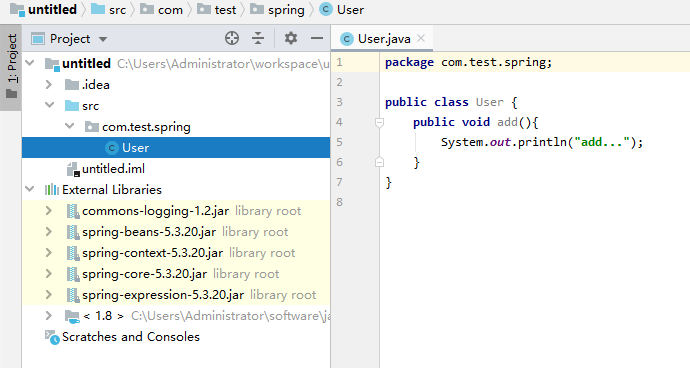

4. 在src中创建Spring的xml配置文件：

   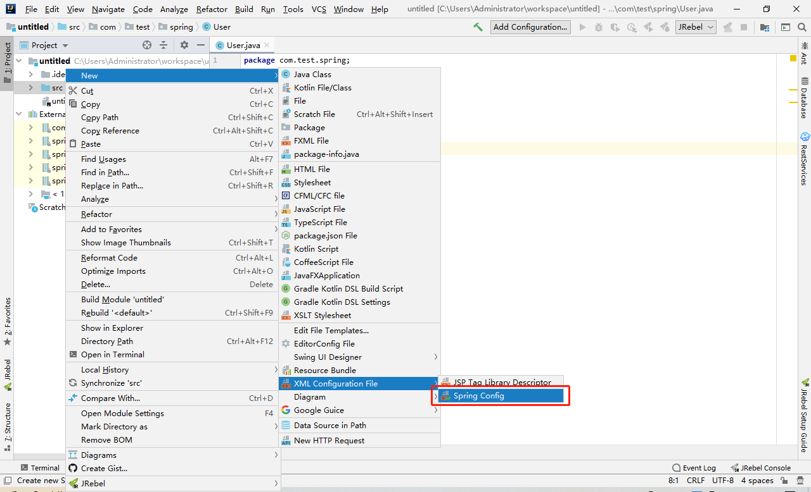

   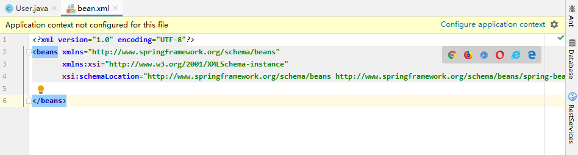

5. 创建配置文件中的内容，bean标签id自拟，class为第三步中创建的类的全路径：

   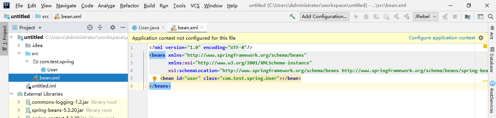

6. 创建测试主类，测试类仅用作框架运行测试，实际生产并不会出现类似代码：

   ```java
   import org.springframework.context.ApplicationContext;
   import org.springframework.context.support.ClassPathXmlApplicationContext;
   
   public class Test {
   
       public static void main(String[] args) {
           // 1 加载Spring配置文件(bean.xml文件应在项目src目录下)
           ApplicationContext applicationContext = new ClassPathXmlApplicationContext("bean.xml");
           // 2 获取配置创建的对象
           User user = applicationContext.getBean("user",User.class);
           // 3 执行对象方法
           user.add();
       }
   
   }
   ```

   此示例将User对象由Spring ApplicationContext进行创建，表现出Spring IOC控制反转。