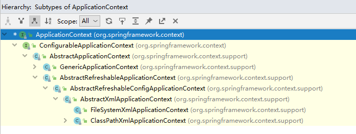
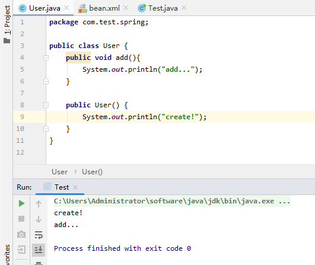
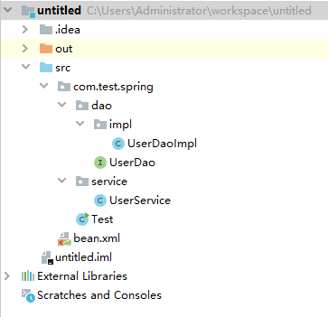

# 3-IOC容器

## IOC概述

1. 控制反转是一种面向对象编程的设计原则，用于降低程序代码之间的耦合度。
2. 通过控制反转，所有实例将被Spring调度系统进行创建和控制。
3. DI依赖注入表示IOC在对实例进行管理调度后，Spring IOC将把此实例自动传递到依赖此实例的其他实例中。

Spring IOC底层采用xml解析、工厂模式、反射来实现。xml解析主要用来读取配置文件，工厂模式将根据配置文件指示创建对象，反射将对class文件进行读取创建对象。

IOC的最终作用就是将代码耦合度尽量降低，在读取xml创建对象之后，如果类路径发生了改变，只需要修改xml内容，所有应用此类实例的地方无需进行更改。

## Factory接口

IOC思想的实现基于IOC容器，也就是对象工厂。Spring中存在两个工厂接口，使用方法是一致的：

1. BeanFactory：Spring内部依赖此工厂进行对象创建，不提供给应用开发使用。在加载配置文件的时候并不会创建对象， 而是在getBean的时候才会创建对象。
2. ApplicationContext：面向应用开发，是BeanFactory的子类，提供了更多的功能。在加载配置文件的时候，就会对配置文件中的对象进行创建。

服务器启动的时候，应提前创建好所有对象供环境调用，所以推荐使用ApplicationContext进行创建对象。

ApplicationContext存在两个重要的实现类，可在IDEA中使用Ctrl+H查看类集成结构：



1. ClassPathXmlApplicationContext：目录起点从项目src目录开始，也就是classpath路径。
2. FileSystemXmlApplicationContext：目录从盘符开始。

## Bean管理

Bean管理也就是由Spring创建对象（IOC），再由Spring将创建的对象注入到依赖此对象的属性中（DI）。

### xml 进行内容注入

基于xml方式创建对象，与上文演示相同，采用bean标签进行类定位：

```xml
<bean id="user" class="com.test.spring.User"></bean>
```

> bean标签：创建对象。
>
> id属性：获取bean时的唯一标识，整个容器中此名称不能重复。
>
> class属性：所创建实例的类的全路径。
>
> name属性：与id属性类似，都用做获取bean，但id不能存在特殊符号，例如斜杠等，但name可以。

Spring创建实例的方式默认采用无参构造函数进行，如果在所创建实例的无参构造中添加输出语句即可看到效果。所以在使用Spring时，每个类中尽量存在无参构造函数：



#### 属性注入

基于xml的方式在创建对象的时候还可以对对象的属性进行注入，注入方式分为两种：

1. set方法注入，需要在类中存在属性对应的set方法：

   ```java
   public class User {
       private String name;
       private int age;
   
       public void setName(String name) {
           this.name = name;
       }
   
       public void setAge(int age) {
           this.age = age;
       }
       
       @Override
       public String toString() {
           return "User{" +
                   "name='" + name + '\'' +
                   ", age=" + age +
                   '}';
       }
   }
   ```

   在Spring配置文件中，创建对象的同时添加对属性的注入操作：

   ```xml
   <bean id="user" class="com.test.spring.User">
       <property name="age" value="10"></property>
       <property name="name" value="aboy"></property>
   </bean>
   ```

   > property标签：对属性进行注入。
   >
   > name属性：实例中的属性名称。
   >
   > value属性：对实例属性进行注入的值。

   

   测试类可输出对象引用，出发toString方法查看注入结果：

   ```java
   public static void main(String[] args) {
       // 1 加载Spring配置文件
       ApplicationContext applicationContext = new ClassPathXmlApplicationContext("bean.xml");
       // 2 获取配置创建的对象
       User user = applicationContext.getBean("user",User.class);
       // 3 执行对象方法
       System.out.println(user);
   }
   ```

2. 有参构造函数注入，就要在类中存在对属性赋值的有参构造函数：

   ```java
   public class User {
       private String name;
       private int age;
   
       public User(String name, int age) {
           this.name = name;
           this.age = age;
       }
   
       @Override
       public String toString() {
           return "User{" +
                   "name='" + name + '\'' +
                   ", age=" + age +
                   '}';
       }
   }
   ```

   在配置文件中，创建对象调用有参构造函数并进行值注入：

   ```xml
   <bean id="user" class="com.test.spring.User">
       <constructor-arg value="aboy"></constructor-arg>
       <constructor-arg value="10"></constructor-arg>
   </bean>
   ```

   > constructor-arg标签：有参构造函数参数注入。
   >
   > value属性：对应顺序的参数进行注入值，第一个标签注入第一个参数...

   如果要指定参数的名称进行注入：

   ```xml
   <bean id="user" class="com.test.spring.User">
       <constructor-arg name="name" value="aboy"></constructor-arg>
       <constructor-arg name="age" value="10"></constructor-arg>
   </bean>
   ```

   > name属性：参数的名称。

   或者采用参数下标的方式进行注入：

   ```xml
   <bean id="user" class="com.test.spring.User">
       <constructor-arg index="0" value="aboy"></constructor-arg>
       <constructor-arg index="1" value="10"></constructor-arg>
   </bean>
   ```

   > index属性：参数在参数表的位置，从0开始数。

   在注入时通常会自动设置参数类型，也可以手动的设置参数类型：

   ```xml
   <bean id="user" class="com.test.spring.User">
       <constructor-arg type="java.lang.String" name="name" value="aboy"></constructor-arg>
       <constructor-arg type="int" name="age" value="10"></constructor-arg>
   </bean>
   ```

   > type属性：参数的类型设置，基本类型可直接设置，对象类型需要写全路径。

#### P 名称空间

也可以采用p名称空间赋值的方式，这种方式仍采用set方法注入，但写法更简单：

1. 在xml配置文件中引入p名称空间相关约束`xmlns:p="http://www.springframework.org/schema/p"`：

```xml
<beans xmlns="http://www.springframework.org/schema/beans"
xmlns:xsi="http://www.w3.org/2001/XMLSchema-instance"
xmlns:p="http://www.springframework.org/schema/p"
xsi:schemaLocation="http://www.springframework.org/schema/beans http://www.springframework.org/schema/beans/spring-beans.xsd">
</beans>
```

2. 在加入p名称空间之后，就可以在bean标签中对属性进行扩展，进行属性的注入：

```xml
<bean id="user" class="com.test.spring.User" p:age="10" p:name="aboy"></bean>
```

#### 字面量赋值

字面量赋值，字面量表示硬编码在xml中的值，如上文所示。在赋值过程中会有特殊值的输入，例如：

1. 空值null的赋值语法如下：

   ```xml
   <!-- 使用set方法注入 -->
   <bean id="user" class="com.test.spring.User">
       <property name="name">
           <null/>
       </property>
   </bean>
   
   <!-- 使用构造函数注入 -->
   <bean id="user" class="com.test.spring.User">
       <constructor-arg name="name">
           <null/>
       </constructor-arg>
   </bean>
   ```

2. 存在特殊符号的赋值可以进行转义或使用CDATA，特殊符号表示在xml中存在意义的尖括号等符号，这会破坏xml的文档结构。

   转义可参考以下：

   | 转移符号 | 实际含义 |
   | -------- | -------- |
   | \&amp;   | &        |
   | \&lt;    | <        |
   | \&gt;    | >        |
   | \&quot;  | "        |
   | \&nbsp;  | 空格     |
   | \&copy;  | 版权符号 |
   | \&reg;   | 注册符号 |

   value属性也可以作为子标签在property中声明，这样就可以采用CDATA标签对内容进行原样输出。当value为属性时，CDATA语法会出现错误：

   ```xml
   <bean id="user" class="com.test.spring.User">
       <!-- 采用转义符号 -->
       <!--<property name="name" value="&lt;"></property>-->
   
       <!-- 采用CDATA标签 -->
       <property name="name">
           <value><![CDATA[<<?>>]]]></value>
       </property>
   </bean>
   ```

#### Bean注入

1. 注入外部Bean，也就是一个对象作为属性在另一个对象中，创建对象的时候，就要对对象类型属性进行创建并注入。

   先创建接口、类、并进行属性定义：

   

   Dao接口代码：

   ```java
   public interface UserDao {
       void update();
   }
   ```

   Dao实现类：

   ```java
   public class UserDaoImpl implements UserDao {
       @Override
       public void update() {
           System.out.println("in dao update!");
       }
   }
   ```

   Service类，声明属性并采用set方法进行注入：

   ```java
   public class UserService {
       UserDao userDao;
   
       public void setUserDao(UserDao userDao) {
           this.userDao = userDao;
       }
       
       public UserDao getUserDao() {
           return userDao;
       }
   }
   ```

   xml文件中创建两个类的对象：

   ```xml
   <bean id="dao" class="com.test.spring.dao.impl.UserDaoImpl"></bean>
   <bean id="service" class="com.test.spring.service.UserService"></bean>
   ```

   然后通过rel属性，对service中的属性进行set方法注入：

   ```xml
   <bean id="service" class="com.test.spring.service.UserService">
       <property name="userDao" ref="dao"></property>
   </bean>
   ```

   > rel属性：指向外部bean标签id值。

   测试类更改为：

   ```java
   public static void main(String[] args) {
       // 1 加载Spring配置文件
       ApplicationContext applicationContext = new ClassPathXmlApplicationContext("bean.xml");
       // 2 获取配置创建的对象
       UserService service = applicationContext.getBean("service",UserService.class);
       // 3 执行对象方法
       service.getUserDao().update();
   }
   ```

2. 注入内部Bean和注入外部Bean在xml中写法不同，但实现的效果相同：

   ```xml
   <bean id="service" class="com.test.spring.service.UserService">
       <property name="userDao">
           <bean id="dao" class="com.test.spring.dao.impl.UserDaoImpl"></bean>
       </property>
   </bean>
   ```

3. 级联赋值表示可以直接调用对象属性的字段进行赋值，例如在多对一或者一对一对象关系中存在上级类Dept：

   ```java
   public class Dept {
       private String name;
   
       public void setName(String name) {
           this.name = name;
       }
   }
   ```

   Emp类中包含一个Dept类型的对象：

   ```java
   public class Emp {
       private Dept dept;
   
       public void setDept(Dept dept) {
           this.dept = dept;
       }
   }
   ```

   那在进行注入的时候语法如下：

   ```xml
   <bean id="emp" class="com.test.spring.bean.Emp">
       <property name="dept">
           <bean id="dept" class="com.test.spring.bean.Dept">
               <property name="name" value="hello"></property>
           </bean>
       </property>
   </bean>
   ```

   级联赋值可以在创建内部对象之后，对对象中的属性进行赋值：

   ```xml
   <bean id="emp" class="com.test.spring.bean.Emp">
       <property name="dept">
           <bean id="dept" class="com.test.spring.bean.Dept"></bean>
       </property>
       <property name="dept.name" value="hello"></property>
   </bean>
   ```

   此语法的前提是让Spring获取到dept引用，所以要在emp中添加dept的get方法：

   ```java
   public class Emp {
       private Dept dept;
   
       public void setDept(Dept dept) {
           this.dept = dept;
       }
   
       public Dept getDept() {
           return dept;
       }
   }
   ```


#### 集合注入字面量

可以将Array、List、Map定义到一个实体类中进行注入测试：

```java
public class User {
    private String[] array;
    
    private List<String> list;
    
    private Map<String,String> map;

    public void setArray(String[] array) {
        this.array = array;
    }

    public void setList(List<String> list) {
        this.list = list;
    }

    public void setMap(Map<String, String> map) {
        this.map = map;
    }
}
```

1. 数组array或者集合list注入可以使用array或者list标签进行元素的定义：

   ```xml
   <bean id="user" class="com.test.spring.User">
       <property name="array">
           <array>
               <value>a</value>
               <value>b</value>
               <value>c</value>
           </array>
   
           <!-- 使用list可以实现同样的效果
               <list>
                   <value>a</value>
                   <value>b</value>
                   <value>c</value>
               </list>
               -->
       </property>
   </bean>
   ```

2. set集合注入使用set标签：

   ```xml
   <bean id="user" class="com.test.spring.User">
       <property name="set">
           <set>
               <value>a</value>
               <value>b</value>
               <value>c</value>
           </set>
       </property>
   </bean>
   ```

3. map集合要使用map标签进行键值对赋值：

   ```xml
   <bean id="user" class="com.test.spring.User">
       <property name="map">
           <map>
               <entry key="A" value="a"></entry>
               <entry key="B" value="b"></entry>
               <entry key="C" value="c"></entry>
           </map>
       </property>
   </bean>
   ```

   > map标签：指定此属性为键值类型。
   >
   > entry标签：单个键值对定义。
   >
   > key属性：单个键值对中的key值。
   >
   > value属性：单个键值对中的value值。

#### 集合注入对象

在集合中注入对象要使用ref标签引入外部bean进行注入：

1. 首先要更改实体类内容，创建一个对象集合容器：

   ```java
   public class Emp {
       private List<Dept> dept;
   
       public List<Dept> getDept() {
           return dept;
       }
   
       public void setDept(List<Dept> dept) {
           this.dept = dept;
       }
   
       @Override
       public String toString() {
           return "Emp{" +
                   "dept=" + dept +
                   '}';
       }
   }
   ```

2. 在xml中进行注入，在集合中将外部对象作为属性引入：

   ```xml
   <bean id="emp" class="com.test.spring.bean.Emp">
       <property name="dept">
           <list>
               <ref bean="dept"></ref>
           </list>
       </property>
   </bean>
   
   <bean id="dept" class="com.test.spring.bean.Dept">
       <property name="name" value="abc"></property>
   </bean>
   ```

3. 测试时，可根据toString方法查看输出结果：

   ```java
   public static void main(String[] args) {
       // 1 加载Spring配置文件
       ApplicationContext applicationContext = new ClassPathXmlApplicationContext("bean.xml");
       // 2 获取配置创建的对象
       Emp emp = applicationContext.getBean("emp", Emp.class);
       // 3 执行对象方法
       System.out.println(emp);
   }
   ```

#### util 名称空间

还可以将集合内容注入的操作进行提取，这将方便把注入的内容应用在不同的集合注入中：

1. 添加uti类名称空间，与p空间相似进行操作，同样是复制p标签然后将最后一个路径改为util即可：

   ```xml
   <beans xmlns="http://www.springframework.org/schema/beans"
          xmlns:xsi="http://www.w3.org/2001/XMLSchema-instance"
          xmlns:p="http://www.springframework.org/schema/p"
          xmlns:util="http://www.springframework.org/schema/util"
          xsi:schemaLocation="http://www.springframework.org/schema/beans http://www.springframework.org/schema/beans/spring-beans.xsd">
   ```

2. 然后引入util的结构规范xds文件，操作方式也是复制schema，然后改为util即可：

   ```xml
   <beans xmlns="http://www.springframework.org/schema/beans"
          xmlns:xsi="http://www.w3.org/2001/XMLSchema-instance"
          xmlns:p="http://www.springframework.org/schema/p"
          xmlns:util="http://www.springframework.org/schema/util"
          xsi:schemaLocation="http://www.springframework.org/schema/beans http://www.springframework.org/schema/beans/spring-beans.xsd
                              http://www.springframework.org/schema/util http://www.springframework.org/schema/util/spring-util.xsd">
   ```

3. 将集合注入内容通过util标签进行提取，ref表示实例注入，value表示字面量注入;

   ```xml
   <util:list  id="listUtil">
       <ref bean="dept"></ref>
       <ref bean="dept"></ref>
       <ref bean="dept"></ref>
   </util:list>
   ```

4. 在进行集合注入的时候，就可以直接引入util标签：

   ```xml
   <bean id="emp" class="com.test.spring.bean.Emp">
       <property name="dept" ref="listUtil"></property>
   </bean>
   ```

### FactoryBean

Spring有两种类型的bean，上文所采用的都是普通bean类型，再就是一种工厂bean（FactoryBean）：

1. 普通bean：配置文件中的bean类型就是返回类型；
2. 工厂bean：返回的bean类型可以与配置的bean类型不一致；

工厂bean是Spring中内置的bean类型，以下创建一个FactoryBean类型：

1. 创建类并继承FacoryBean接口，这个bean就是工厂bean：

   ```java
   public class MyFacoryBean implements FactoryBean {
       //返回bean实例
       @Override
       public Object getObject() throws Exception {
           return null;
       }
   	//返回bean的类型
       @Override
       public Class<?> getObjectType() {
           return null;
       }
   	//是否为单例模式
       @Override
       public boolean isSingleton() {
           return false;
       }
   }
   ```

2. 在getObject方法中进行实例返回：

   ```java
   public class MyFacoryBean implements FactoryBean<Dept> {//类上添加泛型
       @Override
       public Dept getObject() throws Exception {
           //返回实例
           return new Dept();
       }
   
       @Override
       public Class<?> getObjectType() {
           return null;
       }
   
       @Override
       public boolean isSingleton() {
           return false;
       }
   }
   ```

3. 在xml中创建MyFacoryBean配置：

   ```xml
   <bean id="myFacoryBean" class="com.test.spring.bean.MyFacoryBean"></bean>
   ```

4. 在测试类中，要获取Dept类型，而非MyFacoryBean类型，否则将类型不匹配报错：

   ```java
   public static void main(String[] args) {
       // 1 加载Spring配置文件
       ApplicationContext applicationContext = new ClassPathXmlApplicationContext("bean.xml");
       // 2 获取配置创建的对象
       Dept dept = applicationContext.getBean("myFacoryBean", Dept.class);
       // 3 执行对象方法
       System.out.println(dept);
   }
   ```

### Bean 作用域

Spring所创建的实例默认都是单例模式的，在FactoryBean中可以通过方法进行设置。作用域也就是控制实例是否为单例模式：

在xml的bean标签中通过scope属性进行控制单例还是多例：

- 默认值 singleton 单例模式
- prototype 多例模式

```xml
<bean id="myFacoryBean" class="com.test.spring.bean.MyFacoryBean" scope="prototype"></bean>
```

scope为singleton时，加载配置文件时就会创建实例对象；当为prototype时，在getBean方法时才会创建新的实例。

除了这两个值为，还有request和session值，这关系到servlet所指向的作用域空间。

### Bean 生命周期

