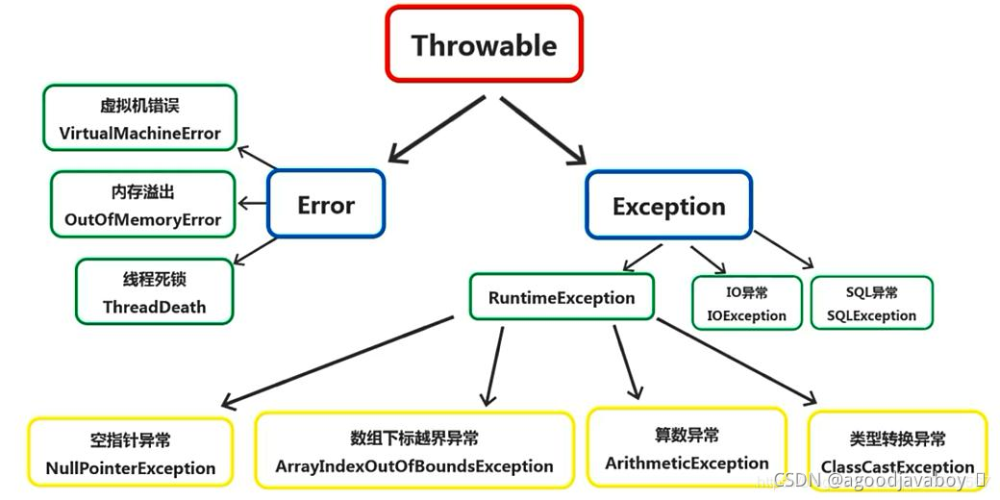

# 异常

异常表示在程序运行中出现的错误，也就是在方法进行运算的时候出现的问题。例如运算异常或者数组下标不存在等异常。语法异常在编译时就无法通过，不属于异常的范围。

异常出现之后通常程序会停止运行并且在控制台描述异常的具体内容，Java存在容错性的特点，也就是说在程序运行中允许出现异常，并且在出现异常之后仍继续运行。

## 异常对象

Java将程序中可能出现的异常通过类的方式进行了描述，所有的异常都可以进行记录和抛出，所以最终极的类Throwable，表示可抛出的。



- Throwable：所有异常的根类，表示可抛出的异常。
  - Exception：表示程序运行中因语法或运算导致的异常，这类异常通常可以避免。
    - RuntimeException：运行时异常，运行中才可以发生的异常，也叫未检查异常。
    - 其他异常：在编译时可以抛出的异常，进行异常的预判并让调用者察觉此异常的发生，也叫已检查异常。
  - Error：错误，通常指计算机虚拟机或者内存内部所发生的空间错误或其他不可预知也不可避免的异常。

## 异常的处理

异常的处理可以采用抛出或者捕获的方式，抛出表示将异常的处理交给调用者，当前方法内并不对异常进行处理。捕获表示在当前方法进行异常的处理，异常一旦发生时没有办法解决的，通常捕获所做的就是对异常所导致的结果的弥补。

如果语句出现了异常的抛出，那调用者就必要对其进行捕获或者继续抛出，否则将在语法上出现问题。其中RuntimeException会在程序运行中出现，所以并不能被预判，如果没有进行捕获或者抛出也是不会出现异常的。但运行时异常仍可以进行捕获或者抛出，并且也有可能会在程序运行过程中出现问题。

例如使用N除以0，这句话并不会被Java认为是一个异常，所以并不会提示这句话存在语法错误，但是在运行时就会出现运行时异常。

### 抛出

1. 抛出就是将此方法中出现的异常对象抛出给调用者，由调用者感染异常并处理异常。
2. 使用关键字`throws`写在方法的声明上，后跟抛出的异常的对象类型，可以写多个，并用逗号分开。
3. 抛出异常并没有防范措施，也没有补救措施，是消极的处理异常方式。把解决和弥补异常的责任交给调用者。
4. 当语句出现异常后，语句下面的代码不会执行了，而是创建异常对象，向外抛出让当前程序停止。
5. 在方法上抛出异常是可以连续抛出的，多个异常对象的类型用`,`隔开。在调用位置处理异常的时候，也是要对所有抛出的异常进行处理的。

```java
//抛出一个异常，空指针是Exception的子类可以多态
public static void test(Dog d) throws Exception{
    d.eat();//这里的d引用很可能是一个空指针
}

//在主函数上抛出异常，因为调用方法时可能会出现异常
//因为main函数是虚拟机调用的，所以此异常将抛给虚拟机
public static void main(String[] args) throws Exception {
    test(null);//此处可能会出现异常，以为调用的方法抛出了异常
}
```

> 在主函数中，异常在进行感染和传播的过程中并不会被解决或者捕获，而是在虚拟机中触发异常，导致程序的停止。

### 捕获

异常的抛出可能是因为被调用者声明了所抛出的异常，这将导致调用者需要对异常进行处理。有两种选择：将异常持续抛出直到虚拟机，这样的方式会导致程序的停止，实际上与普通的发生异常没有区别、再一种就是对被调用者出现的异常进行捕获，并做弥补措施，这可以让出现异常的语句出错而不会感染到方法内其他的代码。

1. 首先将可能会出现异常的代码，或者调用被调用者抛出异常的调用语句放到`try`代码块中。
2. 将可能会出现的异常对象放到`catch`代码块的代码块的小括号中。
3. 当try中出现异常，创建异常的位置则创建异常对象，然后由catch进行对象的捕获并在catch代码块中做补救措施。
4. try代码块就算是出现了异常，catch将其捕获后继续执行下面的代码，程序不会停止。
5. 如果try没有异常发生，就不会出现异常对象，catch也不会启动。（ry和catch只有一个会执行到底。
6. 捕获的方式是积极的处理异常的方式。
7. 虚拟机认为，try块和catch块都有可能执行不完，如果方法有返回值，那就要在两个代码块中都有返回。或者在try catch的外部执行返回。
8. 在进行某一语句的异常捕获时，如果此语句报出的异常为Exception类型，那极有可能是Exception子类的多态的结果。所以语句所抛出的异常类型实际以异常对象的类型为主，而不以抛出的异常的引用类型为主。

```java
public static void main(String[] args){
    try {
        test(null);						//可能会出现异常的语句，写在try中
    } catch (Exception e) {				//出现异常后，异常对象将向e引用进行赋值
        System.out.println("出现了异常");	 //执行补救代码
        e.printStackTrace();		//打印异常栈，显示异常出现在哪里，感染的路线
    }
    System.out.println("执行下面的代码"); //即使上面的程序出现了异常，此处的代码也会执行
}

public static void test(Dog d) throws Exception{
    d.eat();
}
```

#### 连续细致的捕获

如果抛出的异常为Exception类型，那其异常对象的实际类型可能是Exception的子类。如果要对不同类型的异常做不同类型的解决方案，那就要进行对象类型的划分，并且单独制定解决方案。

1. 调用方法时，如果方法出现异常则会原路返回，顺便感染所有调用者，只有catch才能截获异常链。
2. 在进行异常截获的时候，可以执行截获的异常类型，如果没办法确定是什么异常类型，就需要使用多种不同的异常类型就行捕获。
3. 在连续catch中，如果有一个捕获，下面的都不会执行捕获了。
4. 可以直接使用Exception捕获所有异常，因为所有异常都是Exception的子类，执行多态，可以接收所以异常对象。
5. 要将小范围的捕获异常优先捕获，大范围的异常最后捕获。如果在上面已经大范围捕获，小范围则失效。
6. 如果出现连续try catch，虚拟机认为任何一个catch都有可能不执行，则在所有的try和catch中执行返回。

```java
try {
    test3(null);
} catch (IOException e){				//如果出现IO异常，则被此捕获
    e.printStackTrace();
} catch (NullPointerException e) {		//如果出现空指针异常，则被此捕获
    e.printStackTrace();
} catch (Exception e) {					//如果出现异常，则被此捕获（所有异常都会被捕获）
    e.printStackTrace();
}
```

## finally

1. `finally`是与`try catch`连用的代码块，表示“绝对会执行的代码”。
2. try和catch由于异常是否发生的不确定性，两个代码块中的内容都有可能执行不完，那将必要执行的代码写到fianlly中。
3. finally中，一般书写一些关闭传输流等语句，在无论是否出现异常后必要执行的代码。
4. finally中如果存在返回语句，则以finally的返回为主，无论try catch中是否书写了返回。当finally中没有返回语句时，也将执行完finally中的代码后才会执行方法的返回。

```java
try {
    test3(null);
} catch (IOException e){
    e.printStackTrace();
} catch (NullPointerException e) {
    e.printStackTrace();
} catch (Exception e) {
    e.printStackTrace();
}finally{
    System.out.println("hello");		//此处代码必定执行
}
```

当finally中不存在返回语句，而try或者catch中存在返回语句时，会执行完finally后才会执行返回：

```java
//当方法执行完毕之后，先执行finally，再执行return
public static void main(String[] args){
    System.out.println(suanshu(1));
}

public static int suanshu(int a){
    int b = 0;
    try{
        b = 6/a;
        return b;
    }catch(ArithmeticException e){
        e.printStackTrace();
        return b;
    }finally{
        System.out.println("hello");
    }
}
//输出结果：hello 6
```

## 自定义异常类

当程序运行中可能会出现专用的异常时，可以创建自定义的异常类。自定义的异常类只需要根据自己的分类继承相应的父类即可。例如运行时出现的异常可以继承RuntimeException，这可以让调用者无需进行捕获或者抛出，必要进行处理的异常就去继承Exception，强制调用者进行处理。

1. 创建自定义的异常类：

   ```java
   public class MyException {
   
   }
   ```

2. 将异常类继承Exception类或者RuntimeException类：

   ```java
   //继承Exception时，创建的是编译异常类
   //继承RuntimeException是，创建的是运行异常类
   public class MyException extends Exception{
   
   }
   ```

3. 创建有参构造方法，接收一个参数，用来描述异常信息：

   ```java
   public class MyException extends Exception{
   	public MyException(String msg){		//msg表示错误信息
   		
   	}
   }
   ```

4. 在有参构造函数中，调用父类的有参构造，将异常信息传过去：

   ```java
   public class MyException extends Exception{
   	public MyException(String msg){
   		super(msg);
   	}
   }
   ```

5. 为了防止自动调用异常，给异常类也提供无参构造函数：

   ```java
   public class MyException extends Exception{
       public MyException(){
           super();
       }
   	public MyException(String msg){
   		super(msg);
   	}
   }
   ```

## 手动抛出异常

当程序运行到了某种不可继续运行的状态，例如出现了空值或者运算即将出现异常的时候，就可以自定义的抛出特定的异常。手动抛出的异常与Java抛出的异常等效。

1. 在程序中，可以使用throw关键字，在特定的位置触发某个异常。
2. 触发异常的方式是：创建异常对象。
3. 可以触发java提供的异常，也可以触发自定义的异常对象。
4. 手动的触发一个异常，一般是与条件分支一起用的。

```java
public static void main(String[] args){
    try {
        System.out.println(suanshu(0));
    } catch (Exception e) {
        e.printStackTrace();
    }
}

public static int suanshu(int a) throws Exception{
    if(a==0){
        throw new MyException("除数不能为0");			//当某种条件满足则触发异常，停止程序
    }
    return 6/a;
}
```

## 存在异常时的方法重写

1. 方法名相同
2. 参数表相同
3. 返回值相同
4. 访问修饰符相同或者更窄（父类要窄一些）
5. 方法抛出的异常比父类中相同或更少（子类中抛出的异常更窄或更少）