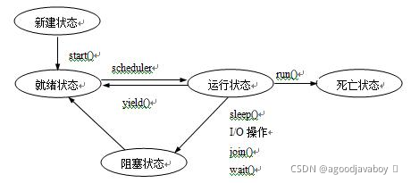

# 线程

计算机在运行一个程序的时候，会开辟一个进程来运行相关的代码，线程是在进程中进行具体运行的单位。进程将由系统调配系统资源，是操作系统运行的基础。一个进程包括着多个线程，线程是计算机操作系统运行程序能够调度的最小单位，是单一的执行流程。

在Java中，JVM的启动就是一个进程的启动，每一个程序中运行时，主函数将自动的创建一个线程加入到进程中运行代码。

多线程看起来是并行的，但实际上多线程在实际运行时是串行的，只是线程在运行时会分时间段的获取可执行自己程序的权利，并在程序没有运行完成的时候就交出执行权由其他的程序接手开始执行。

1. 在CPU运行程序时，并不是多个线程同时执行，而是随机的给多个线程分配时间片，时期拥有运行程序的权利。
2. 当一个线程拥有了时间片，则开始执行自己的代码，如果时间片到期，则停止执行自己的代码，保存自己的当前状态。
3. 也就是说，外界看起来多个线程是齐头并进的，但实际上在CPU处理的时候，多个线程还是排着队一个一个线程的在执行的，这被称为“宏观并行，微观串行”。
4. 多线程的好处：
   - 提高资源利用率，可以让CPU满载工作；
   - 提升程序运行时间，不用等待其他程序执行完再执行自己的程序；
   - 提高程序的响应速度，使用多线程可以让计算机同时处理多个用户或者程序的访问；
5. 多线程的问题：
   - 增加内存的消耗，多个线程进行切换的时候要记录自己的当前状态，并在再次获取时间片的时候取出自己的状态继续运行，存取的过程将消耗一定的空间。
   - 多线程操作同一数据时，内存数据的同步，通讯等安全问题。

## 创建线程

主函数就是一个线程，可以通过主函数来开放更多自定义的线程。

自定义创建线程以类为单位，创建自定义线程类并继承或者实现相关的接口或者父类，然后重写其中的方法，从而让线程开启并允许自定义线程中的逻辑程序。

自定义线程有两种方式，继承Thread类和实现Runnable接口，两种方式都可以创建自己的线程，但是在实际运行中还是具有一定的区别。

无论是实现还是继承，都要重写接口或者父类中的run方法，此方法中编写自定义的线程中的逻辑，并且此方法不能抛出任何异常，都要在当前线程处理。

### 继承Thread类

1. Thread类是java用来描述线程的类，可以继承Thread类，来创建一个自己的线程：

```java
public class MyThread extends Thread{}
```

1. 自定义线程类的运行内容放置在自己的run方法中，此方法重写自父类：

```java
public class MyThread extends Thread{
    @Override
    public void run(){
        //自定义线程执行的内容
    }
}
```

1. 启动自定义线程时，要创建此类的对象，并调用start方法，此方法继承自父类：

```java
public static void main(String[] args){
    Thread t1 = new MyThread();
    t1.start();
    Thread t2 = new MyThread();
    t2.start();
}
```

1. 启动线程后，将自动执行覆盖后的run方法中的内容。

### 实现Runnable接口

1. Runnable接口是Thread类的父接口，可以实现此接口来创建自定义线程：

```java
public class MyThread implements Runnable{
    @Override
    public void run(){
        //自定义线程执行的内容
    }
}
```

1. 启动线程时，创建自定义线程类的对象（推荐使用多态到Runnable），调用Thread有参构造方法，将Runnable引用类型的自定义线程类对象传入，再调用start方法启动：

```java
public static void main(String[] args){
    Runnable run = new MyThread();
    Thread t1 = new Thread(run);
    Thread t2 = new Thread(run);
    t1.start();
    t2.start();
}
```

1. 同样的启动线程后将自动执行run方法中的内容。

### 两种创建方式的不同

如果一种代码可以通过实现接口方法完成，同样可以重写父类方法完成，更推荐采用实现接口的方式。因为重写毕竟是更改了父类中原本的程序，也并不一定子类一定是对方法进行了升级，可能自己重写的方法效率和安全不比父类的老方法要好用。

使用Thread类创建的线程将创建多个子类类型对象，并分别执行多个子类对象各自的run方法。而通过Runnable创建的只有一个子类对象，无论开启了多少个线程都是对一个对象进行的操作。

以下演示一个多线程的两种写法，通过代码即可察觉两种方式的不同：

```java
//线程类1：继承Thread类
class MyThread extends Thread{
    private int ticket = 10;	//此属性表示票数
    private String name;		//此属性用于存储当前线程名字
    public MyThread(String name){//有参构造将在创建线程时就赋予线程名称
        this.name =name;
    }
    public void run(){			//运行的方法里，不停的减少当前线程的票数
        while(true){
			if(count>0){
				System.out.println(name+"窗口剩余："+count--);
			}else{
				break;
			}
		}
    }
}
public class ThreadDemo {
    public static void main(String[] args) {
        //开启三个线程，都开始各自卖票
        MyThread mt1= new MyThread("一号窗口");
        MyThread mt2= new MyThread("二号窗口");
        MyThread mt3= new MyThread("三号窗口");
        mt1.start();
        mt2.start();
        mt3.start();
    }
}
//以上测试的运行结果：输出30次卖票日志

//线程类2：实现Runnable接口
class MyThread1 implements Runnable{
    private int ticket =10;
    public void run(){
        while(true){
			if(count>0){
                //Thread.currentThread().getName()获得通过构造函数赋予的线程标识
				System.out.println(Thread.currentThread().getName()+"窗口剩余："+--count);
			}else{
				break;
			}
		}
    }
}
public class RunnableDemo {
    public static void main(String[] args) {
         //只创建一个线程实例
         Runnable mt = new MyThread1();
         //同时开启三个线程，三个线程使用同一个线程类实例
         //并通过构造方法对运行时的线程设置标识名称
         Thread t1 = new Thread(mt,"一号窗口");
         Thread t2 = new Thread(mt,"二号窗口");
         Thread t3 = new Thread(mt,"三号窗口");
         t1.start();
         t2.start();
         t3.start();
    }
}
//以上测试输出结果：输出10次卖票日志
```

## 线程的状态



线程在运行中会在五种状态中来回切换，其中阻塞状态表示其他线程巧夺了程序执行权，而导致当前线程等待的情况。

### 初始状态

线程创建之处，则称为新建状态。新建的线程拥有了自己的内存空间，但是还没有运行，也不能叫做一个真正的线程，可以调用start方法使其进入就绪状态。

### 就绪状态

线程拥有了运行的条件，但是还没有获得CPU分给的时间片没有权利运行程序，处在线程池中。等待状态不是执行状态，当系统选中一个等待执行的线程时（过程随机），其将从等待状态转为执行状态，此动作称为“CPU调度”。

### 运行状态

处在运行状态的线程存在多种转变情况：阻塞状态、就绪状态、死亡状态。

线程池中的“就绪线程”获得了CPU分给的时间片就会转换为运行状态，开始执行自己要执行的代码。如果在执行过程中时间片到期，则保存自己当前的状态并交出运行权，变成就绪状态等待获得运行权。也可以对运行中的线程调用yield方法，使其让出CPU执行权。

### 阻塞状态

处在运行状态中的线程遇到sleep方法或者阻塞式IO方法的介入，将让出CPU时间片，并暂停自己的运行，进入阻塞状态。进入阻塞的线程不能直接回到就绪状态，只有到阻塞情况消除才能回到就绪状态，然后再次等待CPU时间片的发放，开始后从原来暂停的位置继续。

**当出现以下情况，线程进入阻塞状态：**

1. 调用sleep方法进行休眠。
2. 调用了阻塞式IO方法，比如Scanner的输入方法，在方法返回内容之前此线程阻塞。
3. 线程试图获得一个同步监视器（同步锁），但是同步监视器正在被其他线程持有。
4. 线程在等待某个通知（notify）。
5. 调用了县城了suspend方法将线程挂起，此方法不推荐使用，容易造成死锁。

### 死亡状态

当线程的run方法执行完，或者被强制性的停止，就认为其已经死去，这个线程对象可能还是活的，但是已经不是一个单独执行的线程。线程一旦死亡，就无法再重生。如果在一个死亡了的线程上调用start方法，将抛出`java.lang.IllegalThreadStateException`异常。

**当出现以下情况，线程进入死亡状态：**

1. run方法中的代码执行完毕。
2. 强制性终止，比如出现了异常。
3. 调用了stop方法强行停止线程。

### 无限期等待

这种状态属于就绪状态的一种，但是需要程序激活线程才会重新启动，不会自动启动：

- 有限期等待：等待系统分配时间片，调用sleep进行睡眠，wait开始等待，join串行等。
- 无限期等待：系统不会分配时间片，调用了LockSupport的park方法等。

| 初始 | 运行     | 无限期等待 | 有限期等待    | 阻塞    | 结束       |
| ---- | -------- | ---------- | ------------- | ------- | ---------- |
| NEW  | Runnable | Waiting    | Timed Waiting | Blocked | Terminated |