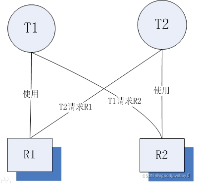

## 线程的常用操作

学习线程要注意，线程的执行与从前学习流程控制时所执行程序的顺序有所不同，曾经的主函数所运行的单线程程序只需要梳理一个线程的运行顺序就可以了，但在多线程的程序里是多个线程同时并发的，并且线程的执行时随机的，并不能预知具体哪个线程在哪个时间点执行哪个语句。

线程的操作可以操作当前执行的线程的状态，让当前线程与其他线程之间产生协作。

### 休眠 sleep

休眠也就是暂停，让当前运行的线程暂停运行一段时间。

sleep是静态方法，阻塞的是当前正在运行的线程而不是调用它的线程，只对正在运行的线程有效。也就是sleep写在哪里，才会阻塞哪里。

```java
public static void main(String[] args){
    MyThread t = new MyThread();
    t.start();
    t.sleep(1000); //这里将阻塞main线程，而不是t线程
    Thread.sleep(1000);//这里将阻塞main线程，而不是t线程
}
```

sleep参数中的数值表示阻塞的毫秒数，但是当线程经历了阻塞之后回到的是就绪状态而不是运行状态，所以要想继续开始运行还需要CPU分配给其时间片，这个操作是随机的，所以一般线程阻塞的时间会多多少少的比参数中设置的多一些。

### 让步 yield

yield和sleep很像，都是Thread类提供的静态方法。可以让正在运行的线程让出时间片，等待下一次的运行。

yield方法调用后，当前线程并不像sleep一样进入阻塞状态，而是进入就绪状态。当让步结束，会立马接过程序执行权，然后开始执行当前线程的程序。

sleep方法将抛出异常，yield不会抛出编译异常。并且sleep比yield具有更好的可移植性，通常不会使用yield方法控制并发的线程。

```java
class MyThread extends Thread {
    @Override
    public void run() {
        Thread.yield();
        for (int i = 0; i < 30; i++) {
            if(i==5) Thread.yield();
            System.out.println(i);
        }
    }
}
```

### 合并 join

线程的合并的含义就是将几个并行线程的线程合并为一个单线程执行，应用场景是当一个线程必须等待另一个线程执行完毕才能执行时，Thread类提供了join方法来完成这个功能，注意，它不是静态方法。

| 方法                             | 作用                                                         |
| -------------------------------- | ------------------------------------------------------------ |
| void join()                      | 调用的位置的线程，等待调用者线程运行结束后再执行             |
| void join(long millis)           | 当前线程等待该线程终止的时间最长为 millis 毫秒。 如果在millis时间内，该线程没有执行完，那么当前线程进入就绪状态，重新等待cpu调度。 |
| void join(long millis,int nanos) | 等待该线程终止的时间最长为 millis 毫秒 + nanos 纳秒。如果在millis时间内，该线程没有执行完，那么当前线程进入就绪状态，重新等待cpu调度 |

```java
public static void main(String[] args) throws InterruptedException
    {
        System.out.println("main start");
        Thread t1 = new Thread(new Worker("thread-1"));
        t1.start();
        t1.join();
        System.out.println("main end");
    }
//在上面的例子中，main线程要等到t1线程运行结束后，才会输出“main end”。如果不加t1.join(),main线程和t1线程是并行的。而加上t1.join(),程序就变成是顺序执行了。
//在用到join()的时候，通常都是main线程等到其他多个线程执行完毕后再继续执行。其他多个线程之间并不需要互相等待。
```

### 优先级 Priority

1. 每个线程执行时都有一个优先级的属性，优先级高的线程可以获得较多的执行机会，而优先级低的线程则获得较少的执行机会。

2. 与线程休眠类似，线程的优先级仍然无法保障线程的执行次序。只不过，优先级高的线程获取CPU资源的概率较大，优先级低的也并非没机会执行。

3. 每个线程默认的优先级都与创建它的父线程具有相同的优先级，在默认情况下，main线程具有普通优先级。

4. Thread类提供了setPriority(int newPriority)和getPriority()方法来设置和返回一个指定线程的优先级，其中setPriority方法的参数是一个整数，也可以使用Thread类提供的三个静态常量：

   | 静态属性      | 值   |
   | ------------- | ---- |
   | MAX_PRIORITY  | 10   |
   | MORM_PRIORITY | 5    |
   | MIN_PRIORITY  | 0    |

5. 虽然java提供了十个优先级，但还是推荐采用静态常量的用法，这样才能使程序有更好的移植性。

```java
public class Test1 {  
    public static void main(String[] args) throws InterruptedException {  
        new MyThread("高级", 10).start();  
        new MyThread("低级", 1).start();  
    }  
}  

class MyThread extends Thread {  
    public MyThread(String name,int pro) {  
        super(name);//设置线程的名称  
        setPriority(pro);//设置线程的优先级  
    }  
    @Override  
    public void run() {  
        for (int i = 0; i < 100; i++) {  
            System.out.println(this.getName() + "线程第" + i + "次执行！");  
        }  
    }  
}
```

### 守护 Daemon

1. 守护线程的用处较少，比如JVM的垃圾回收器（finalize()），内存管理等线程都是守护线程。
2. 守护线程表示后台运行的线程。
3. 数据库链接中也用到守护线程：检测连接数，超时时间，状态等。
4. 可以使用setDaemon方法将调用者设置为守护线程（后台线程）。

```java
//此方法要在启动线程前调用，该方法首先调用该线程的 checkAccess 方法，且不带任何参数。这可能抛出 SecurityException（在当前线程中，自己不能把自己设置为后台线程）。
public final void setDaemon(boolean on);
/*
	参数：on 如果为true，则此线程为守护线程。
	抛出：
		IllegalThreadStateException：如果当线程正在活跃抛出异常
		SecurityException：如果当前线程无法修改此线程
*/
```

1. JRE判断程序是否执行结束的标准是所有的前台执线程行完毕了，而不管后台线程的状态。因此，在使用后台线程时候一定要注意这个问题。

### 结束 stop

Thread.stop()、Thread.suspend、Thread.resume、Runtime.runFinalizersOnExit这些终止线程运行的方法已经被废弃了，使用它们是极端不安全的！想要安全有效的结束一个线程，可以使用下面的方法：

- 正常执行完run方法，然后结束掉；
- 控制循环条件和判断条件的标识符来结束掉线程。

所以上面的方法是可以结束正在运行的线程，但绝对不推荐使用。

## 线程安全/同步

多个线程同时操作的资源，也被称为“临界资源”。实际上在多个线程并行运算的时候，很可能对临界资源进行过量的运算。就例如上文中的多线程程序，在某种特殊情况下就会造成值运算出现负数的情况。

### 同步方法

在使用Runnable接口的时候可以使用：Thread.currentThread().getName()获得当前执行线程的名字。可以在代码的任意位置书写这段语句，查看当前执行的线程的名字是什么。

1. 使用`synchronized`关键字修饰的方法称为同步方法，每个java对象都存在一个内置锁，当使用此关键字修饰方法时，内置锁会保护整个方法。
2. 在调用此方法前获得内置锁，如果没有获得当前对象的内置锁则处于阻塞状态。实际上获得当前对象内置锁的操作和在同步代码块中书写this锁是相同的。
3. synchronized关键字也可以修饰静态方法，表示锁住整个类，无论有多少个对象进行访问，都要串行执行。
4. **在使用同步方法的时候，如果创建出了多个自定义Thread类对象，那同步方法的锁是各个对象。只有使用Runnable接口，开启的多个线程都有一个自定义Thread类对象启动，才能有同步效果。**

```java
public class MyThread3 implements Runnable{
	@Override
	public synchronized void run() {
		while(Test.count>0){
			System.out.println(Thread.currentThread().getName()+"卖了"+Test.count+"号票");
			Test.count-=1;
		}
	}
}
public class Test {
	static int count = 50;
	public static void main(String[] args) {
		Runnable t = new MyThread3();
        //启动的时候，多个线程使用的是同一个自定义线程类的对象。
		Thread t1 = new Thread(t,"1=》");
		Thread t2 = new Thread(t,"2=》");
		t2.start();
		t1.start();
	}
}
```

### 同步代码块

1. 使用synchronized修饰的语句块称为同步代码块，被此关键字修饰的语句块会自动加上内置锁实现同步。
2. 同步是一种高开销的操作，应尽量减少同步的内容。通常没有必要同步整个方法，使用同步代码块即可。

```java
public void save(){
    synchronized (System.out){
        System.out.println("hello");
    }
}
```

**同步代码块与同步方法的区别：**

1. 同步方法的锁只可能是this，同步代码块的锁可以是多种的。
2. 同步方法只在实现Runnable接口并启动一个线程类时有效，同步代码块没有线程条目的约束。

### 同步锁

1. 同步锁实际是一个对象。
2. 同步锁用于控制同步代码块的执行权利，当某一线程开始执行代码块内容则获得同步锁权限，其他线程不得使用。
3. 多个线程应该使用同一同步锁（是个单例），才能控制代码块的执行权利。

```java
//可以使用静态的引用类型属性
synchronized(System.out){
    
}
//可以使用当前线程对象：但是当前线程对象只能控制当前线程，不能控制其他线程
synchronized(this){
    
}
//可以使用任意类型对象：这样实际没有锁的功效，每次进入代码块都将处在默认开启状态
synchronized(new Dog()){
    
}

//还可以使用自定义的静态属性来控制：静态属性只能存在一个，所以多个线程用的是同一个对象的锁
static Object i = new Object();
synchronized(i){
    
}
//只有对象才能拥有开关的功能，单单只是一个引用将报出运行时错误！
```

## 死锁

多个线程因竞争资源形成的互相等待状态，如果不人工介入，这些线程都不能继续进行。例子：当面试官问程序员死锁是什么时，程序员回答：先让我入职，再告诉你答案。

**避免死锁**：尽量不要将同步代码块进行嵌套，同步锁尽量不使用一个。

### 死锁产生的原因

1. **系统资源的竞争：**通常系统中拥有的不可剥夺资源，其数量不足以满足多个进程运行的需要，使得进程在运行过程中，会因争夺资源而陷入僵局，如磁带机、打印机等。只有对不可剥夺资源的竞争才可能产生死锁，对可剥夺资源的竞争是不会引起死锁的。

2. **进程推进顺序非法：** 进程在运行过程中，请求和释放资源的顺序不当，也同样会导致死锁。比如两个线程互相拥有对方的锁，并保有运行状态，两者相互等待。

   

3. **必要的条件：** 死锁的发生必定要满足以下条件。

   1. 互斥条件：一个资源每次只能被一个进程使用。
   2. 不剥夺条件：一个进程因请求资源而阻塞时，对已获得的资源保持不放。
   3. 请求和保持条件：进程已获得的资源，在未使用完之前，不能强行剥夺。
   4. 循环等待条件：若干进程之间形成一种头尾相接的循环等待资源关系。

### 死锁案例

```java
/**
 * 一个简单的死锁类
 * t1先运行，这个时候flag==true,先锁定obj1,然后睡眠1秒钟
 * 而t1在睡眠的时候，另一个线程t2启动，flag==false,先锁定obj2,然后也睡眠1秒钟
 * t1睡眠结束后需要锁定obj2才能继续执行，而此时obj2已被t2锁定
 * t2睡眠结束后需要锁定obj1才能继续执行，而此时obj1已被t1锁定
 * t1、t2相互等待，都需要得到对方锁定的资源才能继续执行，从而死锁。 
 */
public class DeadLock implements Runnable{
    
    private static Object obj1 = new Object();
    private static Object obj2 = new Object();
    private boolean flag;
    
    public DeadLock(boolean flag){
        this.flag = flag;
    }
    
    @Override
    public void run(){
        System.out.println(Thread.currentThread().getName() + "运行");
        
        if(flag){
            synchronized(obj1){
                System.out.println(Thread.currentThread().getName() + "已经锁住obj1");
                try {  
                    Thread.sleep(1000);  
                } catch (InterruptedException e) {  
                    e.printStackTrace();  
                }  
                synchronized(obj2){
                    // 执行不到这里
                    System.out.println("1秒钟后，"+Thread.currentThread().getName()
                                + "锁住obj2");
                }
            }
        }else{
            synchronized(obj2){
                System.out.println(Thread.currentThread().getName() + "已经锁住obj2");
                try {  
                    Thread.sleep(1000);  
                } catch (InterruptedException e) {  
                    e.printStackTrace();  
                }  
                synchronized(obj1){
                    // 执行不到这里
                    System.out.println("1秒钟后，"+Thread.currentThread().getName()
                                + "锁住obj1");
                }
            }
        }
    }
}
public class SyncThread implements Runnable{
    private Object obj1;
    private Object obj2;
    public SyncThread(Object o1, Object o2){
        this.obj1=o1;
        this.obj2=o2;
    }
    @Override
    public void run() {
        String name = Thread.currentThread().getName();
        synchronized (obj1) {
            System.out.println(name + " acquired lock on "+obj1);
            work();
            synchronized (obj2) {
                System.out.println("After, "+name + " acquired lock on "+obj2);
                work();
            }
            System.out.println(name + " released lock on "+obj2);
        }
        System.out.println(name + " released lock on "+obj1);
        System.out.println(name + " finished execution.");
    }
    
    private void work() {
        try {
            Thread.sleep(3000);
        } catch (InterruptedException e) {
            e.printStackTrace();
        }
    }
}
```

## 线程通讯

- Object的wait方法将使线程放弃运行资格，处在冻结状态，同时释放线程锁，但是Thread的sleep方法不会释放线程锁。
- 线程运行时，内存中会建立一个线程池，冻结状态的线程都存储在线程池中。
- Object的notify方法将唤醒线程池中被冻结的线程，notifyall将唤醒所有冻结的线程。
- 都用在同步里面，因为这3个函数是对持有锁的线程进行操作，而只有同步才有锁，所以要使用在同步中。
- 在使用时必须标识它们所操作的线程持有的锁，因为等待和唤醒必须是同一锁下的线程。

```java
class Producer implements Runnable{  
    private Resource res;  
    Producer(Resource res){  
        this.res=res;  
    }  
    public void run(){  
        while(true){  
            res.set("商品");  
        }  
    }  
}  
class Consumer implements Runnable{  
    private Resource res;  
    Consumer(Resource res){  
        this.res=res;  
    }  
    public void run(){  
        while(true){  
            res.out();  
        }  
    }  
}  
class Resource{  
    private String name;
    private int count=1;  
    private boolean flag=false;  
    public synchronized void set(String name){  
        while(flag){
           try{
               wait();
           }catch(Exception e){
               
           }   
        } 
        this.name=name+"---"+count++;  
        System.out.println(Thread.currentThread().getName()+"...生产者..."+this.name);  
        flag=true;  
        this.notifyAll();
    }  
    public synchronized void out(){  
        while(!flag){
            try{
                wait();
            }catch(Exception e){
                
            }  
        } 
        System.out.println(Thread.currentThread().getName()+"...消费者..."+this.name);  
        flag=false;  
        this.notifyAll();
    }  
}  
public class ProducerConsumerDemo{  
    public static void main(String[] args){  
        Resource r=new Resource();  
        Producer pro=new Producer(r);  
        Consumer con=new Consumer(r);  
        Thread t1=new Thread(pro);  
        Thread t2=new Thread(con);  
        Thread t3=new Thread(pro);  
        Thread t4=new Thread(con);  
        t1.start();  
        t2.start();  
        t3.start();  
        t4.start();  
    }  
}
```