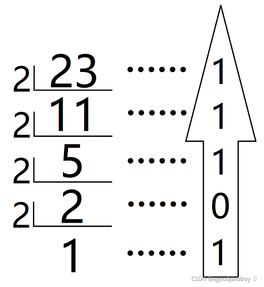
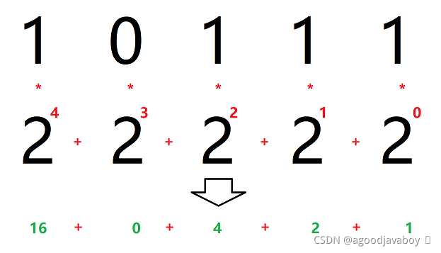
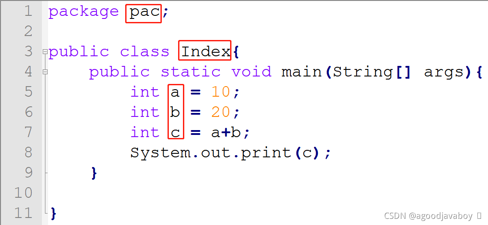
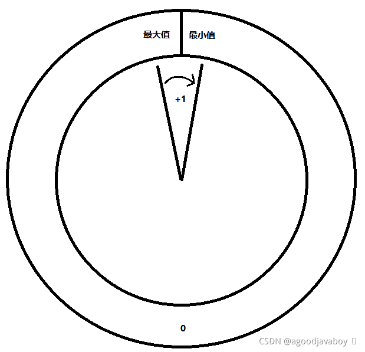

# 数据类型

Java是一种强数据类型语言，每一个变量在声明时都必须规定其数据类型，在运行中也不允许其改变数据类型。数据类型的作用其实就是规范变量存储数据的大小，从而合理利用计算机内存空间。

在程序运行过程中出现的数值都要使用变量进行承接，因为变量规定了存储数据的大小，所以要预判运行中出现的数据大小从而规定变量的数据类型。

## 十进制与二进制的转换

在了解Java数据类型之前要具备一定计算机进制运算常识，因为计算机运算中通常只使用二进制，所以对进制的转换有利于对Byte等二进制计量单位的理解和演算。

### 十进制转换为二进制

采用”除二取余“法可以将十进制运算得到二进制。其具体方法就是将一个整数进行除二运算得到其余数，再对商进行除二运算，一直对商进行运算直到余数为0或1，再将历史得到的所有余数从后向前累加得到二进制数。例如下文中23转换二进制得10111：



### 二进制转换为十进制

二进制数从右向左乘二的几次方，二的几次方从零次方开始每位增加一个，最终将所有乘积相加得到转换后的值。所有的值乘零都得零，所以零位上的运算可以忽略，并且任何数的零次方都得一，所以最右面的运算最大得到1，最小得到0。



## Java的数据类型

Java中存在两类数据类型：

1. 基本数据类型共八种，是最基础的元数据类型，所有的复杂类型都由多个基本类型组成。
2. 复合数据类型可自定义创建，一般由多个基本数据类型组成，因为可以创建，所以没有个数限制。

### 基本数据类型

| 类型名  | 名字                     | 占用字节数                             |
| ------- | ------------------------ | -------------------------------------- |
| byte    | 字节类型（整数类型）     | 1B                                     |
| short   | 短整型（整数类型）       | 2B                                     |
| int     | 整型（整数类型）         | 4B                                     |
| long    | 长整型（整数类型）       | 8B                                     |
| float   | 单精度浮点型（小数类型） | 4B                                     |
| double  | 双精度浮点型（小数类型） | 8B                                     |
| char    | 单个字符类型             | 2B                                     |
| boolean | 布尔类型                 | 不同的操作系统或JVM将区分boolean的大小 |

在使用变量对数据类型进行存取值时，值要添加相应的修饰来决定其初始类型：

- long类型值需要在数值后添加L或者l；
- float类型值需要在数值后添加F或者f；
- char类型值需要在单个字符前后添加单引号；
- boolean类型只能取值为true或false；

> 在计算机中，每存储一个0或者1称为1bit，简称为1b，8bit被称为1Byte，简写为1B。虽然有八位计数位置，但第一位只用来记录正负数，0表示此数值为正数，1表示此数值为负数，那么实际记录数值的只有7bit。1B最大的数字理应是最大正数，也就是`01111 1111`，通过二进制转十进制可以得到为127，最小的数应该是最小负数，也就是`1111 1111`，运算得到-127，但实际上`0000 0000`和`1000 0000`都表示为0，这样就白白的浪费了一种组合方式。所以`1000 0000`理应表示的-0变成了比当前类型表示的最小数还要小一个的数，这也是计算机在运算过程中的规则。所以1B的最大值仍然是127，最小值变成了-128。

### 复合数据类型

例如`helloworld`这样由多个字母组成的字符串并不属于基本数据类型，其底层实际是由多个char类型值拼接而成，所以字符串属于复合数据类型。

复合数据类型通常指通过多种基本数据类型整合而成的数据类型，复合数据类型通常使用引用来接收。可以使用引用接收的复合数据类型可以通过：类、接口、数组来创建。有关引用类型和复合数据类型的知识将在学习面向对象之后展开应用和详述。

# 变量

变量是程序中值的载体，值可以存储在一个变量中，然后通过变量进行运算得到结果。并且变量在创建的初期就必须要规定其数据类型，控制其中存在的值的大小和类型，并且在未来运算中不能发生改变。

一个变量就将在空间内占用一段空间，这段空间的内容是空的，这里所说的空并不是0，而是虚无。数据类型规定了这段空间的最大空间，变量在承接值时开始创建这个空间的初始大小（数值类型为0），然后将值放到空间中，那变量就拥有了意义。

## 声明变量

声明变量并不会存储实际的值，但这段空间并没有意义，所以并不能进行运算等。声明变量的时候就要声明数据类型来控制变量存储数值的上限。

```java
public class Index{
    public static void main(String[] args){
        int a;
        double b;
        char c;
        boolean d;
    }
}
```

1. 变量名属于标识符，可自拟但要遵循标识符命名规范。
2. 变量名前要添加相应数据类型进行约束。
3. 声明变量属于语句，所以必要在结尾添加英文分号。

## 变量赋值

变量实际意义就是存储数值，这些数值可能来自web请求中的参数，或者其他持久化数据源中，也可以直接写到程序里。在对变量进行赋值之前，必须保证变量已经规定了数据类型，并且值与数据类型相匹配。

```java
public class Index{
    public static void main(String[] args){
        //声明变量并赋值
        int a = 1;
        double b = 1.0D;
        char c = 'A';
        boolean d = false;
        
        //将变量的声明与赋值分开
        int b;
        b = 10;
    }
}
```

> 在程序中写的数字或其他数值在程序运行中不能进行改变，所以这种数值被称为常量的一种。但是数值所赋值到的变量仍然为变量，因为变量中得值仍可以在未来运算中改变。
>
> 也就是说程序中写死的值是常量的一种，而承接常量值的变量仍为变量性质。
>
> 在程序中的数字如果没有后缀，则强制此数值默认为何种类型。整数默认为int类型，小数默认为double类型。

## 变量值的改变

上文中声明变量后仅在内存中存在了一个没有意义的空间，在赋值之后此空间具有了内容。变量的”变“的含义就是此空间内的值可以在运行中发生改变，所以可以对变量进行重新赋值使其数值更新：

```java
public class Index{
    public static void main(String[] args){
        int a = 1;//a为1
        a = 2;//a为2
        a = 3;//a为3
    }
}
```

## 连续定义与赋值

在多个变量类型相同时，可以同时声明多个同一类型的变量：

```java
int a,b,c;
```

当多个变量类型相同，并且要向其中赋的值也相同，还可以在声明后向所有变量中注入数值：

```java
int d,e,f = 1;
```

还可以使用等号串联的方式将最右侧值赋值给左侧所有变量，但前提是变量已经被声明：

```java
int a,b,c;
a = b = c = 5;//a b c同时变成5
```

## 生命周期

现在所有的变量声明和赋值语句都写在了方法中，未来还可能写到其他单元里。变量可以在任何代码块中声明和赋值，一般用在类、方法、局部代码块例如流程控制语句等。

在同一代码块中（同一大括号包围的范围内），不得出现重复名称的变量名，否则将出现变量名的冲突。

大部分变量书写的位置都使用大括号包裹起来，例如方法的大括号或者类的大括号等。变量声明的语句出生，到所在大括号结尾结束，在大括号之外再不会出现冲突，也不能再使用。

# 标识符命名规范

标识符表示在程序中所有用于标识类、方法、变量名称的字符，标识符的命名需遵循一定规范，并规避采用关键字[关键字]和保留字[保留字]，否则将导致程序异常。判断关键字可以使用具有高亮功能的编辑工具来判断，通常字体出现特殊颜色的单词大多为保留字或关键字。



标识符的命名规范分为两类，强制命名规范如果违反将导致程序异常报错无法运行，建议性的规范并不会导致程序异常，但命名规范通常在业内大多数应用中使用，采用标准的规范能快速的了解标识符所标识的成员含义甚至类型。

## 强制命名规则

1. 命名只能以数字、字母、下划线(_)、美元符号($)组成，不能出现空格或其他字符。
2. 数字不能开头，但可以穿插到中间或末尾。
3. 命名没有长度的限制，但严格区分大小写。
4. 不得使用java中的关键字和保留字，关键字和保留字是java已经为其定义了具体的含义，或者准备对其做具体含义的单词。例如`class`（关键字）或`goto`（保留字）都不可作为自定义名称。

## 命名规范

1. 包名：字母全部小写，例如`pack`。
2. 类名：每个单词的首字母大写，例如`HelloWorld`。
3. 变量名、方法名：第一个单词的首字母小写，其他的单词首字母大写，例如`helloWorldVeryGood`。
4. 常量名：单词全部大写，每个单词之间用下划线隔开，例如`USER_SEX`。
5. 见名知义：在遵循以上标准的基础上，通常采用有意义的单词来构成标识符。

# 基本类型的转换

类型转换也就是让一个变量接收一个与其类型不符的值，如果变量原来所占用的空间能够容纳转换后接收的内容将正常存储和使用，但如果变量空间不足或不符存入的值的类型，将出现精度损失或者报错的情况。在以下类型转换过程中，不考虑到boolean类型，因为boolean类型并不能进行运算。

## 自动数据类型提升

### 赋值时

在多种类型变量之间进行值传递的时候，Java会考虑到每个变量所管理的空间大小。同类型（整型或浮点型）之间进行转换的时候，数据类型占用空间较小的变量可以直接向占用空间较大的类型的变量中赋值：

```java
int a = 100;
long b = a;

float c = 1.0f;
double d = c;
```

> 单精度浮点型float数值向double类型中进行赋值的时候会出现精度损失的问题，可能会变大很微小的量。这是因为单精度在存储中就并没有太高精度，会有些许偏差，但这点偏差并不会在单精度中表现出来。双精度的精度很高，会放大单精度空间中的精度偏差从而表现出来。

浮点型小数的变量可以无条件接收任意大的整形类型变量，并且与字节大小无关。但实际存储数值的时候，过大的值会在较小的空间内出现精度损失的问题，所以尽量还是采用大空间接收小变量的原则：

```java
long l = 1000L;
float f = l;
```

### 运算时

运算中出现的数值理应以最大空间的变量类型为结果类型，但实际运用中还是要考虑最终结果的大小来声明结果类型。Java给运算后的结果规定了必须的最小的类型，当然也是运算因子的最大类型为主：

- 在运算过程中，如果出现double类型的变量，那得出的结果就是double类型的。
- 在运算过程中，如果出现float类型的变量，那得出的结果就是float类型的。
- 在运算过程中，如果出现long类型的变量，那得出的结果就是long类型的。
- 在运算过程中，如果没有以上任何情况，那结果都是int类型的。

```java
byte b = 10;
short s = 10;
int i = 10;
long l = 10L;
double d = 1.0;
float f = 1.0f;

int sum = b + s;//没有出现double，long，float，结果为int
long sum2 = b + s + l;
float sum3 = b + s + l + f;
double sum4 = b + s + l + f + d;
```

### char类型进行计算

char类型作为一个基本数据类型，是可以与数值类型进行运算的。每一个字符对应着编码表中的某个数字，编码表取决于系统不同。整形和char类型之间是可以相互强制转换的，或者通过运算的方式自动实现。

```java
int a = 1;
char b = (char)a;

int c = 'a'+10;
```

char中如果想存入一个单引号或者双引号或者其他特殊的符号，可以通过反斜杠转义的方式完成。反斜杠后的第一个字母将作为原文输出或者与反斜杠配合成特殊字符输出：

| 转义符 | 实际意义                            |
| ------ | ----------------------------------- |
| \n     | 换行(LF) ，将当前位置移到下一行开头 |
| \t     | 水平制表(HT) （跳到下一个TAB位置）  |
| \v     | 垂直制表(VT)                        |
| \/      | 代表一个反斜线字符’‘’               |
| \’      | 代表一个单引号（撇号）字符          |
| \\"      | 代表一个双引号字符                  |

```java
char n = '\n';
```

## 强制数据类型转换

强制数据类型转换通常使用在将大空间变量向小空间变量赋值时，并且可以强制改变Java默认的运算结果的类型来控制接收变量的类型。

在进行强制类型转换的时候，如果值大于空间存储大小，则会出现精度损失的问题，得到错误的或有偏差的值。如果空间大于值的大小，则直接转换成功不会出现异常。

- 大数据类型变量向小数据类型变量赋值需要转换。
- 浮点型向整型赋值需要转换。

### 转换成功

接收值的变量能够容纳接收的变量的值时，不会出现精度损失，原变量中的内容将正确的赋值到新变量中。

```java
int a = 100;
byte b = (byte)a; // b = 100
```

### 损失精度

当接收值的变量无法容纳接收的值时，将会出现错误的数字保存到新变量中。

```java
int a = 128;
byte b = (byte)a; // b = -128
```

在过大的变量出现精度损失问题时，是有规律可循的，这种向空间赋值过大的值的问题称为值溢出。在数据类型中的值超过可存储大小时，将从最小值向前推进：数据的存储可以理解为“环装存储”，当值在存储过程中超过的最大值的界限，则进入最小值的范围向前存储。具体运算原理可使用二进制运算推演。

