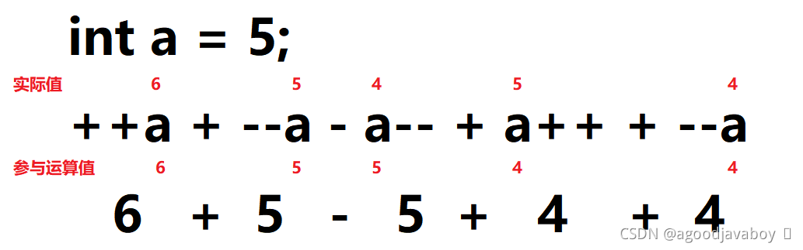

# 运算符

计算机的主要作用就是运算，运算是计算机中最原子的操作。Java提供了丰富快捷的运算符号实现二目数据运算[^二目运算]和三目逻辑运算[^三目运算]，并且因为计算机理解数据都是二进制的，所以还提供了有关二进制的运算符，使用快捷的运算方式实现较为复杂的算法。Java的运算符很像普通数学中应用到的运算符号，也存在优先级，运算顺序等规律，所以在学习Java运算符的时候，可以套用一些数学中常用的运算常识。

运算中常用的是二目运算，在学习一个运算符的时候要时刻提问自己以下两个问题：

1. 运算符链接的是什么类型的数据。
2. 运算结果是什么类型的。

## 算术运算

算术运算是对数字进行运算，二目中都要为数字类型，不限制整型或浮点型。算数运算的结果也是数字类型。当多个数学运算符相连时，将从左向右依次进行运算，像数学一样，乘除和取余的优先级高于加减。

### 普通数学运算

| 运算符 | 作用                                                         | 示例（运算结果） |
| ------ | ------------------------------------------------------------ | ---------------- |
| +      | 加法运算，将两个值进行相加                                   | 1+1（2）         |
| -      | 减法运算，前面的值减去后面的值得到差                         | 2-1（1）         |
| *      | 乘法运算，两值相乘得积                                       | 2*3（6）         |
| /      | 整除运算，前值除后值得到商，不要余数（整数与整数运算整除得商，整数与小数运算得小数结果） | 10/3（3）        |
| %      | 取余运算（模），前值除后值得到余数，不要商                   | 10%3（1）        |

### 递增递减运算

| 运算符 | 含义             | 示例   |
| ------ | ---------------- | ------ |
| ++     | 在自身大小中加一 | 1++(2) |
| –      | 在自身大小中减一 | 2–(1)  |

递增递减运算的结果与实际加一减一的结果没有区别。递增递减中的两个加减号可以写到变量前，也可以写道变量之后。当加减号写到变量前面时，运算的结果将直接得出并直接覆盖变量原来的值，但如果加减号写道变量后面的时候，运算的结果不会直接覆盖变量原来的值，而是在下次运算或者做结果输出的时候覆盖变量的值。



### 赋值运算

等号在数学中表示结果展示所用，但在程序中通常将结果展示到一个变量空间中，所以等号也可以当作一种赋值运算符号。赋值运算与算术运算对称，可以在运算后直接将运算结果计入运算成员中：

```java
int a = 10;

a+=10;
//等效于：
a = a+10;
```

承接上文`a = 10`，a去参与其他运算得到的结果如下：

| 运算符 | 作用                                                       | 实例          |
| ------ | ---------------------------------------------------------- | ------------- |
| +=     | 将号后面值加入前面的变量中                                 | a+=1;（a=11） |
| -=     | 在减号前面的值中减去等号后面的值                           | a-=1;(a=9)    |
| *=     | 两值相乘，将结果赋值给乘号前面的值                         | a*=2(a=20)    |
| /=     | 用除号前面值除以等号后面的值，将结果赋值给除号前面的值     | a/=3(a=3)     |
| %=     | 用模号前面的值，除余等号后面的值，将结果赋值给模号前面的值 | a%=3（a=1）   |

使用赋值运算符进行计算时，是直接将需要添加的值直接加入到变量空间中。当使用加法运算并赋值结果的方式时，会开辟新的空间用于记录运算的临时结果，再将临时结果空间的值存入到指定的变量中。

这样就可以避免在运算过程中导致的自动类型提升问题，例如byte类型的变量进行加一运算得到的结果是int类型，姑且可以认为运算的临时空间初始大小就是int类型那么大，如果要放到byte类型中就要经历强制类型转换。如果采用赋值运算的方式就可以直接在byte空间内部加一，从而避免自动类型提升产生过大的类型的结果的问题。

如果使用int类型的变量`*=`double类型的0.1，得到的结果应该是一个小数，但是因为int类型空间并不能记录小数，所以只能记录结果中的整数部分，小数都无法展示和记录下来。

## 布尔运算

布尔运算将得到一个boolean类型的结果，也就是非对即错。布尔运算符可能连接两个值，或者连接两个布尔值或表达式，但最终得到的都是一个boolean结果。布尔运算将在未来大量应用到流程控制中。

### 比较运算（关系运算）

Java的比较运算与数学中的比较运算大致相同，需要连接两个数值来判断大小。当判断结果为正确得到结果为true，否则结果为false。

| 运算符 | 作用                                                         | 示例          |
| ------ | ------------------------------------------------------------ | ------------- |
| >      | 判断前者是否大于后者                                         | 1>2（false）  |
| <      | 判断前者是否小于后者                                         | 1<2（true）   |
| >=     | 判断前者是否大于后者且包含后者                               | 1>=2（false） |
| <=     | 判断前者是否小于后者且包含后者                               | 1<=1（true）  |
| ==     | 判断前者与后者是否相同                                       | 1==1（true）  |
| !=     | 判断前者与后者是否不同（如果不同得到true，如果相同得到false） | 1!=2（true）  |

其中`==`在做基本类型比较的时候比较的是值的内容，在比较引用类型是是引用的地址，也就是说可能完全相同的两个值在使用`==`号比较后为true，但完全相同的两个引用类型在使用`==`号比较后就可能会出现false，其原因就是两个对象的地址不相同。关于对象类型使用`==`号的知识将在未来详述。

### 逻辑运算

逻辑运算符需要连接两个布尔值或者布尔运算表达式，最终将得到一个布尔运算结果。布尔运算表达式可以是比较运算或者是逻辑运算表达式，只要是得到布尔值的表达式就可以。

| 运算符 | 作用                                           | 示例                    |
| ------ | ---------------------------------------------- | ----------------------- |
| &&     | 与：连接的两个布尔值必须全部都是true才得到true | true&&false（false）    |
| \|\|   | 或：连接的两个布尔值任何一个为true则得到true   | false\|\|false（false） |
| !      | 非：将后面的布尔值进行取反                     | !true（false）          |
| ^      | 异或：两值不相同则为true，否则位false          | true^false（true）      |
| &      | 与&&使用方式相同                               | true&false（false       |
| \|     | 与\|使用方式相同                               | false\|false（false）   |

其中&&和||属于带有短路特性的逻辑运算，例如`false && i++>1`运算之后，会发现i的值并没有发生改变，是因为&&在判断了第一个值之后发现为false，那接下来无论出现true还是false结果肯定就是false，索性不再向后运算，直接将false作为结果。||与&&相同，如果判断到值为false就不会向后运算了，因为无论怎么运算结果肯定是false。利用这一特性可以在未来应用中优化程序运行速度，提高逻辑运算效率。

### 三目运算

三目运算也叫做三元运算，将通过三个值的运算得到一个结果，这个结果可以是任何类型的结果。其中第一个值必须是一个布尔运算或者布尔值，其余的两个值的类型必须一致，结果的类型必须与后两个值的类型一致。当布尔运算结果为true时将采纳第二个值作为结果，如果false则采用第三个值为结果。

三目运算的语法为：`类型A 变量 = 布尔值?类型A能匹配的值1:类型A能匹配的值2;`，并且三目运算是可以嵌套使用的，嵌套的三目运算将作为第二和第三个值（任何三目运算的第一个值都必须是布尔表达式），但是要保证所有的三目运算的结果都为最终接收变量能够匹配的类型。

```java
//变量 = 布尔表达式?当布尔表达式为true的时候采用的值:当布尔表达式为false的时候采用的值;
int a;
a = false?123:456;
System.out.print(a);//a=456

//嵌套//
int a;
a = true?(1+1==2?12:13):(2+2==5?45:76);
System.out.print(a);//a=12
```

## 位运算

位运算将从二进制的角度对每一位上的值进行运算。运算结果得到一个新的二进制结果，但反映出来的是一个十进制的数字。

在学习二进制时，要熟练掌握十进制与二进制之间的转换运算，以便对运算过程进行演算。

### 位与和位或

位与和位或和逻辑运算中的与和或相同，但是是在每一位二进制数上进行的运算。其中1与boolean类型中的true对应，0与false对应。

| 运算符 | 含义                                               | 示例      |
| ------ | -------------------------------------------------- | --------- |
| &      | 两个值的每位进行比较，都为1则得1，任何一个为0则得0 | 2&3（2）  |
| \|     | 两个值得每位进行比较，任何一个为1则得1，都为0得0   | 2\|3（3） |
| ^      | 两个值得每位进行比较，不相同则为1，相同则为0       | 6^3（5）  |
| ~      | 取反，若为1则得到0，若为0则得到1                   | ~6（-7）  |

### 位移运算

位移运算会将二进制数字整体向空间的左侧或者右侧移动，在空间之外的内容将被忽略删除，新出现的位用0补充。

| 运算符 | 含义                               | 示例        |
| ------ | ---------------------------------- | ----------- |
| >>     | 将数字的二进制表达形式向右移动几位 | 10>>1（5）  |
| <<     | 将数字的二进制表达形式向左移动几位 | 10<<1（20） |
| >>>    | 无符号右移                         | 3>>>1（1）  |

\>>右移后高位补的数字取决于原数字是正数还是负数，如果是正数则用0补位，如果为负数则用1补位。但是>>>无符号右移后，无论原数字是正数还是负数，都将以0向高位补位。

## 运算符优先级

在同类型运算中，采用从左向右的运算顺序。当一套算式中出现多种运算符时，遵循以下原则：

1. 逻辑非运算优先级最高。
2. 算术运算优先级第二，其中乘除和取余运算优先级高于加减法优先级。
3. 比较运算优先级第三。
4. 逻辑运算优先级最低，将在最后运算。

但实际应用过程中，仍然采用小括号的方式手动规定优先级，小括号可嵌套使用，将从最小单位的小括号中开始运算。并且在实际使用中场景较为复杂，一旦出现多种类型混合运算的方式，建议非同类型的运算还是加上小括号，无论自然优先级是否复合要求。

优先级从高到低排序：

| 优先级从高到低排序：                               |
| -------------------------------------------------- |
| 使用括号添加的优先级最高                           |
| ++、–、~、!                                        |
| *、/、%                                            |
| +、-                                               |
| <<、>>、>>>                                        |
| <、>、<=、>=                                       |
| ==、!=                                             |
| &                                                  |
| ^                                                  |
| \|                                                 |
| &&                                                 |
| \|\|                                               |
| ?:                                                 |
| =、*=、/=、%=、+=、-=、<<=、>>=、>>>=、&=、^=、\|= |

## 字符串类型的加法

字符串与字符串之间只能使用加法来进行字符串拼接的操作，实际上就是将数值或者字符串作为字符拼接成一个整体的字符串。

但在一串字符串相加运算中，在没有进行字符串相加前，仍然是采用数字相加的。在经历字符串相加之后就持续向后进行字符串相加操作，无论后面是否存在数字都将采用拼接的方式。

```java
String a = "hello";
String b = 1+1+a;//2hello
String c = a+1+1;//hello11
String d = 1+1+a+1+1;//2hello11
```

[^二目运算]: 两个值参与运算得到一个结果，称为二目运算。
[^三目运算]: 三个值参与运算得到一个结果，称为三目运算。