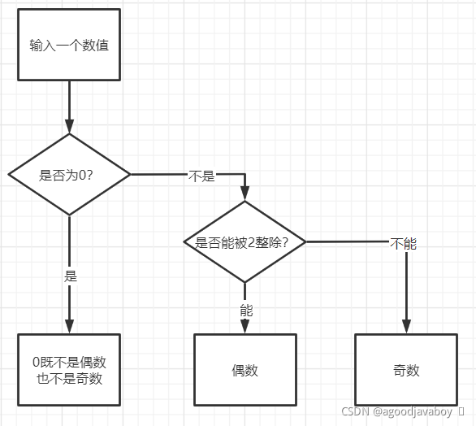
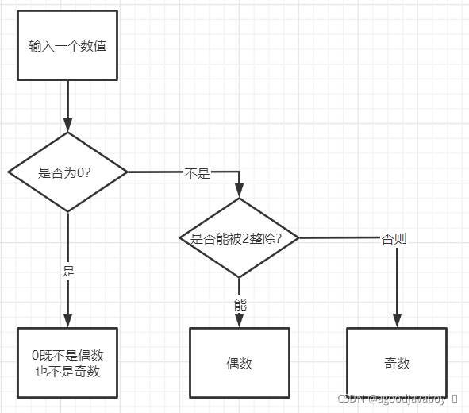

# 流程控制

计算机不仅仅能够提供运算数据的能力，通过程序编码还可以使其具有决策和批量执行的能力。

实际上在程序的开发过程中，大量的时间都会考虑流程的执行分支和批量数据的筛选或者重复的操作。流程控制的代码让计算机具有了思考能力，通过编码决定具体的决策可以使其完成特定情况下的程序执行，以及重复的频繁操作。

## 条件分支

在计算机运行过程中，会在同一个步骤下出现多种运行可能，具体运行那一条子流程取决于某些特定的参数。实际上对于某一个步骤来说只会有两种可能，也就是执行或者不执行。所以决定流程是否启动的关键参数就是一个布尔类型参数或者表达式。

### if 语句

if表示如果，传入的参数为布尔类型值或表达式，也就是说如果条件是对的，那就执行，否则不会执行。if将包含一部分执行代码，在条件正确后执行该代码。

```java
if(布尔/布尔表达式){
    当布尔值或者表达式为true的时候，才会执行的代码！
}
```

判断一个数字是否为偶数的判断示例，其设计思想如下。其中先对数值进行是否为0的判断，如果不为零在进行运算判断并输出结果：



实际代码如下，运用到了if流程控制语句以及if语句嵌套：

```java
//计算输入的值是否是个偶数，并打印相应的内容（0既不能判定为偶数也不能是奇数）
int num = 15;

if(num==0){
    System.out.print("0既不是偶数也不是奇数");
}

if(num!=0){
    int flag = num%2;//flag要么为1（没有整除），要么为0（整除）
    if(flag == 0){
        System.out.print(num+"是偶数");
    }

    if(flag != 0){
        System.out.print(num+"是奇数");
    }
}
```

if的小括号参数中更多写的是比较运算或者逻辑运算，当然也可以直接写布尔值常量，但那是没有意义的。

程序在编译时会默认所有的if语句代码块不会被执行，即使肉眼可见代码块是绝对可以执行的（除非是绝对正确的常量的比较或者常量true），也无法在编译时被Java认可：

```java
//关于局部变量及变量初始化
//java编译时会对程序进行风险的预测，所有的if语句，java都认为“可能无法执行”！

int a = 100;
int b;
if(a == 100){//即使直观来看，是必定会执行的，但是java编译认为所有if都可能不执行
    b = 10;
}
System.out.print(b);//如果所有的if都不执行，此变量则未初始化！

//如果在if条件中直接写true或者1==1类似的代码，则不会报错，以为这样的条件将绝对的满足。
```

> Java中所有的变量都必须“先赋值后使用”，第一次赋值就叫做初始化，也就是在使用变量之前至少对其赋值一次。
>
> 所谓使用变量，也就是将其进行输出打印，或者参与到运算式中。

### if else 语句

if表示的是如果条件达成则执行，不达成则不去运行。那else就标识否则，也就是在if条件没有达成的情况下执行，如果if条件达成了，则不会去执行else代码块。也就是说if和else代码块只会有一个代码块执行。其语法如下：

```java
if(布尔值或者表达式){
    当布尔值或者表达式为true时执行的代码！
}else{
    当不执行if的时候，执行此处的代码！
}
```

当再次去处理“判断一个数字是否为偶数”的程序时，就可以采用如下的逻辑：



在编写代码的时候，就可以运用if和else搭配的方式：

```java
int num = 10;

if(num==0){							//如果输入的值是个0的话
    System.out.print("!");
}else{								//否则：如果输入的值不是个0
    if(num%2==0){					//如果此值可以被2除尽的话
        System.out.print("偶数");
    }else{							//否则：此值不能被2除尽
        System.out.print("奇数");
    }
}
```

### if else if 语句

以上关于if的写法只能决定程序知否执行一条分支，采用if else之后就可以在两条程序分支中选其一运行。如果在一套流程中出现了多个分支，在满足不同条件的情况下选择一条分支运行，那实际上是可以写多个if语句来完成的，但如果采用连续的if else语法能让逻辑和程序更简单。

在连续的if else中，多个代码块整合为一体，并且通过不同的条件控制是否执行。程序执行时会从第一个if的条件开始判断，如果遇到条件匹配的则直接运行其代码块，代码块结束后不会再去判断其余代码块的条件，也就不会再去执行其代码。语法如下：

```java
if(布尔值或者表达式){
    布尔值成立后执行的代码！
}else if(布尔值或者表达式){
    布尔值成立后执行的代码！
}else if(布尔值或者表达式){
    布尔值成立后执行的代码！
}else{
    如果没有任何一个if进入，就执行此处代码。
}
```

也就是说，在多个代码块相连的时候只会执行其中一个代码块的代码，或者不执行任何代码块执行else中的代码。实际使用代码如下：

```java
//根据用户输入的内容，判断用户所在的年龄区间段
int age = 18;

// 0-10：小孩  10-20：少年 20-40：青壮年 40>：中老年
if(age>40){
    //中老年
}else if(age>20){
    //青壮年
}else if(age>10){
    //少年
}else if(age>0){
    //小孩
}else{
    //年龄是负数了！
}
```

### switch 语句

if语句采用布尔运算的方式来选择执行某一个代码块，switch则是采用值对等匹配的方式来选择某一个代码块执行。实际上if也可以做对等值的判断，但switch的语法更简便：

```java
switch(值){
    case 值A:
        当值D与值A相等时执行的代码！
            break;
    case 值B:
        当值D与值B相等时执行的代码！
            break;
    case 值C:
        当值D与值C相等时执行的代码！
            break;
    ......
    default:
        当以上任何一个case都没有执行时执行此处的代码
}
```

1. switch存在一个小括号和一个大括号，小括号中存放的是一个byte、short、int、char中某个类型的值，在java1.8之后还支持字符串类型值的填写。

2. 大括号总存在一个case单词，单词后也书写着一个值，这个值的类型与小括号中的相同，在小括号中的值与某一个case后的值对等匹配之后，将会执行case后的代码。

3. case中的代码最后还存在一个break单词，这个单词作为一个单独的语句，主要用作在代码执行完成后退出整个switch语句，继续执行switch之后的代码。这个break是选填的，也就是说可以不填写这个语句。如果不填写break，switch将在匹配一个case后执行其代码，接着执行这个case以及default后所有case中的代码。实际上在最后一个case中是没有必要填写break的，毕竟其后也没有可以执行的case了。

4. 所有的case最后可选的存在一个default语句，写法与case相似但不需要指定值。当所有的case中都存在break并且没有任何一个case执行的情况下，将执行default中的代码。因为default通常写到switch的最后，所以通常不会写break语句。

以下实例模拟一个通过数字选择菜单的代码，借助switch做值匹配：

```java
System.out.println("[1]登录、[2]注册、[3]退出");
int input = 1;

switch(input){
    case 1:
        System.out.print("开始登录！");
        break;
    case 2:
        System.out.print("开始注册！");
        break;
    case 3:
        System.out.print("退出！");
        break;
    default:
        System.out.print("输入错误！");
}
```

### 条件分支的选择

因为switch只做单个值的匹配，灵活度并没有if那么高，但实际应用中switch对单个值的判断写法要比if简单的多，所以当处理单个值对等判断的时候，尽量选择switch语句；当需要判断的条件比较多，并且存在区间判断的情况的话，尽量选择if语句。

## 循环控制

当一段代码需要重复执行多遍的时候，就可以采用循环语句。循环要有起点和终点，为了达成终点就要让其具有一个满足终点的条件。在实际代码中通常使用值的方式来标记这三点：

- 起始值：声明创建并赋值的一个变量值。
- 步长：起始值不断的做递增或递减运算向前行进。
- 最大值：当步长达到或超过最大值将停止循环。

### while 语句

while循环有一个小括号和一个大括号，小括号中是一个布尔值，但更多时候是一个布尔表达式。while会判断小括号中的条件是否为true，如果为true则执行大括号中的代码，执行完成后返回小括号查看是否满足为true，直到小括号中的条件为false停止整个while向后执行代码。其语法如下：

```java
while(布尔值、布尔表达式){
    循环执行的语句。
        当布尔值或者布尔表达式结果为true的时候执行此处代码。
        如果为false则跳出此处！
}
```

因为while只提供了一个值判断的位置，并没有提供起始值和结束值书写位置，所以要在外部创建自己的起始值，并在while中对值进行递增，并在小括号中查看值是否达到了终点来控制循环的次数。以下示例用于打印一百条输出语句：

```java
//打印100个helloworld

int a = 1;//起始值
while(a<=100){//终点判断
    System.out.println(a+" ==> helloworld");
    a++;//值递增
}
```

起始值创建的位置不能在循环的内部，那样会在每次循环时将值重新赋值为1，导致循环无法停止。

### do while 语句

与while相似的do while语句只是将大括号和小括号的位置有了改变， 并且在执行过程中不会像while先去判断条件再去执行代码块，而是先执行代码块后再去做判断，如果条件满足则再去执行代码块。如果说while中代码块的执行次数为0-N，那do while的代码块执行次数就是1-N。其语法如下：

```java
do{
    当布尔值或者表达式成立的时候执行的代码块
}while(布尔值或者表达式);
```

### for 语句

while循环并没有提供书写起始值和步长的位置，而for循环在语法上预留了书写所有条件的位置。其语法如下：

```java
for(起始值;结束条件;步长){
    循环执行的代码
}
```

for循环在执行时，将先对起始值进行处理，然后判断结束条件是否满足，如果满足则开始执行其代码块。代码块执行完成后进行值递增也就是步长内的运算，然后再去判断结束条件，如果条件为true则继续执行代码块。在执行过一次起始值处理后，再不会执行起始值的处理了。并且在起始值位置创建的变量生命周期只在整个for循环中有效。以下示例展示输出打印一百以内所有正整数：

```java
for(int j=1;j<=100;j++){
    System.out.println(j);//输出1-100
}
```

for循环虽然准备了书写三种条件的位置，但三种条件中的起始值和步长可以不写到for循环中，必要的只是小括号中的两个分号和判断条件。那上文中的代码就可以改成如下代码，并且效果不变：

```java
int j=1;
for(;j<=100;){
    System.out.println(j);
    j++;
}
System.out.println(j);//输出101
```

因为最后一次代码块执行完成之后会经历步长部分递增的操作，然后再去判断是否满足条件。条件不满足后弹出for循环范围，此时变量已经+1，无论步长代码写到小括号中还是循环体中都是如此。

### 循环的嵌套

循环的代码块中可以写任何代码，当然也可以写循环体。在循环体再写一套循环就称为循环的嵌套。

在循环嵌套中，外层循环执行一次，内层循环将执行到无法执行跳出内层循环后再次执行外层循环。循环嵌套在实际应用中不推荐使用，因为在数据量多大时，会耗费大量的时间执行重复的代码。

实例采用基础的while循环嵌套完成九九乘法表的打印：

```java
//打印九九乘法表
int j = 1;
while(j<=9){
    int i = 1;
    while(i<=j){
        System.out.print(i+"*"+j+"="+(j*i)+" ");
        i++;
    }
    System.out.println();
    j++;
}
```

其中print打印方式将把内容打印到一行而不会发生换行，但print的小括号中必要填写打印内容。println将把内容打印后执行换行，如果没有打印内容则只打印一个换行符号执行换行操作。

### 死循环的构成

循环无法结束称为死循环，死循环形成的条件就是永远达不到终点，实际就是判断语句永远为true。只要将循环中关于递增的语句改装或删除，就可以实现死循环。

```java
while(1==1){
    //此处代码将无限次重复，不可跳出。
}
```

当控制台中执行代码时出现死循环情况，可以使用`Ctrl+C`组合键杀死当前线程阻止当前Java程序继续运行。

## 跳出语句的方式

当程序执行到某种情况下不允许继续执行或者循环需要停止的时候，就用到跳出语句。跳出语句可以废弃某次循环后续的代码，或者废弃整个循环或代码块，甚至停止整个方法。

以下介绍各类跳出的方式，注意观察输出语句来推算跳出的规则。

### break 语句

break语句可以停止当前执行的循环体或者代码块，执行代码块或循环下的后续程序。

#### 代码块跳出

当break处在while中时，将停止当前while程序。当break处在循环中时，将停止整个循环。当break处在循环嵌套的情况时，将跳出最近的一次循环，执行外层循环的下次循环。

```java
for(int i=1;i<=100;i++){
    if(i>=20 && i<=40){
        break;
    }
    System.out.println(i);
}
System.out.println("hello");
```

#### 指定位置跳出

break在嵌套循环中时，将跳出最近的一次循环，但如果想跳出最外层的循环或其他指定位置的循环时，就可以采用标记跳出的方式。

标记跳出时，一般采用大写字母标记循环语句，并在内层指定跳出的循环体标记：

```java
//当执行到k==1的情况时，则停止i循环，也就是停止整个循环嵌套。
A:for(int i=1;i<=2;i++){
    System.out.println("i => "+i);
    for(int j=1;j<=2;j++){
        System.out.println("j => "+j);
        for(int k=1;k<=2;k++){
            System.out.println("k => "+k);
            if(k==1){
                break A;
            }
        }
    }
}
```

### continue 语句

在遇到continue语句后，只会停止执行当前循环，也就是忽略当前循环接下来的语句，而执行下一次循环。

```java
for(int i=1;i<=100;i++){
    if(i>=20 && i<=40){
        continue;
    }
    System.out.println(i);
}
System.out.println("hello");
```

### return 语句

return在本章作为跳出语句学习，return将跳出整个方法，暂停方法内接下来的代码。如果写到主函数中，则是停止整个程序：

```java
for(int i=1;i<=100;i++){
    if(i==20){
        return;
    }
    System.out.println(i);
}
System.out.println("hello");
```

## 循环语句的选择与使用练习

当不确定循环次数的时候，可以采用死循环的方式，并制定跳出语句来实现循环的停止（具体跳出循环的方式将在下文讲述）。当确定了循环的次数，则要采用变量控制的方法来完成。

无限循环采用while更容易完成，而有循环次数的循环使用for更容易完成。并且根据while和do while循环次数的不同还可以酌情考虑。

下文将书写两套代码模仿登录功能，其中存在次数限制，而另一套则可以无限尝试：

> 与Scanner有关语句涉及到了面向对象的知识以及方法的调用，不会在本章展开细讲，但具体含义可以如下简单理解：
>
> `Scanner sc = new Scanner(System.in);`语句所创建出的sc引用类型变量具有让用户在控制台输入内容的能力，执行`sc.nextInt();`语句之后，控制台则处在光标跳动的状态，用户输入一段整数并点击回车后，输入的值将赋值给`sc.nextInt();`前面的变量。每次调用`sc.nextInt();`都会支持控制台输入，但sc的创建只需要一次。

```java
//书写一个登陆的流程，输入用户名和密码进行匹配，只能匹配三次	
boolean flag = false;
for(int i=1;i<=3;i++){
    Scanner sc = new Scanner(System.in);
    int id = sc.nextInt();
    int password = sc.nextInt();

    if(id==123 && password==345){
        System.out.println("登陆成功！");
        flag = true;
        break;
    }else{
        System.out.println("登陆失败！");
    }
}
if(flag){
    System.out.println("首页！！！");
}else{
    System.out.println("账户已被锁定！");
}
//书写一个登陆流程，输入用户名和密码，知道输入成功才可停止程序
boolean flag = false;		
int i = 1;
while(true){
    Scanner sc = new Scanner(System.in);
    int id = sc.nextInt();
    int password = sc.nextInt();

    if(id==123 && password==345){
        System.out.println("登陆成功！");
        flag = true;
        break;
    }else{
        System.out.println("登陆失败！");
    }

    i++;
}

if(flag){
    System.out.println("首页！！！");
}else{
    System.out.println("账户已被锁定！");
}
```

## 语句的简写方式

循环或者流程控制的小括号后的大括号是可以忽略的，将默认第一行语句为大括号中的内容。但这种写法可读性和可维护性存在质疑，虽然Java提供了这种写法，但应用开发中还需尽量避免使用。

```java
//以下以if为例
if(今天的天气==下雨)
    System.out.println("hello");//此语句默认为if大括号内语句
System.out.println("world");//此语句不是大括号内语句
```

