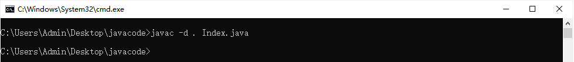
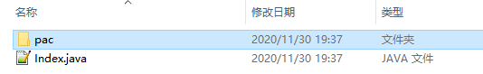
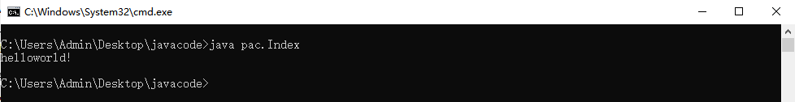
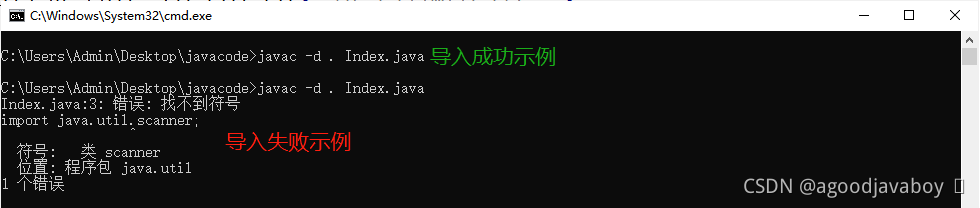
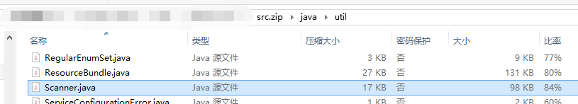
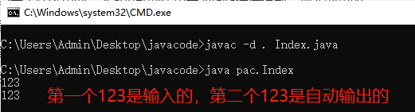

# 包与导包

Java中的包也就是操作系统中的文件夹，包表示一些Java文件的集合。JDK所提供的程序都存在于各个的包中，并且在实际开发过程中，自定义的每一个Java文件都要存在于一个包里。

将同一功能或者同一类型的Java文件放到同一文件夹里，加上公开类的特性能够让开发人员在文件系统中就能看到整个系统的全貌，以及所有Java文件的分布和意义。

此前在进行Java文件编译的时候，Java文件所生成的class文件将放置到Java文件的同级目录下：那是因为环境变量中CLASSPATH变量所配置的位置是一个英文点，也就是程序执行所在命令行所在目录下。并且因为通常会将命令行定位到Java文件所在位置再进行编译，所以生成的class文件就和Java文件放到了一起。采用包声明的方式之后，就可以将class文件指定的放置到某个文件夹中。

在采用了开发工具之后，开发工具会自动的将class文件系统的编译到独立的文件夹中，以和源代码隔离。

## 声明包

包的声明也就是在Java程序中规定当前Java文件所生成的class文件放置到哪里。这与环境变量中的CLASSPATH变量有关，在使用了开发工具之后，将具有规定Java文件存放位置的能力，并且Java所生成的class文件也将由开发工具自动进行管理。

包的管理可以指定class文件的放置位置，也就能将源代码和字节码文件分离放置。在未来导入其他包的时候，也能够通过其定义的包位置将其导入，因为包定义的是class文件所在位置，那导入的实际上也就是字节码文件。

### 定义包位置

包的定义一般放在Java文件的第一行，使用package关键字后加包的名称，在编译时将自动创建包名的文件夹并将class文件放置到里面：

```java
package pac;

public class Index{
    public static void main(String[] args){
        System.out.println("helloworld!");
    }
}
```

### 定义包后的编译

在声明了包之后，编译程序的语句也应该指定包生成位置，否则将无法解释运行字节码文件：`java -d . java文件名.java`，其中-d的意义也就是指定编译生成的class文件目录，目录将参考Java文件中package的定义，点的意思是当前命令行目录，那class文件包也将从当前目录开始创建。



采用-d语句生成的class文件将存放到java文件同级目录下的指定文件夹下，前提是将命令行定位到Java文件所在目录：



### 定义包后的运行

在存在包结构创建了class文件之后，执行class文件的指令也要有所更改：`java 包名.类名`，前提是命令行所在路径必须是Java源文件所在路径：



在包定义的时候，所有的英文点都表示更深层的文件夹，如下图所创建的class文件就将在pac文件夹的chil文件夹中：

```java
package pac.chil;

public class Index{
    public static void main(String[] args){
        System.out.println("helloworld!");
    }
}
```

## 导入包

导入也就是将其他class文件导入到当前Java文件中一起编译，从而能够使用其他class文件中的代码。

导入的class文件可以是自己编译生成的，或者是Java提供的，或者其他第三方class文件，实际上他们都并没有什么区别。

导入Java官方提供的class文件，在编译程序时将从类库中通过包路径获取class文件，而并非从当前目录中寻找。

当需要导入的class文件和当前源文件所生成的class文件处在同一包下时，无需导入可直接使用。

### 导入语句

导入语句通常写在package指令的下面，其他所有代码的上面。导入时要书写class文件的全限定名或包的全限定名，全限定名也就是`所有包名.类名`，最简单的办法也就是在类的package后查看其所处包，后加逗号再加类名。

以下导入一个Java提供的可支持控制台输入的class文件Scanner：

```java
package pac;

import java.util.Scanner;

public class Index{
    public static void main(String[] args){
        System.out.println("helloworld!");
    }
}
```

当前只测试对class的导入，并不学习类的使用方式，所以可以直接编译上面的实例代码查看是否报错，如果报错则表示有语法或单词的错误：



Java提供的源码包可以看到Scanner在Java类库中所处的位置，源码包存放在JDK安装路径下，名称为src.zip：



### 导入的几种方式

**单个导入：**

```java
package pac;

import java.util.Scanner;
import java.util.List;

public class Index{
    public static void main(String[] args){
        System.out.println("helloworld!");
    }
}
```

**全包导入：** 只会导入最后一个包名中所有的class文件，不会级联导入其父包或子包内的class文件。

```java
package pac;

import java.util.*;
import java.io.*;

public class Index{
    public static void main(String[] args){
        System.out.println("helloworld!");
    }
}
```

**临时导入：** 并不使用import指令，而是在使用时指定`包.类`，只在当前语句有效。

```java
package pac;

public class Index{
    public static void main(String[] args){
        java.util.Scanner scanner = new java.util.Scanner();
    }
}
```

### 导入自定义包

对于class来说，只有在使用者与被使用者不在同一包下的时候才需要导包，所以定义包位置的时候要定位到两个包中，但创建两个java文件的时候要在同一文件夹内。

首先创建被使用者，本章只演示包的导入，所以不写任何执行性代码：

```java
package pac;

public class Index{}
```

然后创建使用者，将其编译到与被使用者不同的文件夹，并在当前文件中导入使用者：

```java
package pac2;

import pac.Index;

public class Test{}
```

现将使用者编译后，再将被使用者进行编译。只要编译成功即表示导入成功。

## 关于Scanner的练习

Scanner的具体使用涉及到面型对象编程的知识，但本章仅学习与包导入和导入的class的使用验证。但仍需认真记住Scanner的使用，将在未来学习过程中使用Scanner测试和开发练习程序。

在导入类的时候，要知晓以下几个方面：

1. 这个类是做什么用的：Scanner是用于控制台输入内容扫描的工具，可以将控制台中输入的内容转化为程序中的值。
2. 这个类在哪里：Scanner由JDK提供，存在于类库的`java.util`包下。
3. 这个类要怎么使用：Scanner需要创建对象，并在创建对象的同事监控系统输入内容。通过创建出的Scanner对象执行控制台阻塞指令，并扫描和收集输入的内容。

以下将书写Scanner导入以及Scanner使用程序：

```java
package pac;

import java.util.Scanner;

public class Index{
    public static void main(String[] args){
        Scanner sc = new Scanner(System.in);//创建Scanner对象
		int a = sc.nextInt();//执行输入方法并将输入的数字（只能是数字）放置到变量a中
		System.out.println(a);//输出刚刚输入的数字
    }
}
```

控制台编译和运行指令如下，在运行程序时命令行将存在闪烁的光标等待用户输入，输入数字并点击回车后展示输入的内容：

